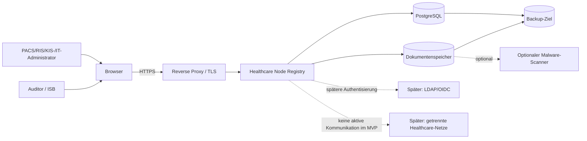

# Systemkontext

## Trust Boundaries

1. Benutzergerät zu Reverse Proxy
2. Reverse Proxy zu Anwendung
3. Anwendung zu PostgreSQL
4. Anwendung zu Dokumentenspeicher
5. optionaler Scanner
6. Backup-Ziel
7. spätere Verzeichnisdienste oder Netzwerkagenten

Das MVP führt keine ungefragten Netzwerk- oder DICOM-Scans aus.
