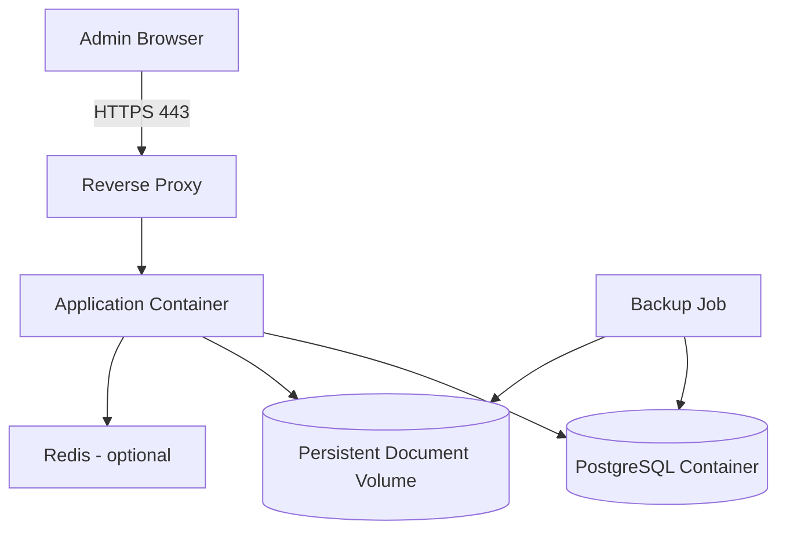

# Deployment Architecture

## Primärer Betriebsmodus

Ein Docker-Compose-Stack auf einer vom Kunden verwalteten Linux-VM oder einem lokalen Container-Host.

## Produktionsanforderungen

- feste Image-Versionen
- TLS
- persistente Volumes
- externe, getestete Backups
- NTP
- DNS
- zentrale oder lokale Logrotation
- Ressourcenlimits
- kein Root-Prozess, soweit technisch möglich
- Read-only Filesystem, soweit möglich
- getrennte Secrets
- dokumentierter Restore-Test

## Nicht vorgesehen

- direkte Veröffentlichung der Datenbank
- Verwendung von `latest`
- Standardpasswörter
- Debug-Modus
- ungesicherte HTTP-Nutzung außerhalb einer isolierten Erstinstallation
