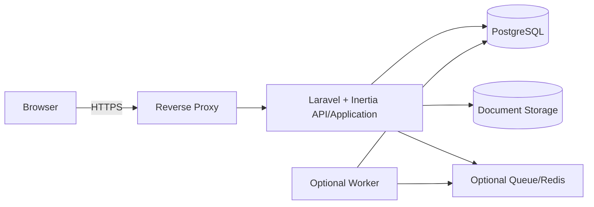

# Architecture Overview

## Architekturstil

Für die erste Produktgeneration wird ein modularer Monolith vorgesehen. Er reduziert Betriebsaufwand und verteilt fachliche Komplexität nicht vorzeitig auf mehrere Services.

## Komponenten

### Webanwendung

- Routing, Authentisierung und Autorisierung
- fachliche Anwendungsfälle
- UI-Auslieferung
- Audit-Erzeugung
- Import/Export

### PostgreSQL

- fachliche Daten
- Integritätsconstraints
- Audit-Metadaten
- keine Binärdokumente, sofern kein ADR dies ausdrücklich anders entscheidet

### Dokumentenspeicher

- lokales Volume oder S3-kompatibler On-Premise-Speicher
- Metadaten in PostgreSQL
- Prüfsumme und Zugriffskontrolle
- Backup gemeinsam mit Datenbank konsistent planen

### Queue

Erst einführen, wenn asynchrone Aufgaben wie Malware-Scan, große Exporte oder spätere Health Checks dies benötigen.

## Domänenmodule

- Identity
- Organizations
- Assets
- Endpoints
- Connections
- Topology
- Documents
- Taxonomy
- Audit
- ImportExport
- Administration

## Vertrauensgrenzen

- Browser zu Reverse Proxy
- Reverse Proxy zu Anwendung
- Anwendung zu Datenbank
- Anwendung zu Dokumentenspeicher
- optionale spätere Worker zu medizinischen Netzen

## Architekturziele

- geringe Betriebscomplexität
- lokale Installierbarkeit
- sichere Updates
- testbare Fachlogik
- erweiterbares Datenmodell
- kontrollierte Abhängigkeiten
