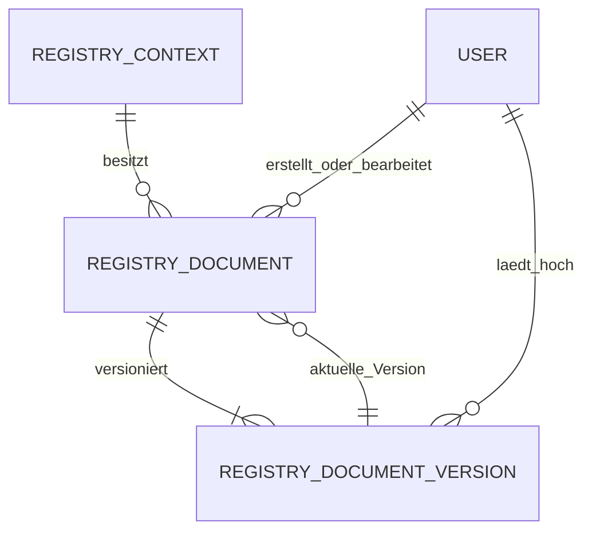

# Architektur der Registry-Dokumentenablage

## Bausteine und Verantwortlichkeiten

Die Dokumentenablage bleibt Teil des modularen Laravel-Monolithen:

- `RegistryDocument` verwaltet fachliche Metadaten und die polymorphe Zuordnung zu Organisation, Standort, Abteilung oder System.
- `RegistryDocumentVersion` hält die unveränderlichen Datei- und Integritätsdaten jeder Version.
- `RegistryDocumentUploadService` koordiniert Prüfung, Scan, private Ablage, Datenbanktransaktion und Audit.
- `RegistryDocumentFileInspector` validiert Allowlist, MIME-Typ, Signatur, Größe und SHA-256.
- `MalwareScanner` kapselt den installationsabhängigen Scanner.
- `ClamAvMalwareScanner` streamt Dateien ohne gemeinsamen Dateipfad über das ClamD-`INSTREAM`-Protokoll.
- `RegistryDocumentRescanService` verarbeitet offene Scanstatus erneut und aktualisiert Status und Audit.
- `RegistryDocumentQueryService` liefert kontextgebundene Suche, Filter und serverseitige Pagination.
- `RegistryDocumentController` erzwingt Berechtigungen, Kontext-Policy und Freigabestatus bei jeder Dateioperation.

## Datenmodell

`REGISTRY_CONTEXT` steht für genau einen Datensatz aus Organisation, Standort, Abteilung oder System. Die Datenbank erzwingt eindeutige Versionsnummern je Dokument. Der zusammengesetzte Fremdschlüssel `(current_version_id, id)` verhindert, dass die aktuelle Version auf ein anderes Dokument zeigt.

Binärdaten werden nicht in PostgreSQL gespeichert. Die Datenbank enthält ausschließlich fachliche Metadaten, Storage-Referenzen, Prüfsummen und Scanstatus.

## Upload-Ablauf

1. Form-Request prüft Dokumentrecht, Metadaten und konfiguriertes Größenlimit.
2. Controller löst den erlaubten Registry-Kontext auf, prüft dessen Policy und lehnt archivierte Kontexte ab.
3. Inspector vergleicht Dateiendung, erkannten MIME-Typ und Signatur und berechnet Größe sowie SHA-256.
4. Kontext- beziehungsweise versionsbezogene Duplikaterkennung prüft den Hash.
5. Der Scanner-Adapter bewertet die temporäre Upload-Datei.
6. Die Datei wird unter einem UUID-Namen im privaten, nach Jahr und Monat gegliederten Disk gespeichert.
7. Dokument, Version, Zeiger auf die aktuelle Version und Audit-Ereignis werden transaktional geschrieben.
8. Scheitert die Datenbanktransaktion, wird die bereits gespeicherte Datei wieder entfernt.

Neue Versionen sperren den Dokumentdatensatz während der Ermittlung der nächsten Versionsnummer. Alte Versionen bleiben unverändert erhalten. Metadatenänderungen sind ein eigener Anwendungsfall und werden nicht aus einem Versionsupload abgeleitet.

## Storage- und Zugriffsgrenze

Der Disk `registry_documents` zeigt auf `storage/app/private/registry-documents`, besitzt keine URL und wird von Laravel nicht direkt ausgeliefert. Clientseitige Sichtbarkeit ist keine Zugriffskontrolle: Download und Preview prüfen bei jeder Anfrage Dokumentrecht, Registry-Kontext, Archivstatus, Scanstatus und Dateiexistenz.

Nur Status `clean` ist abrufbar. Die Vorschau prüft zusätzlich serverseitig auf MIME-Typ `application/pdf` und Erweiterung `pdf`. Pfade und Storage-Namen stammen ausschließlich vom Server.

## Audit-Integration

Es existiert keine zweite Dokumenthistorie. `RegistryAudit` schreibt Dokumentereignisse append-only in `security_events`, jeweils mit Typ und Public-ID des Registry-Kontexts. Dadurch übernimmt `RegistryHistoryService` die Ereignisse automatisch in System- und Strukturhistorien, ohne Dateien oder sensible Scannerdiagnosen zu duplizieren.

## Betrieb, Backup und Restore

Das persistente Storage-Volume und PostgreSQL sind eine logische Sicherungseinheit. Sicherungen benötigen einen konsistenten Zeitpunkt, Integritätsmanifest und verschlüsseltes Ziel. Nach Restore müssen Referenzen und Dateien in beide Richtungen geprüft werden:

- jede wiederhergestellte Version verweist auf eine existierende Datei mit passender Größe und SHA-256;
- jede aktuelle Version gehört zum referenzierenden Dokument;
- verwaiste Storage-Dateien werden gemeldet und nicht ungeprüft gelöscht;
- archivierte Dokumente und historische Versionen bleiben erhalten.

Der aktuelle Code implementiert Archivierung, aber keine physische Aufbewahrungsbereinigung. Eine spätere Retention muss rechtliche Vorgaben, Audit-Nachweis, konsistente Datei-/Datenbanklöschung und getestete Wiederherstellbarkeit gemeinsam behandeln.

## Malware-Scanner und Rescan

Der produktive Compose-Pfad verwendet ClamAV über TCP 3310 ausschließlich im internen `backend`-Netz. Upload-Scans laufen synchron, damit bereits beim Speichern ein eindeutiger Status vorliegt. Verbindungs- und Scanfehler führen fail-closed zu `unavailable` beziehungsweise `failed`; nur `clean` ist abrufbar.

Der separate `scheduler`-Dienst startet stündlich das Artisan-Kommando `registry-documents:rescan`. Es bearbeitet begrenzte Batches der Status `pending`, `failed` und `unavailable`. Die Signaturdaten liegen im Volume `clamav_data`; FreshClam erhält über das getrennte Netz `clamav_updates` ausgehenden Zugriff. ClamD selbst besitzt keinen Host-Port.

## Bewusste Grenzen

- Scans laufen synchron im Upload-Request; bei großen erlaubten Dateien ist das konfigurierte ClamD-Lesezeitlimit relevant.
- Infizierte Dateien werden gesperrt aufbewahrt, aber nicht automatisch verschoben oder gelöscht.
- Lokaler privater Storage ist implementiert; ein S3-kompatibler Adapter ist architektonisch möglich, aber nicht konfiguriert oder getestet.
- Es gibt keine OCR, Volltextindizierung, Office-Vorschau oder automatische Archivextraktion.
