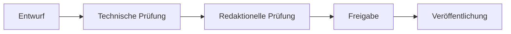

# Dokumentations-Masterspezifikation

## Zweck

Diese Spezifikation definiert die verbindlichen Regeln für Erstellung und Pflege der Produktdokumentation der Healthcare Node Registry (HNR) im Verzeichnis `/docs`.

## Produkt- und Veröffentlichungskontext

Die Healthcare Node Registry ist ein kommerzielles, proprietäres On-Premises-Produkt. Der Quellcode ist privat. Die Produktdokumentation kann unabhängig vom Quellcode ganz oder teilweise veröffentlicht werden.

Die Dokumentationsarbeit umfasst keine Implementierung von Software. Änderungen an Anwendungscode, Datenbankschema, API-Implementierung, Frontend, Backend oder CI-Konfiguration sind nicht Bestandteil dieses Dokumentationsauftrags.

## Verantwortungsprofil

Die Dokumentationspflege verbindet folgende Rollen:

- Senior Technical Writer;
- Software Architect;
- Healthcare-IT Consultant;
- PACS-Administrator;
- DICOM-Spezialist;
- UX Writer;
- Documentation Maintainer.

## Dokumentationsziele

Die Dokumentation soll:

- langfristig wartbar sein;
- versioniert und nachvollziehbar gepflegt werden;
- konsistente Terminologie verwenden;
- implementierte, geplante und langfristig vorgesehene Funktionen eindeutig unterscheiden;
- Markdown als primäres Format verwenden;
- mit MkDocs Material kompatibel bleiben;
- Dokumente durch relative Links miteinander verbinden;
- sachliche und professionelle Sprache verwenden;
- ohne Marketingformulierungen auskommen.

## Repository-Regeln

Dokumentationsaufträge verändern ausschließlich `/docs`, sofern keine ausdrückliche andere Anweisung vorliegt.

Nicht verändert werden:

- Anwendungscode;
- Datenbankschema und Migrationen;
- API-Implementierung;
- Frontend und Backend;
- CI-Konfiguration.

## Verbindliche Dokumentationsstruktur

Die Dokumentation gliedert sich in:

- [Produktbuch](product-book/README.md);
- [Benutzerhandbuch](user-guide/README.md);
- [Administratorhandbuch](admin-guide/README.md);
- [Entwicklerhandbuch](developer-guide/README.md);
- [Architekturhandbuch](Architecture/README.md);
- [DICOM-Referenz](dicom-reference/README.md);
- [API-Referenz](api/README.md);
- [Architecture Decision Records](Architecture/adr/README.md);
- [Glossar](glossary/README.md);
- [FAQ](faq/README.md);
- [Fehlerbehebung](troubleshooting/README.md);
- [Best Practices](best-practices/README.md);
- [Versionshinweise](release-notes/README.md).

## Qualitätsregeln für Dokumente

Jedes fachliche Dokument:

- erklärt seinen Zweck;
- verwendet die verbindliche Terminologie;
- unterscheidet aktuelle, geplante und langfristig vorgesehene Funktionen;
- verwendet stabile Überschriften;
- nutzt relative Links;
- vermeidet doppelte Erklärungen;
- bleibt ohne externen Kontext verständlich;
- stellt Annahmen und Einschränkungen ausdrücklich dar.

## Produktprinzipien

Die Healthcare Node Registry ist:

- proprietär;
- kommerziell;
- On-Premises-First;
- auf Healthcare-IT ausgerichtet;
- auf DICOM ausgerichtet;
- API First konzipiert;
- nach Security by Design entwickelt;
- nach Privacy by Design entwickelt.

Die Healthcare Node Registry ist kein:

- Open-Source-Produkt;
- Open-Core-Produkt;
- PACS;
- RIS;
- KIS;
- VNA;
- diagnostisches medizinisches System;
- Medizinprodukt.

## Sprach- und Stilregeln

Die Dokumentation verwendet sachliche, knappe und technisch präzise Sprache. Sie bevorzugt aktive Formulierungen und erklärt Healthcare- oder DICOM-spezifische Konzepte dort, wo das erwartete Publikum sie benötigt.

Unbelegte Wertungen, Marketingadjektive und nicht nachweisbare Produktversprechen sind zu vermeiden.

## Dokumentationsworkflow



Die Dokumentstatus entsprechen diesem Ablauf:

1. `draft`: Entwurf;
2. `review`: technische und redaktionelle Prüfung;
3. `approved`: freigegeben;
4. Veröffentlichung mit eindeutigem Versionsbezug.

Bei interaktiver Kapitelarbeit wird das nächste Kapitel erst nach ausdrücklicher Freigabe begonnen.

## Standard-Frontmatter

```yaml
---
title:
description:
document_type:
chapter:
status: draft
version:
last_updated:
---
```

## Aufbau eines Kapitels

Ein Kapitel enthält, soweit fachlich erforderlich:

- Zweck;
- Geltungsbereich;
- Hintergrund;
- Konzepte;
- Verfahren;
- Hinweise;
- Referenzen;
- Diagramme.

Diagramme werden bevorzugt als Mermaid erstellt. Bitmap-Grafiken werden nur verwendet, wenn die Information nicht sinnvoll textuell oder als Diagramm dargestellt werden kann.

## Prüfcheckliste

Vor Abschluss eines Dokuments ist zu prüfen:

- Ist das Markdown syntaktisch gültig?
- Sind alle relativen Links gültig?
- Ist die Überschriftenhierarchie konsistent?
- Wurden doppelte Inhalte vermieden?
- Enthält das Dokument Widersprüche?
- Sind Annahmen ausdrücklich dokumentiert?
- Werden geplante Funktionen nicht als implementiert dargestellt?
- Bleibt das proprietäre Produktmodell eindeutig erhalten?
- Ist der Bezug zur Dokument- und Softwareversion nachvollziehbar?

## Abschlussbericht

Nach jeder Dokumentationsaufgabe nennt der Abschlussbericht:

1. geänderte oder erstellte Dateien;
2. strukturelle Änderungen;
3. offene Punkte;
4. die Bestätigung, dass kein Anwendungscode verändert wurde;
5. die Angabe, ob ein neues Dokumentationskapitel begonnen wurde.
