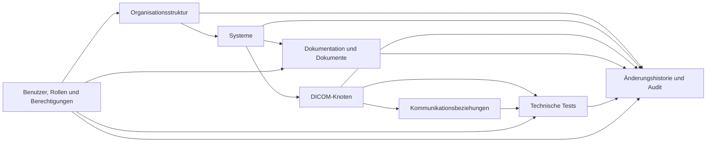

# Produktkonzept und Funktionsumfang

## Zweck

Dieses Kapitel beschreibt das fachliche Produktkonzept der Healthcare Node Registry (HNR). Es ordnet die vorhandenen Arbeitsbereiche in einen gemeinsamen Produktzusammenhang ein und trennt den aktuellen Funktionsumfang von geplanten Ausbaustufen und langfristigen Entwicklungsrichtungen.

Die grundlegende Vision, Zielgruppen und Produktprinzipien sind in [Kapitel 1: Produktvision](01-product-vision.md) beschrieben. Dieses Kapitel konkretisiert, welche fachlichen Aufgaben das Produkt aktuell unterstützt.

## Geltungsbereich

Das Kapitel beschreibt Produktfunktionen auf fachlicher Ebene. Es ist keine Bedienungs-, Installations- oder API-Anleitung. Verbindliche Verfahren werden später im [Benutzerhandbuch](../user-guide/README.md), [Administratorhandbuch](../admin-guide/README.md) und in der [API-Referenz](../api/README.md) dokumentiert.

Die Einstufung als aktuell basiert auf dem zum Aktualisierungsdatum im privaten Repository erkennbaren Produktstand. Ein als geplant oder langfristig bezeichnetes Thema ist nicht Bestandteil des verfügbaren Funktionsumfangs.

## Fachliches Produktkonzept

Die HNR verbindet drei Perspektiven auf eine medizinische Kommunikationsinfrastruktur:

1. **Organisatorischer Kontext:** Organisationen, Standorte und Abteilungen beschreiben, wo Systeme fachlich und betrieblich eingeordnet sind.
2. **Technischer Kommunikationskontext:** Systeme, DICOM-Knoten und Kommunikationsbeziehungen beschreiben beteiligte Komponenten und Kommunikationswege.
3. **Nachweis- und Betriebskontext:** Dokumentation, Dokumente, Tests, Änderungshistorie, Audit und Berechtigungen unterstützen Pflege, Prüfung und Nachvollziehbarkeit.

Die Bereiche sind keine voneinander unabhängigen Inventarlisten. Verknüpfungen und gemeinsame Navigation sollen den Kontext eines Objekts erhalten.

## Statusklassen des Funktionsumfangs

| Status | Bedeutung |
|---|---|
| Aktuell | Im erkennbaren Produktstand implementiert und durch bestehende Produkt- oder technische Dokumentation belegt |
| Geplant | Als nächster oder späterer Ausbau dokumentiert, aber nicht als verfügbar zu behandeln |
| Langfristig | Strategische Entwicklungsrichtung ohne zugesagten Zeitpunkt oder verbindlichen Umfang |

## Aktueller Funktionsumfang

### Dashboard

Das Dashboard bietet einen zentralen Einstieg in die Registry. Es zeigt zusammengefasste Bestands- und Diagnoseinformationen sowie letzte Registry-Änderungen. Es verwendet vorhandene Registry- und Testergebnisse und erfindet keine externen Monitoringdaten.

### Organisationsstruktur

Die Organisationsstruktur bildet Organisationen, Standorte und Abteilungen hierarchisch ab. Anwender können aktive Einheiten auswählen, zugeordnete Systeme betrachten und – abhängig von ihren Berechtigungen – Stammdaten pflegen oder Einheiten archivieren.

Für ausgewählte Organisationseinheiten stehen strukturierte Dokumentation, Dokumente und Änderungshistorie im jeweiligen Kontext zur Verfügung. Weitere Einzelheiten beschreibt die bestehende Dokumentation zur [Organisationsstruktur](../Domain/OrganizationStructure.md).

### Systeme

Systeme bilden technische Anwendungen und Infrastrukturkomponenten ab. Zu den verfügbaren Angaben gehören unter anderem Systemtyp, Status, Host- und Netzwerkangaben, Hersteller- und Produktinformationen sowie die organisatorische Zuordnung.

Ein System-Workspace bündelt Stammdaten, DICOM-Knoten, Kommunikationsbeziehungen, strukturierte Dokumentation, Dokumente und Änderungshistorie. Archivierte Systeme bleiben historisch nachvollziehbar, stehen aber nicht wie aktive Systeme für reguläre Bearbeitungs- und Navigationsvorgänge zur Verfügung.

### DICOM-Knoten

DICOM-Knoten beschreiben Application Entities im Kontext eines registrierten Systems. Sie enthalten insbesondere:

- Namen und AE-Titel;
- Host und Port;
- SCU-/SCP-Rolle;
- Status und TLS-Kennzeichnung;
- unterstützte DICOM-Dienste;
- letzten bekannten Prüfstatus.

Die HNR behandelt einen DICOM-Knoten als fachliches Kommunikationsobjekt und nicht lediglich als Netzwerkadresse. Grundlagen erläutert die [DICOM-Dokumentation](../Healthcare/DICOM.md).

### DICOM-Kommunikationsbeziehungen

Kommunikationsbeziehungen verbinden Quell- und Zielknoten für einen definierten DICOM-Dienst. Unterstützte Modellierungen umfassen Echo, Storage, Modality Worklist, Query sowie vorgesehene Move- und Get-Beziehungen. Die bloße Modellierbarkeit eines Dienstes bedeutet nicht, dass für ihn bereits eine aktive Diagnosefunktion verfügbar ist.

Die Topologie visualisiert registrierte Knoten, Systeme und Kommunikationsbeziehungen. Sie dient der Orientierung und technischen Dokumentation, nicht der automatischen Netzwerkerkennung.

### Diagnose und Tests

Der Test-Workspace führt kontrollierte technische Prüfungen gegen registrierte DICOM-Knoten aus. Aktuell umfasst er:

- Netzwerkprüfung mit DNS-Auflösung, TCP-Verbindung und Antwortzeit;
- DICOM C-ECHO;
- Modality-Worklist-C-FIND;
- PACS Study Root C-FIND;
- kontrollierten synthetischen C-STORE;
- Capability-Matrix durch Association Negotiation;
- serverseitige Analyse bereitgestellter DICOM-Dateien;
- wiederverwendbare Testprofile;
- persistenten Testverlauf;
- bereinigten JSON- und CSV-Export von Diagnoseergebnissen.

Schreibende oder potenziell datenverändernde Prüfungen verwenden strengere Berechtigungen und Bestätigungen. Die Tests ersetzen keine klinische oder herstellerseitige Systemvalidierung. Details und Sicherheitsgrenzen beschreibt der [Diagnose-Workspace](../Healthcare/DiagnosticTestWorkspace.md).

### Strukturierte Dokumentation

Organisationen, Standorte, Abteilungen und Systeme besitzen kontextspezifische Dokumentationssektionen. Der Dokumentationsstand wird anhand definierter Pflichtfelder nachvollziehbar dargestellt. Änderungen werden ohne unkontrollierte Ablage vollständiger Langtexte in der Audit-Metadatenstruktur protokolliert.

### Registry-Dokumente

Die private Dokumentenablage ordnet Dokumente einem Registry-Kontext zu. Der aktuelle Umfang umfasst:

- zentrale Dokumentkategorien;
- Metadaten, Gültigkeitsangaben und Schlagwörter;
- unveränderliche Dateiversionen;
- SHA-256-Prüfsummen und Duplikaterkennung;
- serverseitige Dateityp-, Größen- und Signaturprüfung;
- eine Malware-Scanner-Schnittstelle;
- berechtigungsgeprüften Download;
- abgesicherte PDF-Vorschau;
- Suche, Filter und serverseitige Seitennavigation;
- Archivierung und Audit-Ereignisse.

Die vorhandene Scanner-Schnittstelle ist kein Nachweis, dass in jeder Installation bereits ein produktiver Malware-Scanner angebunden ist. Betriebs- und Sicherheitsgrenzen beschreibt die [Registry-Dokumentation](../Features/registry-documentation.md).

### Änderungshistorie und Audit

Die HNR verwendet eine gemeinsame append-only Ereignisquelle für Registry-Änderungen, Dokumentaktionen, Tests und administrative Vorgänge. Kontextbezogene Historien stehen in Registry-Workspaces zur Verfügung.

Der zentrale Audit-Arbeitsbereich bietet Suche, Filter, Ereignisgruppen, Vorher-/Nachher-Darstellung, Detailansicht, direkte Navigation zu verfügbaren Objekten und CSV-Export. Der Zugriff ist berechtigungsgeprüft. Weitere Einzelheiten enthält die Dokumentation zum [Audit-Workspace](../Features/audit-workspace.md).

### Benutzer, Rollen und Berechtigungen

Die lokale Benutzerverwaltung ist ein Unterbereich der Einstellungen. Der aktuelle Umfang umfasst:

- lokale Benutzerkonten;
- Aktivierung und Deaktivierung;
- administrative Passwortvergabe nach einer zentralen Passwortregel;
- Widerruf bestehender Sitzungen bei Deaktivierung oder Passwortänderung;
- Rollen und Berechtigungen;
- Schutz der Systemadministrator-Rolle und des letzten aktiven Systemadministrators;
- Audit administrativer Änderungen sowie erfolgreicher An- und Abmeldungen.

Autorisierung wird serverseitig durchgesetzt. Die Oberfläche allein ist keine Sicherheitsgrenze. Details enthält die [Dokumentation der Benutzerverwaltung](../Features/UserManagement.md).

### Globale Suche

Die Kopfzeile enthält eine berechtigungsgeprüfte Suche über Organisationsstruktur, Systeme, DICOM-Knoten, Kommunikationsbeziehungen, Dokumente, Testergebnisse, Testprofile und – bei vorhandenem Verwaltungsrecht – Benutzer. Treffer führen in den jeweiligen Workspace. Nicht autorisierte Objektgruppen werden nicht als Suchergebnis ausgegeben.

## Funktionsübergreifende Regeln

### Berechtigungsprüfung

Lesende und schreibende Aktionen werden serverseitig autorisiert. Rollen bündeln vorhandene Berechtigungen. Besonders sensible Aktionen, etwa kontrollierter C-STORE, Dokumentzugriffe oder Benutzerverwaltung, besitzen gesonderte Rechte.

### Archivierung statt unkontrollierter Löschung

Fachliche Registry-Objekte und Dokumente werden grundsätzlich archiviert, wenn ihre historische Nachvollziehbarkeit erhalten bleiben muss. Rollen können nur gelöscht werden, wenn sie nicht mehr zugewiesen und nicht technisch geschützt sind.

### Öffentliche Objektkennungen

Nach außen verwendete Objektverweise nutzen öffentliche Kennungen. Interne relationale Primärschlüssel sind kein stabiler Bestandteil externer Navigation oder zukünftiger Schnittstellen.

### On-Premises-Betrieb

Die Anwendung, Datenbank und privaten Dokumente sind für den kontrollierten lokalen Betrieb ausgelegt. Technische Diagnose erfolgt aus der bereitgestellten Laufzeitumgebung und unterliegt deren Netzwerk- und Sicherheitsgrenzen.

## Geplanter Funktionsumfang

Die folgenden Themen sind dokumentiert, aber noch nicht als vollständig verfügbar zu behandeln:

### Referenzdaten und Verwaltungsoberflächen

Zentrale Pflegeoberflächen für fachliche Referenzdaten können fest hinterlegte Werte schrittweise ersetzen. Kandidaten sind unter anderem Hersteller, Systemtypen, DICOM-Dienste, Dokumentkategorien und Portprofile. Umfang und Datenführerschaft müssen vor der Umsetzung festgelegt werden.

### Feingranulare Diagnoseberechtigungen

Netzwerk, C-ECHO, Modality Worklist und PACS Query besitzen getrennte Berechtigungen. Konfigurierbare Netzwerkfreigaben, Timeouts und Parallelitätsgrenzen bleiben als weitere Härtung vorgesehen.

### Dokumentfreigabe und Aufbewahrung

Dokumentfreigabe, Vier-Augen-Prinzip, verbindliche Aufbewahrungsregeln und ein produktiver Malware-Scan- beziehungsweise Rescan-Prozess sind geplante Ausbaustufen.

### Audit-Aufbewahrung und Integritätsnachweis

Weitergehende Aufbewahrungssteuerung und formale Integritätsnachweise für Audit-Daten sind geplant. Der aktuelle CSV-Export ist nicht mit einem vollständigen Compliance-Archiv gleichzusetzen.

### Verantwortlichkeiten

Eine weitergehende fachliche Modellierung von System- und Betriebsverantwortlichkeiten ist vorgesehen. Bis zu ihrer Umsetzung dürfen Zuständigkeiten nicht aus nicht vorhandenen Datenfeldern abgeleitet werden.

## Langfristige Entwicklungsrichtungen

Langfristig können folgende Themen bewertet werden:

- OIDC, LDAP/Active Directory und bei nachgewiesenem Bedarf SAML;
- Mehrfaktor-Authentisierung;
- eine öffentlich dokumentierte, versionierte Produkt-API;
- abgesicherte DICOM-TLS-Unterstützung für Diagnosefunktionen;
- zusätzliche synthetische Storage-SOP-Klassen;
- weitere DICOM-Funktionen wie C-MOVE oder C-GET nach gesondertem Sicherheitsdesign;
- Auswertungen und Dashboards auf Basis vorhandener Ereignisgruppen;
- kontrollierte Integrationen mit führenden Infrastruktur- oder Identitätssystemen.

Diese Themen sind keine Produktzusage. Sie benötigen jeweils fachliche Priorisierung, Architekturentscheidung, Sicherheitsbewertung, Implementierung, Tests und Dokumentationsfreigabe.

## Bewusste Abgrenzungen

Die HNR verarbeitet technische Infrastrukturinformationen. Sie ist kein PACS, RIS, KIS oder VNA und übernimmt keine klinische Befundung. Sie ist weder diagnostische Software noch ein Medizinprodukt.

Die HNR ersetzt keine allgemeine CMDB, kein IP Address Management und kein umfassendes Monitoring. Discovery oder Integrationen dürfen langfristig ergänzen, aber nicht ohne festgelegte Datenführerschaft eine zweite Wahrheit erzeugen. Die vollständige strategische Abgrenzung beschreibt [Kapitel 1](01-product-vision.md#abgrenzung-zu-netbox-und-klassischen-cmdb-systemen).

## Abhängigkeiten zwischen Arbeitsbereichen

| Arbeitsbereich | Benötigt | Liefert Kontext für |
|---|---|---|
| Organisationsstruktur | keine fachliche Registry-Voraussetzung | Systeme, Dokumentation, Dokumente, Audit |
| Systeme | Organisation | DICOM-Knoten, Dokumentation, Tests |
| DICOM-Knoten | System | Topologie, Beziehungen, Tests |
| Kommunikationsbeziehungen | mindestens Quell- und Zielknoten | Topologie und technische Analyse |
| Tests | registrierter DICOM-Knoten und Berechtigung | Testverlauf, Audit, Dashboard |
| Dokumente | Registry-Kontext und Berechtigung | Betrieb, Historie und Audit |
| Benutzerverwaltung | administrative Berechtigung | autorisierter Zugriff auf alle Arbeitsbereiche |

## Hinweise zur Nutzung dieses Kapitels

Dieses Kapitel ist eine fachliche Umfangsübersicht. Detaillierte Bedienabläufe, konkrete Betriebsverfahren, Felddefinitionen und Schnittstellenverträge werden nicht hier dupliziert, sondern in den jeweils zuständigen Handbüchern und Referenzen gepflegt.

Bei Änderungen am Produktumfang müssen mindestens dieses Kapitel, die betroffene Fachdokumentation und die zugehörigen Versionshinweise geprüft werden.

## Referenzen

- [Kapitel 1: Produktvision](01-product-vision.md)
- [Zentrale Dokumentationsübersicht](../README.md)
- [Dokumentations-Masterspezifikation](../DOCUMENTATION_MASTER_SPECIFICATION.md)
- [Architekturüberblick](../Architecture/Overview.md)
- [DICOM-Grundlagen](../Healthcare/DICOM.md)
- [Zugriffskontrolle](../Security/AccessControl.md)
- [Audit-Workspace](../Features/audit-workspace.md)
- [Registry-Dokumentation](../Features/registry-documentation.md)
