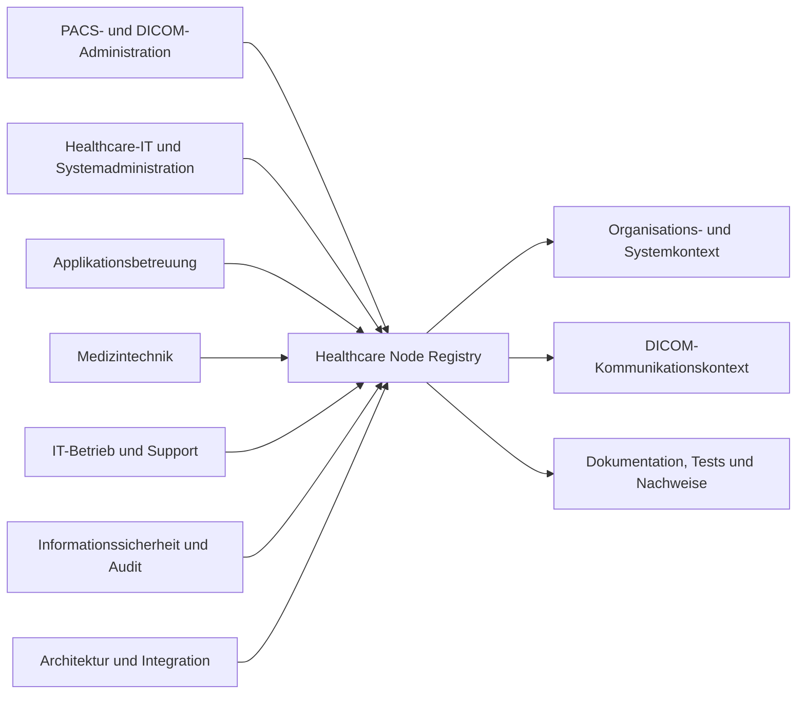

# Zielgruppen und Nutzungsszenarien

## Zweck

Dieses Kapitel beschreibt die Zielgruppen der Healthcare Node Registry (HNR), ihre Informationsbedürfnisse und typische Nutzungsszenarien. Es erläutert, wie unterschiedliche fachliche Rollen mit denselben Registry-Daten arbeiten, ohne daraus automatisch technische Berechtigungen oder fest eingebaute Produktrollen abzuleiten.

Die Produktvision und der Funktionsumfang sind in [Kapitel 1](01-product-vision.md) und [Kapitel 2](02-produktkonzept-und-funktionsumfang.md) beschrieben. Konkrete Bedienabläufe werden später im [Benutzerhandbuch](../user-guide/README.md) dokumentiert.

## Geltungsbereich

Die Zielgruppen beschreiben fachliche Verantwortungsprofile. Sie sind nicht mit den technisch konfigurierbaren Rollen der HNR gleichzusetzen. Eine Person kann mehrere Verantwortungsprofile wahrnehmen; umgekehrt kann ein Profil auf mehrere Personen verteilt sein.

Zugriffe ergeben sich ausschließlich aus den serverseitig geprüften Rollen und Berechtigungen. Dieses Kapitel erweitert das Berechtigungsmodell nicht.

## Gemeinsames Arbeitsmodell

Alle Zielgruppen verwenden denselben dokumentierten Bestand, betrachten ihn jedoch aus unterschiedlichen Perspektiven:

Die HNR unterstützt Zusammenarbeit durch gemeinsame Objektkennungen, Beziehungen, Änderungshistorien und direkte Navigation zwischen fachlich verbundenen Arbeitsbereichen.

## Zielgruppen

### PACS- und DICOM-Administratoren

PACS- und DICOM-Administratoren verwalten und prüfen medizinische Kommunikationsbeziehungen. Sie benötigen insbesondere:

- DICOM-Knoten mit AE-Titel, Host und Port;
- SCU-/SCP-Rollen und unterstützte Dienste;
- Quell-, Ziel- und gegebenenfalls Ziel-AE-Beziehungen;
- System- und Organisationszuordnung;
- technischen Prüfstatus und Testverlauf;
- Dokumente und Änderungshistorie im betroffenen Kontext.

Typische Aufgaben sind die Dokumentation neuer DICOM-Knoten, die Prüfung einer Kommunikationsstörung und die Bewertung, welche registrierten Beziehungen von einer technischen Änderung betroffen sein können.

### Healthcare-IT und Systemadministration

Healthcare-IT und Systemadministration pflegen den technischen Bestand im organisatorischen Zusammenhang. Sie benötigen:

- Organisationen, Standorte und Abteilungen;
- Systemtyp, Status und technische Stammdaten;
- Host-, IP-, Hersteller-, Produkt- und Versionsangaben;
- zugeordnete DICOM-Knoten;
- betriebliche Dokumentation und Dokumente;
- nachvollziehbare Änderungen.

Ihr Schwerpunkt liegt auf konsistenten Systemdaten und dem Zusammenhang zwischen Organisation, Anwendung und technischer Kommunikation.

### Applikationsbetreuung für PACS, RIS, KIS und VNA

Die Applikationsbetreuung betrachtet einzelne Anwendungen und ihre Abhängigkeiten. Sie benötigt:

- System- und DICOM-Konfigurationen;
- Kommunikationspartner und DICOM-Dienste;
- Zuordnung zu Standorten und Abteilungen;
- technische Dokumentation und Herstellerunterlagen;
- Ergebnisse kontrollierter Verbindungs- und Dienstprüfungen.

Die HNR ersetzt dabei weder das betreute PACS, RIS, KIS oder VNA noch deren herstellerspezifische Administrationswerkzeuge.

### Medizintechnik

Die Medizintechnik benötigt eine verständliche Zuordnung medizinisch-technischer Geräte zu Standorten, Systemen und DICOM-Knoten. Relevante Informationen sind:

- organisatorischer Einsatzort;
- technisches System und Gerätedaten;
- AE-Titel und Netzwerkparameter;
- dokumentierte Kommunikationsbeziehungen;
- Betriebs- und Herstellerdokumente;
- bekannte Prüf- und Änderungsinformationen.

Die HNR führt keine medizinische Geräteprüfung durch und trifft keine Aussage zur medizinprodukterechtlichen Freigabe eines Geräts.

### IT-Betrieb und interner Support

IT-Betrieb und Support verwenden die Registry zur Orientierung und technischen Eingrenzung. Sie benötigen schnell auffindbare Informationen zu:

- betroffenem System oder DICOM-Knoten;
- organisatorischem Kontext;
- Host, Port und Kommunikationspartnern;
- letztem Prüfstatus;
- bekannten Dokumenten und Änderungen.

Diagnosefunktionen unterstützen kontrollierte technische Prüfungen. Sie ersetzen weder allgemeines Netzwerkmonitoring noch eine vollständige Störungsmanagement-Plattform.

### Informationssicherheit, Audit und Qualitätsmanagement

Diese Zielgruppe benötigt überwiegend lesenden und nachvollziehbaren Zugriff auf:

- Benutzer, Rollen und Berechtigungen;
- Änderungshistorien und Audit-Ereignisse;
- administrative Sicherheitsereignisse;
- Dokumente, Versionen und Integritätsmerkmale;
- Testergebnisse und Exporte im erlaubten Umfang.

Operative Änderungsrechte ergeben sich nicht aus der fachlichen Prüffunktion. Eine Trennung zwischen Prüfung und Bearbeitung wird über das konfigurierbare Berechtigungsmodell umgesetzt.

### Architektur und Integration

Verantwortliche für Architektur und Integration bewerten Systemgrenzen und Kommunikationsmuster. Sie benötigen:

- eine konsistente Organisations- und Systemübersicht;
- DICOM-Knoten und Kommunikationsbeziehungen;
- Dienste und SCU-/SCP-Rollen;
- Topologie und direkte Abhängigkeiten;
- dokumentierte technische Entscheidungen und Änderungen.

Die HNR liefert hierfür den Healthcare- und DICOM-Kontext. Sie ersetzt keine vollständige Enterprise-Architekturplattform.

### Benutzer- und Rollenadministration

Administrativ berechtigte Personen verwalten lokale Konten, Rollen und Berechtigungen. Ihre Aufgaben umfassen:

- Benutzerkonten anlegen und aktualisieren;
- Konten aktivieren oder deaktivieren;
- Passwörter administrativ setzen;
- Rollen zuweisen;
- kundenspezifische Rollen aus vorhandenen Berechtigungen bilden;
- Schutzregeln für Systemadministratoren beachten;
- administrative Änderungen über das Audit nachvollziehen.

Diese administrative Verantwortung kann organisatorisch mit anderen Zielgruppen kombiniert oder getrennt vergeben werden.

## Fachliche Profile und technische Berechtigungen

Die HNR enthält keine verbindliche Eins-zu-eins-Zuordnung zwischen den beschriebenen Zielgruppen und technischen Rollen. Außer der geschützten Systemadministrator-Rolle können Betreiber eigene Rollen aus vorhandenen Berechtigungen bilden.

| Fachlicher Bedarf | Relevante Berechtigungsbereiche |
|---|---|
| Registry lesen | `registry.view` oder ein gleichwertiges Verwaltungsrecht |
| Registry pflegen | `registry.manage` |
| Audit einsehen | `audit.view` |
| Dokumente verwenden | getrennte Rechte für Anzeige, Upload, Änderung, Archivierung, Download und Versionen |
| Diagnose ausführen | separates Recht `diagnostics.*` je Diagnoseart |
| DICOM-Datei analysieren | `tests.analyze_file` |
| Testergebnisse exportieren | `tests.export` |
| Benutzer verwalten | `users.manage` |
| Rollen verwalten und zuweisen | `roles.manage` |

Die konkrete Rollengestaltung ist eine Betreiberentscheidung. Sie soll dem Prinzip der minimal erforderlichen Berechtigung folgen. Die verbindlichen Regeln beschreibt die [Zugriffskontrolle](../Security/AccessControl.md).

## Aktuelle Nutzungsszenarien

### Ein registriertes Objekt finden

**Ausgangslage:** Eine Person kennt beispielsweise einen Systemnamen, AE-Titel, Host, eine IP-Adresse oder einen Dokumenttitel.

**Ablauf:**

1. Die Person verwendet die globale Suche.
2. Die HNR durchsucht nur die für sie autorisierten Objektgruppen.
3. Die Trefferliste zeigt Objekttyp und fachlichen Kontext.
4. Die Person öffnet den zugehörigen Workspace.
5. Dort stehen abhängig vom Objekt Stammdaten, Beziehungen, Dokumentation, Tests oder Historie zur Verfügung.

**Ergebnis:** Das Objekt wird ohne Kenntnis seiner internen Kennung im fachlichen Kontext geöffnet.

### Ein System und seine DICOM-Kommunikation dokumentieren

**Ausgangslage:** Ein technisches System soll in den dokumentierten Bestand aufgenommen werden.

**Ablauf:**

1. Eine berechtigte Person prüft oder ergänzt Organisation, Standort und Abteilung.
2. Sie legt das System mit verfügbaren technischen Stammdaten an.
3. Sie ergänzt einen oder mehrere DICOM-Knoten mit AE-Titel, Host, Port, Rolle und Diensten.
4. Sie modelliert bekannte Kommunikationsbeziehungen zu vorhandenen Zielknoten.
5. Sie ergänzt strukturierte Dokumentation oder zugehörige Dokumente.
6. Die HNR zeichnet die relevanten Änderungen in der gemeinsamen Ereignisquelle auf.

**Ergebnis:** System, DICOM-Knoten und Kommunikationsbeziehungen sind gemeinsam auffindbar und historisch nachvollziehbar.

Hinweis: Eine eigenständige strukturierte Verantwortlichkeitsfunktion ist geplant. Bis zu ihrer Umsetzung dürfen nicht vorhandene Verantwortlichkeitsangaben nicht vorausgesetzt werden.

### Eine DICOM-Kommunikationsstörung eingrenzen

**Ausgangslage:** Eine registrierte Kommunikation ist nicht verfügbar oder liefert unerwartete Ergebnisse.

**Ablauf:**

1. Die Person sucht den betroffenen DICOM-Knoten oder öffnet ihn im Test-Workspace.
2. Sie prüft die dokumentierten Netzwerk- und DICOM-Parameter.
3. Sie wählt eine für den Dienst geeignete und erlaubte Prüfung.
4. Die HNR führt die Prüfung serverseitig aus.
5. Ergebnis, Einzelschritte, Dauer und bereinigte technische Details werden angezeigt und gespeichert.
6. Die Person vergleicht das Ergebnis mit früheren Testläufen und dokumentierten Änderungen.

**Ergebnis:** Die technische Eingrenzung ist reproduzierbar und dem registrierten Knoten zugeordnet.

Die HNR stellt keine klinische Diagnose und bestätigt nicht die vollständige Funktionsfähigkeit eines medizinischen Systems.

### Eine Modality Worklist prüfen

**Ausgangslage:** Eine Modalität erhält keine oder unerwartete Worklist-Einträge.

**Ablauf:**

1. Eine berechtigte Person wählt einen registrierten Knoten mit dokumentierter Worklist-Unterstützung.
2. Sie prüft AE-Titel, Host, Port und den verwendeten Kommunikationskontext.
3. Sie startet eine kontrollierte Modality-Worklist-C-FIND-Abfrage mit den erforderlichen Suchkriterien.
4. Die HNR zeigt Status, Dauer, Trefferzahl und bereinigte Ergebnisdetails.
5. Der Lauf bleibt im Testverlauf nachvollziehbar.

**Ergebnis:** Die Person kann Netzwerk-, Association- und Abfrageprobleme voneinander abgrenzen, ohne die HNR als klinische Worklist-Anwendung zu verwenden.

### Einen kontrollierten Storage-Test ausführen

**Ausgangslage:** Die Erreichbarkeit eines Storage SCP soll mit einem synthetischen Testobjekt geprüft werden.

**Ablauf:**

1. Eine ausdrücklich berechtigte Person wählt einen geeigneten DICOM-Knoten.
2. Die Oberfläche verlangt eine bewusste Bestätigung.
3. Die HNR erzeugt und überträgt ein kontrolliertes synthetisches Secondary-Capture-Testobjekt.
4. Das Ergebnis wird gespeichert und auditiert.

**Ergebnis:** Der Storage-Pfad kann kontrolliert geprüft werden, ohne ein bereitgestelltes Patientenbild als reguläres Testobjekt zu verwenden.

### Technische Dokumente verwalten

**Ausgangslage:** Ein Vertrag, Betriebshandbuch, Zertifikat oder anderes technisches Dokument soll einem Registry-Objekt zugeordnet werden.

**Ablauf:**

1. Eine berechtigte Person wählt den fachlichen Registry-Kontext.
2. Sie erfasst Dokumentmetadaten und lädt einen erlaubten Dateityp hoch.
3. Die HNR prüft Dateityp, Signatur, Größe, Prüfsumme und den verfügbaren Malware-Scanstatus.
4. Spätere Dateistände werden als unveränderliche Versionen ergänzt.
5. Berechtigte Personen können als sauber bewertete Dateistände herunterladen oder unterstützte PDF-Dateien anzeigen.
6. Upload, Versionierung, Metadatenänderung und Archivierung werden auditiert.

**Ergebnis:** Dokument und Versionen bleiben dem fachlichen Kontext zugeordnet und anhand ihrer Integritätsmerkmale nachvollziehbar.

Ein produktiver Malware-Scanner ist nicht automatisch in jeder Installation verfügbar. Nicht als sauber bewertete Dateien werden nicht regulär freigegeben.

### Eine Änderung nachvollziehen

**Ausgangslage:** Es soll geklärt werden, was sich an einem Objekt geändert hat und wer die Änderung ausgelöst hat.

**Ablauf:**

1. Eine berechtigte Person öffnet die kontextbezogene Historie oder den zentralen Audit-Arbeitsbereich.
2. Sie grenzt Ereignisse über Suche, Zeitraum, Gruppe, Aktion oder Objektkontext ein.
3. Die Detailansicht zeigt vorhandene Vorher-/Nachher-Werte und technische Metadaten.
4. Ist das betroffene Objekt noch aktiv und verfügbar, kann es direkt geöffnet werden.
5. Bei Bedarf wird die gefilterte Audit-Auswahl als CSV exportiert.

**Ergebnis:** Die Änderung ist innerhalb der vorhandenen Audit-Daten nachvollziehbar. Der CSV-Export ersetzt kein formal freigegebenes Langzeitarchiv.

### Benutzerzugriff administrieren

**Ausgangslage:** Eine Person benötigt Zugriff oder ein bestehendes Konto soll gesperrt werden.

**Ablauf:**

1. Eine berechtigte Administration öffnet die Benutzerverwaltung unter Einstellungen.
2. Sie legt das Konto an oder aktualisiert dessen Status.
3. Mit Rollenverwaltungsrecht weist sie geeignete Rollen zu.
4. Bei einer Passwortänderung oder Deaktivierung widerruft die HNR bestehende Sitzungen des Kontos.
5. Die administrative Änderung wird auditiert.

**Ergebnis:** Der Zugriff wird mit vorhandenen Rollen und Berechtigungen gesteuert, ohne eine parallele Berechtigungsarchitektur zu erzeugen.

## Geplante Nutzungsszenarien

Die folgenden Szenarien sind noch nicht als vollständig verfügbar zu behandeln.

### Verantwortlichkeiten strukturiert pflegen

Geplant ist eine eindeutigere Modellierung fachlicher und technischer Verantwortlichkeiten. Erst nach Umsetzung und Dokumentationsfreigabe können Nutzungsszenarien verbindlich auf hinterlegte Verantwortliche verweisen.

### Dokumente formal freigeben

Dokumentfreigabe, Vier-Augen-Prinzip und verbindliche Aufbewahrungsregeln sind geplant. Der aktuelle Dokumentstatus ist nicht mit einem vollständigen formalen Freigabeworkflow gleichzusetzen.

### Externen Support begrenzt autorisieren

Zeitlich oder organisatorisch begrenzte Zugriffe für externe Unterstützung sind eine mögliche spätere Ausbaustufe. Aktuell lassen sich Rollen aus vorhandenen Berechtigungen bilden; eine eigenständige zeitliche Zugriffsbeschränkung ist nicht als verfügbar dokumentiert.

### Änderungsauswirkungen erweitert bewerten

Die aktuelle Topologie und die registrierten Beziehungen unterstützen eine manuelle Bewertung direkter Abhängigkeiten. Eine eigenständige, vollständig berechnete Impact-Analyse ist nicht als aktueller Funktionsumfang dokumentiert.

## Verantwortungsgrenzen

### Datenpflege

Die HNR stellt Strukturen, Validierung und Historie bereit. Die betreibende Organisation bleibt für fachliche Richtigkeit, Aktualität und Freigabe der erfassten Informationen verantwortlich.

### Technische Prüfungen

Ein erfolgreicher Test bestätigt nur den geprüften technischen Vorgang zum jeweiligen Zeitpunkt. Er belegt weder die vollständige Verfügbarkeit eines Systems noch die Korrektheit klinischer Inhalte.

### Informationssicherheit

Die HNR setzt Berechtigungen serverseitig durch. Betreiber bleiben für Rollenkonzept, regelmäßige Zugriffsprüfung, sichere Netzfreigaben und organisatorische Kontrollverfahren verantwortlich.

### Medizinischer und regulatorischer Kontext

Die HNR dokumentiert und prüft technische Kommunikation. Sie ist keine diagnostische Software und kein Medizinprodukt. Ergebnisse dürfen nicht als medizinische Bewertung verwendet werden.

## Zusammenarbeit zwischen Zielgruppen

| Auslöser | Federführendes Profil | Typische Mitwirkung | Nachweis in der HNR |
|---|---|---|---|
| Neues DICOM-System | Healthcare-IT oder PACS-/DICOM-Administration | Applikationsbetreuung, Medizintechnik | Stammdaten, Knoten, Beziehungen, Audit |
| Kommunikationsstörung | PACS-/DICOM-Administration oder Support | Netzwerk-/Systemadministration, Applikationsbetreuung | Testlauf, Konfiguration, Historie |
| Dokumentaktualisierung | fachlich verantwortliche Stelle | Systemadministration, Qualitätsmanagement | Dokumentversion, Prüfsumme, Audit |
| Zugriffsänderung | Benutzer- und Rollenadministration | Informationssicherheit, fachliche Verantwortung | Rollenänderung, Sitzungswiderruf, Audit |
| Audit-Prüfung | Audit oder Informationssicherheit | zuständige Administration | Filter, Ereignisdetails, CSV-Export |

Die Tabelle beschreibt fachliche Zusammenarbeit und keine fest eingebauten Workflow- oder Freigaberollen.

## Hinweise für nachfolgende Handbücher

Das Benutzerhandbuch soll Nutzungsszenarien in konkrete, oberflächenbezogene Verfahren überführen. Es darf dabei nur Funktionen beschreiben, die für die betreffende Softwareversion verfügbar und geprüft sind.

Das Administratorhandbuch soll Berechtigungsplanung, Kontoverwaltung, sichere Diagnosevoraussetzungen, Dokumentablage und betriebliche Kontrollen behandeln. Wiederholungen der fachlichen Zielgruppenbeschreibung sind zu vermeiden.

## Referenzen

- [Kapitel 1: Produktvision](01-product-vision.md)
- [Kapitel 2: Produktkonzept und Funktionsumfang](02-produktkonzept-und-funktionsumfang.md)
- [Dokumentations-Masterspezifikation](../DOCUMENTATION_MASTER_SPECIFICATION.md)
- [Zugriffskontrolle](../Security/AccessControl.md)
- [Diagnose-Workspace](../Healthcare/DiagnosticTestWorkspace.md)
- [Registry-Dokumentation](../Features/registry-documentation.md)
- [Audit-Workspace](../Features/audit-workspace.md)
- [Benutzerverwaltung](../Features/UserManagement.md)
