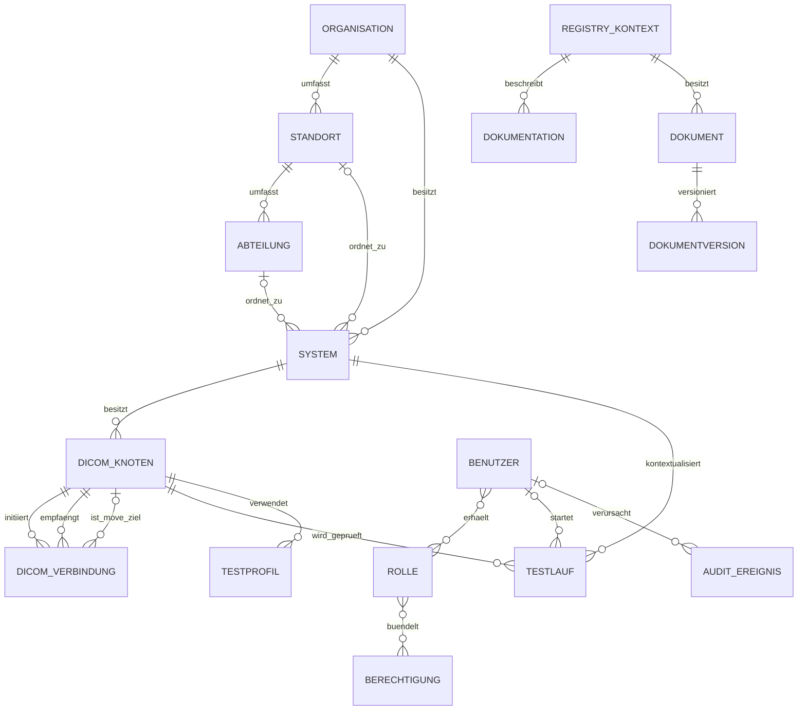

# Fachliches Datenmodell

## Zweck

Dieses Kapitel beschreibt das fachliche Datenmodell der Healthcare Node Registry (HNR). Es erklärt die Bedeutung der zentralen Objekte, ihre Beziehungen und die Regeln, die ihre fachliche Konsistenz sichern.

Das Kapitel ist keine technische Datenbankreferenz. Tabellen, Datentypen, Indizes und Implementierungsdetails werden im [Datenwörterbuch](../Database/DataDictionary.md), in den [Datenbankregeln](../Database/Rules.md) und den zugehörigen Architekturentscheidungen gepflegt.

## Geltungsbereich

Beschrieben wird das aktuell implementierte Kernmodell für:

- Organisationsstruktur;
- Systeme;
- DICOM-Knoten;
- DICOM-Kommunikationsbeziehungen;
- technische Tests und Testprofile;
- strukturierte Dokumentation und Registry-Dokumente;
- Benutzer, Rollen und Berechtigungen;
- Änderungshistorie und Audit.

Geplante Referenzdaten, Verantwortlichkeiten, organisatorische Berechtigungsbereiche und externe Integrationen werden ausdrücklich vom aktuellen Modell getrennt.

## Modellierungsgrundsätze

### Fachobjekte statt unstrukturierter Freitexte

Wiederkehrende technische Sachverhalte werden als eigenständige Objekte und Beziehungen modelliert. Ein DICOM-Knoten ist daher kein Textfeld an einem System und eine Kommunikationsbeziehung ist keine frei formulierte Notiz.

### Trennung von System und DICOM-Knoten

Ein System beschreibt eine technische Anwendung oder Infrastrukturkomponente. Ein DICOM-Knoten beschreibt eine konkrete DICOM Application Entity dieses Systems. Ein System kann keinen, einen oder mehrere DICOM-Knoten besitzen.

Diese Trennung verhindert die fachlich falsche Gleichsetzung von Gerät, Anwendung, Netzwerkadresse und AE-Titel.

### Beziehungen zwischen konkreten Kommunikationspartnern

DICOM-Kommunikationsbeziehungen verbinden konkrete Quell- und Zielknoten. Sie werden nicht lediglich zwischen Organisationen oder Systemen modelliert. Dadurch bleiben Initiator, Empfänger, Dienst und optionale Kommunikationsparameter nachvollziehbar.

### Öffentliche und interne Identität

Fachobjekte verwenden intern relationale Primärschlüssel. Für URLs, Navigation, Audit-Verweise und zukünftige Schnittstellen werden stabile öffentliche Kennungen verwendet. Interne Datenbank-IDs sind kein externer Vertrag.

### Historische Nachvollziehbarkeit

Fachlich relevante Objekte werden archiviert, wenn ihre Historie erhalten bleiben muss. Änderungen erzeugen Ereignisse in der gemeinsamen Audit-Infrastruktur. Dokumentversionen bleiben unveränderlich erhalten.

## Überblick über das Kernmodell



`REGISTRY_KONTEXT` steht in diesem Diagramm für eine Organisation, einen Standort, eine Abteilung oder ein System. Die polymorphe Zuordnung vermeidet vier voneinander getrennte Dokumentations- und Dokumentmodelle.

## Organisationsstruktur

### Organisation

Die Organisation ist das fachliche Wurzelobjekt der Registry-Struktur. Sie gruppiert Standorte und Systeme innerhalb einer Installation.

Eine Organisation ist kein technischer Tenant. Mehrere Organisationen in einer Installation begründen weder getrennte Datenbanken noch eine vollständige Mandantenisolation. Diese Abgrenzung ist in [ADR-0005](../Decisions/ADR-0005-organization-model.md) festgehalten.

Zu den wesentlichen aktuellen Angaben gehören Name, optionale Kurzbezeichnung, Beschreibung und Archivierungszeitpunkt.

### Standort

Ein Standort gehört genau zu einer Organisation. Er bildet einen organisatorischen oder räumlichen Einsatzkontext ab und kann Abteilungen enthalten.

Zu den aktuellen Angaben gehören Name, optionaler Code, Anschrift, Land, Zeitzone, Beschreibung und Archivierungszeitpunkt. Der Name ist innerhalb seiner Organisation eindeutig.

### Abteilung

Eine Abteilung gehört genau zu einem Standort. Sie beschreibt eine fachliche oder organisatorische Einheit, beispielsweise Radiologie oder Kardiologie.

Zu den aktuellen Angaben gehören Name, optionaler Code, Fachgebiet, Beschreibung und Archivierungszeitpunkt. Der Name ist innerhalb seines Standorts eindeutig.

### Hierarchieregeln

```text
Organisation
└── Standort
    └── Abteilung
```

Die Hierarchie beschreibt fachliche Zugehörigkeit. Sie ist keine Abbildung einer vollständigen Unternehmensorganisation und enthält aktuell keine eigenständigen Teams oder strukturierten Verantwortlichkeiten.

## Systeme

Ein System beschreibt eine physische oder logische technische Komponente im Healthcare-IT-Kontext, beispielsweise PACS, RIS, KIS, VNA, Modalität, Viewer, Server oder Storage-Komponente.

### Organisatorische Zuordnung

Jedes System gehört zu genau einer Organisation. Standort und Abteilung sind optional. Wenn sie verwendet werden, müssen sie fachlich zur gewählten Organisationsstruktur passen; die Anwendung validiert diese Zuordnung bei schreibenden Vorgängen.

### Stammdaten

Das aktuelle Systemmodell umfasst insbesondere:

- Name, Systemtyp und Verwaltungsstatus;
- ein oder mehrere Netzwerkinterfaces mit Bezeichnung, Hostname, FQDN und IP-Adresse sowie einem Primärinterface;
- Hersteller, Produkt, Modell und Version;
- Betriebssystem und Betriebssystemversion;
- Serien- und Inventarnummer;
- Beschreibung und interne Hinweise;
- Archivierungszeitpunkt.

Systemtyp und Status stammen aktuell aus zentral in der Anwendung bereitgestellten Auswahlwerten. Eine administrierbare Referenzdatenoberfläche ist geplant und nicht Teil des gegenwärtigen Datenmodells.

Die früher direkt am System gepflegten Felder für Hostname, FQDN und IP-Adresse bleiben während der Übergangsphase als Spiegel des primären Netzwerkinterfaces erhalten. Neue Pflege erfolgt über die Interface-Liste im Netzwerk-Reiter.

### Status und Archivierung

Der aktuelle Systemstatus beschreibt die dokumentierte betriebliche Einordnung, etwa aktiv, geplant, in Wartung oder inaktiv. Er ist kein automatisch gemessener Online- oder Health-Status.

Archivierung ist davon getrennt. Ein inaktives System kann weiterhin ein aktiver Registry-Datensatz sein; ein archiviertes System wird aus regulären aktiven Arbeitsabläufen entfernt und bleibt historisch nachvollziehbar.

## DICOM-Knoten

Ein DICOM-Knoten repräsentiert eine konkrete DICOM Application Entity und gehört genau zu einem System.

### Identität eines Knotens

Die fachliche und technische Identität wird durch mehrere Angaben beschrieben:

- verständlicher Name;
- AE-Titel;
- Host;
- Port;
- zugehöriges System.

Der AE-Titel wird normalisiert und auf die DICOM-gerechte Maximallänge begrenzt. Die Kombination aus System, AE-Titel, Host und Port ist im aktuellen Modell eindeutig.

### Rolle und Dienste

Die Rolle beschreibt, ob der Knoten als SCU, SCP oder in beiden Rollen dokumentiert ist. Unterstützte Dienste werden aktuell als explizite Merkmale am Knoten geführt:

- Verification beziehungsweise Echo;
- Storage;
- Query;
- Retrieve;
- Storage Commitment;
- Modality Performed Procedure Step (MPPS);
- Modality Worklist.

Diese Merkmale dokumentieren die konfigurierte oder bekannte Fähigkeit. Sie sind nicht automatisch das Ergebnis einer aktuellen technischen Messung.

### Prüfstatus

Zeitpunkt, Status, Dauer und Meldung der letzten C-ECHO-bezogenen Prüfung können am Knoten zusammengefasst werden. Vollständige Diagnoseergebnisse werden als eigenständige Testläufe gespeichert.

Der letzte Prüfstatus ist eine zeitpunktbezogene technische Beobachtung. Er darf nicht als dauerhafter Gesamtzustand des Systems interpretiert werden.

## DICOM-Kommunikationsbeziehungen

Eine DICOM-Kommunikationsbeziehung modelliert einen gerichteten Kommunikationspfad zwischen registrierten DICOM-Knoten.

### Beteiligte Knoten

- Der Quellknoten initiiert die DICOM Association.
- Der Zielknoten nimmt die Association entgegen.
- Für C-MOVE kann optional ein dritter Knoten als Bildziel dokumentiert werden.

### Dienst

Das aktuelle Modell kennt die Dienste Echo, Store, Worklist, Query, Move und Get. Ein Dienst im Beziehungsmodell bedeutet nicht, dass die HNR bereits für jeden Dienst eine ausführbare Diagnose bereitstellt.

### Optionale Überschreibungen

Calling AE-Titel, Called AE-Titel und Zielport können für eine konkrete Beziehung abweichend dokumentiert werden. Ohne Überschreibung gelten die Angaben der beteiligten Knoten.

### Weitere Merkmale

Eine Beziehung enthält Name, Status, TLS-Kennzeichnung, Testfreigabe, Beschreibung, Hinweise und Archivierungszeitpunkt. Quellknoten, Zielknoten und Dienst bilden im aktuellen Modell einen eindeutigen Kommunikationspfad.

Die zugrunde liegende Modellentscheidung beschreibt [ADR-0006](../Decisions/ADR-0006-endpoint-and-dicom-model.md).

## Technische Tests

### Testlauf

Ein Testlauf ist das unveränderliche Ergebnis einer konkreten technischen Prüfung. Er gehört zu einem DICOM-Knoten und dem zugehörigen System. Ein ausführender Benutzer kann zugeordnet sein.

Ein Testlauf umfasst insbesondere:

- öffentliche Kennung und Testtyp;
- Start- und Endzeitpunkt;
- Status und Dauer;
- Zielhost und Zielport;
- verwendete AE-Titel;
- Zusammenfassung und strukturierte Einzelschritte;
- bereinigte Details, Warnungen und Fehler.

Testläufe sind historische Beobachtungen. Eine spätere Prüfung überschreibt frühere Ergebnisse nicht.

### Testprofil

Ein Testprofil speichert wiederverwendbare Konfiguration für einen registrierten DICOM-Knoten. Es enthält Testtyp, optionale Beschreibung, Calling AE-Titel, Timeout, testspezifische Konfiguration, Aktivierungsstatus und Archivierungszeitpunkt.

Ein Testprofil ist kein Zeitplan und führt sich nicht selbstständig aus. Automatisierte regelmäßige Ausführung ist nicht als aktueller Funktionsumfang dokumentiert.

## Strukturierte Dokumentation

Strukturierte Dokumentation gehört zu genau einem Registry-Kontext. Sektionen und Inhalte werden kontextspezifisch gepflegt. Der aktualisierende Benutzer und der Änderungszeitpunkt bleiben zugeordnet.

Die Vollständigkeitsanzeige bewertet definierte Pflichtfelder. Sie bestätigt nicht automatisch die fachliche Richtigkeit oder formale Freigabe eines Inhalts.

## Registry-Dokumente

### Dokument

Ein Registry-Dokument gehört zu einer Organisation, einem Standort, einer Abteilung oder einem System. Es enthält fachliche Metadaten wie Titel, Beschreibung, Kategorie, Sichtbarkeit, Status, Gültigkeitszeitraum, Vertragsreferenz und Schlagwörter.

Das Dokument ist der veränderbare fachliche Rahmen für seine unveränderlichen Dateiversionen.

### Dokumentversion

Jeder Upload erzeugt eine eigenständige Version. Zu den wesentlichen Merkmalen gehören:

- fortlaufende Versionsnummer;
- Original- und interner Dateiname;
- MIME-Typ und Dateierweiterung;
- Dateigröße und SHA-256-Prüfsumme;
- Storage-Pfad;
- Malware-Scanstatus und optionale Meldung;
- Änderungshinweis, Uploader und Uploadzeitpunkt.

Das Dokument verweist auf genau eine aktuelle Version. Frühere Versionen bleiben erhalten. Eine Version kann nicht nachträglich einem anderen Dokument zugeordnet werden. Die vollständigen Integritätsregeln beschreibt die [Architektur der Dokumentenablage](../Architecture/registry-document-storage.md).

## Identität und Zugriff

### Benutzer

Ein Benutzer besitzt eine öffentliche Kennung, Namen, eindeutige E-Mail-Adresse, Passwort-Hash und Aktivierungsstatus. Ein deaktivierter Benutzer kann sich nicht regulär anmelden; vorhandene Sitzungen werden beim administrativen Deaktivieren widerrufen.

### Rollen und Berechtigungen

Benutzer und Rollen stehen in einer n:m-Beziehung. Rollen bündeln Berechtigungen ebenfalls über eine n:m-Beziehung. Damit können Betreiber eigene Rollen aus den vorhandenen Berechtigungen zusammensetzen.

Die geschützte Systemadministrator-Rolle bleibt ein technischer Sonderfall. Eine zweite Rollen- oder Berechtigungsarchitektur existiert nicht.

### Sitzungen

Die Webanwendung verwendet serverseitige Sitzungen. Sitzungen sind technische Authentisierungsobjekte und keine fachlichen Registry-Objekte. Sie können bei sicherheitsrelevanten administrativen Änderungen gezielt widerrufen werden.

## Änderungshistorie und Audit

Ein Audit-Ereignis beschreibt eine eingetretene fachliche, technische oder administrative Aktion. Es enthält unter anderem:

- eindeutige Ereigniskennung und Ereignistyp;
- Akteurtyp;
- Typ und öffentliche Kennung des betroffenen Objekts, soweit vorhanden;
- strukturierte Metadaten;
- Ereigniszeitpunkt.

Audit-Ereignisse bilden eine append-only Ereignisquelle. Sie ersetzen keine aktuellen Fachobjekte, sondern verweisen auf deren Änderungen und Zustandsübergänge. Ereignisgruppen dienen der Filterung und späteren Auswertung, verändern aber nicht den fachlichen Ereignistyp.

## Zentrale Beziehungsregeln

| Objekt | Pflichtbeziehung | Optionale Beziehung |
|---|---|---|
| Standort | Organisation | keine |
| Abteilung | Standort | keine |
| System | Organisation | Standort, Abteilung |
| DICOM-Knoten | System | keine |
| DICOM-Verbindung | Quell- und Zielknoten | Destination-Knoten für C-MOVE |
| Testlauf | DICOM-Knoten und System | ausführender Benutzer |
| Testprofil | DICOM-Knoten | erstellender Benutzer |
| Strukturierte Dokumentation | Registry-Kontext | aktualisierender Benutzer |
| Dokument | Registry-Kontext | aktuelle Dokumentversion |
| Dokumentversion | Dokument und Uploader | keine |
| Benutzer | keine fachliche Elternbeziehung | Rollen |
| Rolle | keine fachliche Elternbeziehung | Benutzer und Berechtigungen |
| Audit-Ereignis | Ereignistyp und Zeitpunkt | Akteur und Objektverweis |

## Lebenszyklus und Löschregeln

### Aktive und archivierte Fachobjekte

Organisationen, Standorte, Abteilungen, Systeme, DICOM-Knoten, DICOM-Verbindungen, Testprofile und Registry-Dokumente verwenden Archivierung für den fachlichen Lebenszyklus. Archivierte Objekte bleiben für Historie und Audit grundsätzlich referenzierbar, werden aber nicht wie aktive Objekte verwendet.

### Abhängige Objekte

Restriktive Beziehungen verhindern, dass Eltern- oder Kommunikationsobjekte unkontrolliert gelöscht werden, solange abhängige Datensätze existieren. Fachliche Archivierungsregeln ergänzen diese Datenbankintegrität.

### Unveränderliche Nachweise

Testläufe, Audit-Ereignisse und Dokumentversionen dienen als historische Nachweise. Ihre Bedeutung beruht darauf, dass spätere Zustände frühere Ergebnisse nicht überschreiben.

## Statusbegriffe

Unterschiedliche Statusangaben dürfen nicht vermischt werden:

| Statusart | Aussage |
|---|---|
| Verwaltungsstatus | dokumentierte betriebliche Einordnung eines Systems, Knotens oder einer Beziehung |
| Archivierungsstatus | Teilnahme am aktiven Registry-Bestand |
| Prüfstatus | Ergebnis einer konkreten technischen Prüfung zu einem Zeitpunkt |
| Dokumentstatus | fachlicher Lebenszyklus eines Dokuments |
| Scanstatus | technisches Ergebnis der Dateiprüfung |
| Benutzerstatus | Zulässigkeit der lokalen Anmeldung |

Bezeichnungen wie „online“, „gesund“ oder „erreichbar“ dürfen nicht aus reinen Stammdaten abgeleitet werden. Eine erfolgreiche Einzelprüfung ist kein permanenter Live-Status.

## Geplante Modellerweiterungen

Die folgenden Modellbereiche sind geplant oder langfristig vorgesehen und nicht als aktuell verfügbar zu behandeln:

- strukturierte technische und fachliche Verantwortlichkeiten;
- administrierbare Referenzdaten für Hersteller, Systemtypen, Dienste, Kategorien oder Portprofile;
- organisatorische Berechtigungsbereiche;
- formale Dokumentfreigaben und Aufbewahrungsregeln;
- externe Identitäten und Verzeichniszuordnungen;
- stabile Verträge für eine öffentlich dokumentierte Produkt-API;
- zusätzliche DICOM-Diagnose- und Integrationsobjekte nach gesondertem Sicherheitsdesign.

Erweiterungen sollen das vorhandene Kernmodell ergänzen. Sie dürfen Organisation, System, DICOM-Knoten oder Kommunikationsbeziehung nicht durch parallele Fachobjekte mit gleicher Bedeutung duplizieren.

## Bekannte Abgrenzungen

- Mehrere Organisationen stellen keine technische Multi-Tenancy dar.
- Ein DICOM-Knoten ist kein vollständiges physisches Gerätemodell.
- Eine Kommunikationsbeziehung ist keine automatisch erkannte Live-Verbindung.
- Ein Prüfstatus ist kein Monitoringzustand.
- Ein Registry-Dokument ist keine klinische Patientenakte.
- Ein Benutzerprofil ist keine organisatorische Personalakte.
- Audit-Daten sind kein Ersatz für die jeweils aktuellen Fachobjekte.

## Hinweise für nachfolgende Dokumentation

Das Benutzerhandbuch verwendet die hier definierten Fachbegriffe, beschreibt jedoch keine Datenbanktabellen. Das Administratorhandbuch ergänzt betriebliche Integritäts-, Sicherungs- und Aufbewahrungsregeln. Das Architekturhandbuch erklärt die technische Umsetzung und verweist auf dieses Kapitel als fachliche Grundlage.

Neue Fachobjekte benötigen vor ihrer Dokumentation eine klare Bedeutung, Beziehungen, Lebenszyklusregeln, Berechtigungsgrenzen und Abgrenzung zu bestehenden Objekten.

## Referenzen

- [Kapitel 1: Produktvision](01-product-vision.md)
- [Kapitel 2: Produktkonzept und Funktionsumfang](02-produktkonzept-und-funktionsumfang.md)
- [Kapitel 3: Zielgruppen und Nutzungsszenarien](03-zielgruppen-und-nutzungsszenarien.md)
- [Organisationsstruktur](../Domain/OrganizationStructure.md)
- [ADR-0005: Organisationsmodell](../Decisions/ADR-0005-organization-model.md)
- [ADR-0006: Endpoint- und DICOM-Modell](../Decisions/ADR-0006-endpoint-and-dicom-model.md)
- [Statusmodelle](../Database/StatusModels.md)
- [Datenwörterbuch](../Database/DataDictionary.md)
- [Dokumentenablage](../Architecture/registry-document-storage.md)
- [Audit-Architektur](../Architecture/audit-history.md)
