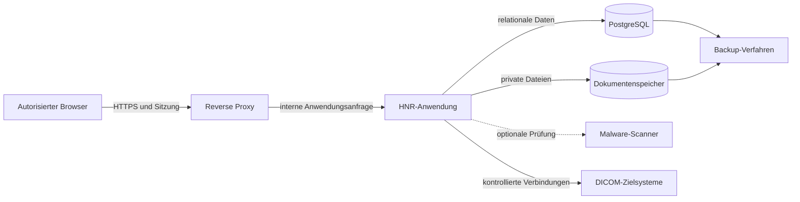

# Sicherheits- und Datenschutzkonzept

## Zweck

Dieses Kapitel beschreibt das Sicherheits- und Datenschutzkonzept der Healthcare Node Registry (HNR) auf Produktebene. Es erklärt Schutzbedarf, Vertrauensgrenzen, vorhandene Kontrollen und die Aufgabenteilung zwischen Produkt und Betreiber.

Technische Einzelheiten werden nicht dupliziert. Maßgeblich bleiben das [Bedrohungsmodell](../Security/ThreatModel.md), die [Zugriffskontrolle](../Security/AccessControl.md), das [Authentisierungskonzept](../Security/Authentication.md) und die weiteren referenzierten Sicherheitsdokumente.

## Geltungsbereich

Das Konzept umfasst:

- Browserzugriff und Webanwendung;
- lokale Benutzer, Rollen, Berechtigungen und Sitzungen;
- Registry- und DICOM-Infrastrukturdaten;
- DICOM-Diagnosefunktionen;
- strukturierte Dokumentation und private Dokumentablage;
- technische Protokolle, Änderungshistorie und Audit;
- Exporte, Backups und spätere Integrationsgrenzen.

Das Kapitel ist keine Rechtsberatung, kein Penetrationstest und keine installationsspezifische Sicherheitsfreigabe.

## Sicherheitsziele

### Vertraulichkeit

Nur autorisierte Personen dürfen Registry-Daten, Dokumente, Testergebnisse, Audit-Ereignisse und administrative Informationen einsehen oder exportieren.

### Integrität

Fachobjekte, Beziehungen, Rollen, Dokumente und Nachweise müssen vor unbemerkter oder unkontrollierter Veränderung geschützt werden. Relationale Regeln, serverseitige Validierung, Berechtigungsprüfung, Prüfsummen und Audit unterstützen dieses Ziel.

### Verfügbarkeit

Die HNR soll innerhalb der vom Betreiber bereitgestellten On-Premises-Umgebung zuverlässig nutzbar und wiederherstellbar sein. Hochverfügbarkeit ist keine alleinige Anwendungseigenschaft; sie hängt von Deployment, Datenbank, Storage, Netzwerk und Betriebsprozessen ab.

### Nachvollziehbarkeit

Relevante fachliche, technische und administrative Aktionen sollen einem Zeitpunkt, Objekt und – soweit vorhanden – Akteur zugeordnet werden können. Audit-Ereignisse sind append-only ausgelegt.

### Datenminimierung

Die HNR verarbeitet nur Informationen, die für technische Dokumentation, Verwaltung und Prüfung erforderlich sind. Patientendaten gehören nicht zum regulären Produktzweck.

## Schutzbedarf

Auch ohne reguläre Speicherung klinischer Patientendaten enthält die HNR sicherheitsrelevante Informationen.

| Informationsart | Beispiele | Schutzinteresse |
|---|---|---|
| Infrastruktur | Hostnamen, IP-Adressen, Ports, Systemtypen | Vertraulichkeit, Integrität |
| DICOM-Konfiguration | AE-Titel, SCU-/SCP-Rollen, Dienste, Beziehungen | Vertraulichkeit, Integrität |
| Identitäten und Zugriffe | Benutzer, Rollen, Berechtigungen, Sitzungen | Vertraulichkeit, Integrität |
| Technische Nachweise | Testläufe, Fehlerdetails, Audit-Ereignisse | Integrität, Nachvollziehbarkeit |
| Dokumente | Verträge, Betriebshandbücher, Zertifikate, Conformance Statements | Vertraulichkeit, Integrität |
| Betriebsdaten | Logs, Konfiguration, Backups, Exporte | Vertraulichkeit, Verfügbarkeit |
| Geheimnisse | Passwörter, Schlüssel, Verbindungsdaten | besonders hohe Vertraulichkeit |

Der konkrete Schutzbedarf kann je Installation höher sein und muss vom Betreiber bewertet werden.

## Sicherheitsprinzipien

### Security by Design

Sicherheitskontrollen sind Bestandteil der Fach- und Anwendungsarchitektur. Sie werden nicht ausschließlich der Oberfläche oder dem umgebenden Netzwerk überlassen.

### Privacy by Design und Default

Patientendaten sind keine Pflichtangaben und kein regulärer Registry-Inhalt. Freitexte, Uploads, technische Testparameter und Exporte müssen datensparsam verwendet werden. Lokale Verarbeitung und restriktive Standardentscheidungen begrenzen unnötige Offenlegung.

### Default Deny

Nicht ausdrücklich erlaubte Aktionen werden abgewiesen. Die Anzeige oder Ausblendung einer Schaltfläche ist keine Sicherheitsentscheidung; maßgeblich ist die serverseitige Autorisierung.

### Minimale Berechtigung

Benutzer erhalten nur die für ihre Aufgaben erforderlichen Rechte. Sensible Aktionen wie Benutzerverwaltung, Rollenänderung, Dokumentdownload, Export oder kontrollierter C-STORE besitzen getrennte Berechtigungen.

### Defense in Depth

Validierung, Policies, Datenbankregeln, private Speicherung, Netzwerksegmentierung, Audit und Backups ergänzen einander. Keine einzelne Kontrolle ersetzt alle anderen Schutzmaßnahmen.

### Sichere lokale Kontrolle

Die HNR ist On-Premises-First. Es besteht keine verpflichtende externe Telemetrie. Externe Dienste und Integrationen müssen ausdrücklich konfiguriert, bewertet und dokumentiert werden.

## Vertrauensgrenzen

Jeder Übergang ist eine Vertrauensgrenze:

1. Browser zum Reverse Proxy;
2. Reverse Proxy zur Anwendung;
3. Anwendung zur Datenbank;
4. Anwendung zum privaten Dokumentenspeicher;
5. Anwendung zum optionalen Malware-Scanner;
6. Anwendung zu registrierten DICOM-Zielsystemen;
7. Datenbank und Storage zum Backup-Verfahren.

Spätere Identitäts-, API- oder Integrationsadapter schaffen zusätzliche Vertrauensgrenzen und benötigen vor ihrer Freigabe eine Aktualisierung des Bedrohungsmodells.

## Authentisierung

### Aktueller Stand

Die Webanwendung verwendet lokale, sessionbasierte Authentisierung. Der aktuelle Schutz umfasst insbesondere:

- serverseitige Sitzungen;
- Frameworkschutz gegen Cross-Site Request Forgery;
- Login-Drosselung;
- moderne Passwort-Hashing-Defaults;
- eine zentrale starke Passwortregel für Setup und administrative Vergabe;
- generische Anmeldefehler ohne unnötige Benutzerpreisgabe;
- Sitzungswechsel nach erfolgreicher Anmeldung;
- Sitzungsinvalidierung bei Abmeldung;
- Widerruf vorhandener Sitzungen bei administrativer Passwortänderung oder Kontodeaktivierung;
- Audit erfolgreicher An- und Abmeldungen.

Produktive Installationen müssen HTTPS und sichere Cookie-Einstellungen passend zur Betriebsumgebung erzwingen.

### Geplant

OIDC, LDAP/Active Directory, SAML bei nachgewiesenem Bedarf und Mehrfaktor-Authentisierung sind spätere Erweiterungen. Sie sind nicht als aktuell verfügbar zu behandeln.

## Autorisierung

### Rollenbasiertes Modell

Die HNR verwendet das vorhandene rollenbasierte Berechtigungsmodell. Benutzer erhalten Rollen; Rollen bündeln einzelne Berechtigungen. Policies und Gates prüfen Anforderungen serverseitig.

Die geschützte Rolle `system-administrator` besitzt einen technischen Sonderstatus. Die Anwendung verhindert die Selbstdeaktivierung und schützt den letzten aktiven Systemadministrator vor Deaktivierung oder Entzug dieser Rolle.

### Sensible Berechtigungsbereiche

Gesonderte Rechte bestehen unter anderem für:

- Registry-Verwaltung;
- Audit-Zugriff;
- Dokumentanzeige, Upload, Änderung, Archivierung, Download und Versionierung;
- kontrollierten Storage-Test;
- DICOM-Dateianalyse;
- Testexport;
- Benutzerverwaltung;
- Rollenverwaltung.

### Aktuelle Grenze

Organisationsbezogene Ressourcenscopes und technisch zeitlich begrenzte Supportzugriffe sind nicht als vollständig implementiert dokumentiert. Mehrere Organisationen innerhalb einer Installation stellen keine technische Mandantenisolation dar.

## Schutz der DICOM-Diagnose

Diagnosefunktionen stellen ausgehende Netzwerkverbindungen her und benötigen deshalb besondere Grenzen.

### Aktuelle Kontrollen

- Ziele stammen aus aktiven, registrierten DICOM-Knoten.
- Host, Port und AE-Titel werden serverseitig abgeleitet oder validiert.
- Archivierte Knoten und nicht konfigurierte Dienste werden abgewiesen.
- Socket-, Association-, DIMSE- und Prozess-Timeouts begrenzen Aufrufe.
- Externe Programme erhalten getrennte Argumente statt zusammengesetzter Shell-Befehle.
- Ausgaben werden begrenzt und interne Pfade maskiert.
- Patientenschlüssel werden vor Persistenz und Export bereinigt.
- C-STORE benötigt ein gesondertes Recht und eine ausdrückliche Bestätigung.
- Storage verwendet ein synthetisches Secondary-Capture-Testobjekt.
- Temporäre lokale Testdateien werden kontrolliert entfernt.
- Tests, Storage, Dateianalyse und Exporte erzeugen Audit-Ereignisse.

### Betreiberpflichten

Der Betreiber muss ausgehenden Netzwerkzugriff auf erforderliche DICOM-Ziele begrenzen. Die Registrierung eines Ziels ersetzt keine Firewall- oder Netzwerksegmentierung.

### Bekannte aktuelle Grenzen

Eine konfigurierbare CIDR-Allowlist, zentrale Parallelitätssteuerung und DICOM-TLS in den Diagnose-Runnern sind nicht vorhanden. Das Feld `tls_enabled` dokumentiert eine Konfiguration, stellt aber keine aktive TLS-Unterstützung der aktuellen Runner sicher.

C-MOVE und C-GET verwenden ausschließlich eine serverseitig konfigurierte synthetische Study UID. MPPS erzeugt nach ausdrücklicher Autorisierungsbestätigung ausschließlich synthetische Identifikatoren und führt N-CREATE sowie N-SET aus. Storage Commitment speichert nach ausdrücklicher Bestätigung ein synthetisches Objekt und korreliert N-ACTION mit dem asynchronen N-EVENT-REPORT.

## Datei- und Dokumentensicherheit

### Speicherung

Registry-Dokumente werden privat außerhalb einer öffentlichen Web-URL gespeichert. Interne Storage-Namen sind nicht benutzerkontrolliert; der Originalname bleibt Metadatum.

### Uploadprüfung

Der aktuelle Uploadpfad verwendet:

- erlaubte Dateitypen statt einer reinen Sperrliste;
- Prüfung von Erweiterung, erkanntem MIME-Typ und Dateisignatur;
- konfigurierbare Größenbegrenzung;
- SHA-256-Prüfsumme und Duplikaterkennung;
- eine Malware-Scanner-Schnittstelle;
- restriktive Behandlung nicht als sauber bewerteter Dateien.

Die vorhandene Schnittstelle bedeutet nicht, dass ein produktiver Malware-Scanner bereits in jeder Installation angebunden ist. Ohne produktive Scannerintegration ist der entsprechende Betriebsprozess unvollständig.

### Download und Vorschau

Jeder Zugriff wird erneut autorisiert. Dateien werden nicht über dauerhafte öffentliche Storage-URLs bereitgestellt. Der Download verwendet sichere Response-Header. Eine Inline-Vorschau ist auf unterstützte, als sauber bewertete PDF-Dateien begrenzt.

### Versionen und Integrität

Dokumentversionen sind unveränderlich. SHA-256 dient als Integritätsmerkmal und zur Duplikaterkennung, ist aber allein kein kryptografisch signierter Freigabenachweis. Formale Dokumentfreigaben und verbindliche Aufbewahrungsregeln sind geplant.

## Protokollierung und Audit

### Technische Logs

Technische Logs dienen Betrieb und Fehleranalyse. Nicht protokolliert werden sollen:

- Passwörter, Tokens und Sitzungswerte;
- vollständige Request-Inhalte;
- hochgeladene Dokumentinhalte;
- Patientendaten;
- Secrets und Verbindungszeichenfolgen;
- unbereinigte Stacktraces in fachlichen Ergebnissen.

### Audit-Ereignisse

Audit-Ereignisse dokumentieren relevante fachliche, technische und administrative Aktionen. Sie enthalten Ereignistyp, Zeitpunkt, Objektverweis, Akteurbezug und strukturierte, begrenzte Metadaten.

Vorher-/Nachher-Werte werden nur für relevante Änderungen dargestellt. Vollständige sensible Inhalte oder Dokumenttexte gehören nicht in Audit-Metadaten.

### Zeit und Integrität

Zeitpunkte werden konsistent gespeichert und für Benutzer lokal dargestellt. Produktive Systeme benötigen zuverlässige Zeitsynchronisation.

Audit ist append-only ausgelegt. Ein formaler Integritätsnachweis, verbindliche Aufbewahrungssteuerung und ein kontrollierter Löschprozess sind geplant und nicht Bestandteil des aktuellen vollständigen Funktionsumfangs.

## Datenschutz

### Verarbeitete personenbezogene Daten

Abhängig von Nutzung und Betreiberkonfiguration können insbesondere folgende personenbezogene Daten entstehen:

- Name und E-Mail-Adresse lokaler Benutzer;
- Benutzerbezug in Audit-Ereignissen und Testläufen;
- IP-Adresse und User-Agent bei Sicherheitsereignissen;
- Namen oder Kontaktdaten in Freitexten und hochgeladenen Dokumenten;
- technische Suchkriterien bei kontrollierten DICOM-Abfragen.

### Patientendaten

Die HNR soll ohne dauerhafte Patientendaten funktionieren. Patientendaten sind weder notwendige Registry-Stammdaten noch vorgesehener Inhalt von Logs oder Audit-Ereignissen.

Bei Modality-Worklist- und PACS-Query-Prüfungen können Suchkriterien oder Antworten technisch Patientenschlüssel enthalten. Persistierte Verläufe und Exporte maskieren definierte Patientenschlüssel. Die serverseitige DICOM-Dateianalyse verarbeitet bereitgestellte Dateien temporär und bereinigt patientenbezogene Ausgaben vor der Persistenz. Temporäre Dateien werden anschließend gelöscht.

Diese technischen Kontrollen entbinden den Betreiber nicht davon, nur zulässige Testdaten und Suchkriterien zu verwenden.

### Datenschutzprinzipien

- Zweckbindung;
- Datenminimierung;
- Richtigkeit;
- Speicherbegrenzung;
- Integrität und Vertraulichkeit;
- Rechenschaftspflicht;
- Privacy by Design und Default.

### Verantwortlichkeit

Der Betreiber bestimmt Verarbeitungszwecke, Rechtsgrundlagen, Rollen, Aufbewahrungsfristen, zulässige Dokumentinhalte und Betroffenenverfahren. Die konkrete datenschutzrechtliche Rolle des Herstellers hängt vom Vertriebs-, Betriebs- und Supportmodell ab.

Konfigurierbare Aufbewahrung, Lösch- oder Anonymisierungsverfahren und vollständige Auskunftsunterstützung sind nicht pauschal als implementiert zu behandeln. Sie benötigen installationsbezogene Verfahren und teilweise weitere Produktentwicklung.

## Export- und Offenlegungsrisiken

Exporte und Downloads können Informationen aus der kontrollierten Anwendung in andere Schutzbereiche übertragen. Deshalb gelten:

- gesonderte Berechtigungen;
- erneute serverseitige Autorisierung;
- begrenzte und bereinigte Exportinhalte;
- Audit relevanter Export- und Downloadaktionen;
- organisatorische Vorgaben für Ablage, Weitergabe und Löschung exportierter Dateien.

Nach dem Download oder Export kann die HNR den weiteren Umgang mit einer Datei nicht technisch kontrollieren.

## Backup und Wiederherstellung

Datenbank und privater Dokumentenspeicher bilden gemeinsam den vollständigen Produktbestand. Backups müssen konsistent, zugriffsgeschützt und entsprechend dem festgelegten Schutzbedarf verschlüsselt oder anderweitig abgesichert werden.

Wiederherstellungstests müssen neben der Datenbank auch Dateiexistenz, Versionen, Prüfsummen und aktuelle Dokumentverweise prüfen. Die vorhandenen Produktfunktionen ersetzen keinen dokumentierten Backup-, Restore- und Desaster-Recovery-Prozess des Betreibers.

Weitere Anforderungen beschreibt [Backup und Wiederherstellung](../Deployment/BackupRestore.md).

## Geteilte Verantwortung

| Bereich | Produktverantwortung | Betreiberverantwortung |
|---|---|---|
| Authentisierung | sichere lokale Sitzungs- und Passwortmechanismen | HTTPS, sichere Konfiguration, Kontenprüfung |
| Autorisierung | serverseitige Rollen- und Berechtigungsprüfung | angemessenes Rollenkonzept und Access Reviews |
| Netzwerkdiagnose | registrierte Ziele, Validierung, Timeouts, Berechtigungen | Firewall, Egress-Begrenzung, Zielsystemfreigaben |
| Dokumente | private Ablage, Validierung, Prüfsummen, Zugriffskontrolle | produktiver Scanner, zulässige Inhalte, Aufbewahrung |
| Datenschutz | Datenminimierung und Maskierung definierter Inhalte | Rechtsgrundlage, Zweck, Fristen, Betroffenenverfahren |
| Audit | strukturierte append-only Ereignisquelle | Zeitsynchronisation, Review, Aufbewahrung und Exportkontrolle |
| Backup | dokumentierte Daten- und Storage-Zusammenhänge | Backupbetrieb, Schutz, Restore-Test und Freigabe |
| Updates | versionierte Software und technische Qualitätsprüfungen | Wartungsfenster, Sicherung, Rollback und Betriebsabnahme |

## Aktuelle Kontrollen und geplante Härtung

| Themenbereich | Aktuell | Geplant oder betreiberabhängig |
|---|---|---|
| Anmeldung | lokale serverseitige Sitzung | MFA und externe Identitätsanbieter |
| Berechtigungen | RBAC, Policies und gesonderte sensible Rechte | organisatorische Scopes und zeitliche Begrenzung |
| DICOM-Ziele | aktive registrierte Knoten | konfigurierbare CIDR-Allowlist |
| Diagnose-Transport | begrenzte TCP-/DICOM-Aufrufe | DICOM-TLS und zentrale Parallelitätsgrenzen |
| Dokumentprüfung | Allowlist, Signatur, Hash, Scanner-Schnittstelle | produktiver Scanner und Rescan-Prozess |
| Dokumentkontrolle | Versionen, Archivierung und Zugriff | formale Freigabe und Aufbewahrungsregeln |
| Audit | Ereignisgruppen, Filter, Details und CSV | Integritätsnachweis und Aufbewahrungssteuerung |
| Datenschutz | keine erforderlichen Patientendaten, Maskierung definierter Schlüssel | vollständige Lösch-, Anonymisierungs- und Auskunftsverfahren |

## Sicherheitsrelevante Nicht-Ziele

Die HNR ist:

- kein Ersatz für Netzwerksegmentierung oder Firewall-Regeln;
- kein Security Information and Event Management-System;
- kein Schwachstellenscanner oder Portscanner;
- kein System zur Verwaltung von Secrets;
- kein klinisches Archiv für Patientendaten;
- kein vollständiges Identity-Governance-System;
- keine alleinige Compliance- oder Medizinproduktefreigabe.

## Sicherheitsprüfung und Weiterentwicklung

Neue Vertrauensgrenzen, Dateiformate, Diagnoseaktionen, Identitätsanbieter oder externe APIs benötigen mindestens:

1. aktualisierte Sicherheitsanforderungen;
2. Threat-Model-Review;
3. Prüfung von Autorisierung und Datenschutz;
4. automatisierte und manuelle Tests;
5. Betriebs- und Rollback-Konzept;
6. aktualisierte Dokumentation;
7. technische und redaktionelle Freigabe.

Der [Secure Development Lifecycle](../Security/SecureDevelopment.md) beschreibt die übergeordneten Phasen. Welche automatisierten Sicherheitsprüfungen in einer konkreten Version verfügbar sind, muss über CI- und Release-Nachweise belegt werden.

## Hinweise für nachfolgende Dokumentation

Das Benutzerhandbuch beschreibt sichere Bedienverfahren, ohne interne Schutzmechanismen als umgehbare Benutzeroption darzustellen. Das Administratorhandbuch konkretisiert HTTPS, Netzwerkfreigaben, Scannerintegration, Backups, Aufbewahrung und Access Reviews. Das Entwicklerhandbuch dokumentiert sichere Implementierungs- und Prüfregeln.

Sicherheits- oder Datenschutzbehauptungen müssen einer konkreten Produktversion und einem prüfbaren technischen oder organisatorischen Nachweis zugeordnet werden.

## Referenzen

- [Kapitel 1: Produktvision](01-product-vision.md)
- [Kapitel 2: Produktkonzept und Funktionsumfang](02-produktkonzept-und-funktionsumfang.md)
- [Kapitel 3: Zielgruppen und Nutzungsszenarien](03-zielgruppen-und-nutzungsszenarien.md)
- [Kapitel 4: Fachliches Datenmodell](04-fachliches-datenmodell.md)
- [Bedrohungsmodell](../Security/ThreatModel.md)
- [Zugriffskontrolle](../Security/AccessControl.md)
- [Authentisierung](../Security/Authentication.md)
- [Logging und Audit](../Security/Logging.md)
- [Dateiupload-Sicherheit](../Security/FileUploadSecurity.md)
- [Datenschutz und DSGVO](../Compliance/DSGVO.md)
- [Diagnose-Workspace](../Healthcare/DiagnosticTestWorkspace.md)
- [Backup und Wiederherstellung](../Deployment/BackupRestore.md)
