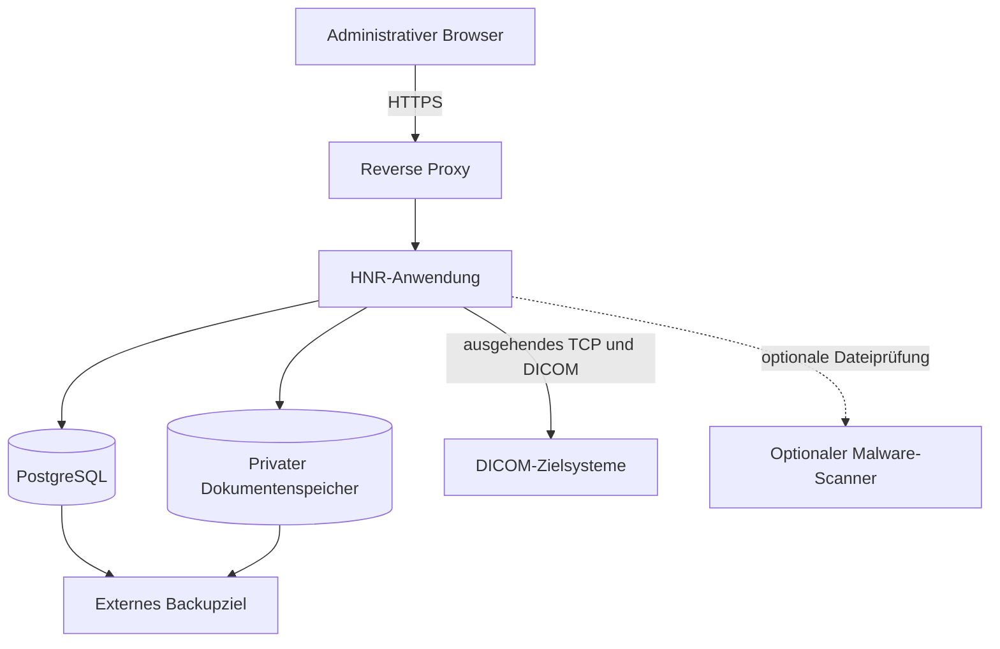
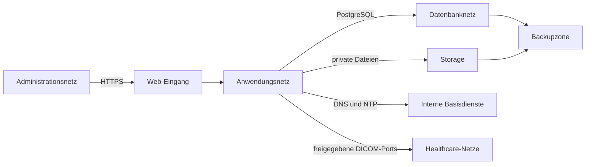

# Betriebs- und Bereitstellungsmodell

## Zweck

Dieses Kapitel beschreibt das Betriebs- und Bereitstellungsmodell der Healthcare Node Registry (HNR) auf Produktebene. Es erklärt die vorgesehenen Komponenten, Datenflüsse, Umgebungen, Betriebsaufgaben und Verantwortungsgrenzen einer On-Premises-Installation.

Das Kapitel enthält keine Installationsbefehle. Konkrete technische Verfahren werden im künftigen [Administratorhandbuch](../admin-guide/README.md) und bis dahin in den vorhandenen [Deployment-Dokumenten](../Deployment/) gepflegt.

## Geltungsbereich

Beschrieben werden:

- der primäre On-Premises-Betriebsmodus;
- Web-, Anwendungs-, Datenbank- und Storage-Komponenten;
- Netzwerk- und DICOM-Kommunikation;
- Entwicklungs-, Test- und Produktionsumgebungen;
- Persistenz, Backup und Wiederherstellung;
- Updates, Rollback und Betriebsnachweise;
- Überwachung und Kapazitätsplanung;
- geteilte Verantwortung zwischen Hersteller und Betreiber.

Cloud-Hosting, SaaS-Mandantenbetrieb und konkrete Hochverfügbarkeitsarchitekturen gehören nicht zum aktuellen Standardbetriebsmodell.

## On-Premises-First

Die HNR ist für den Betrieb innerhalb einer vom Kunden kontrollierten Infrastruktur vorgesehen. Anwendung, Datenbank, Dokumentenspeicher und technische Diagnose verbleiben grundsätzlich in dieser Umgebung.

On-Premises-First bedeutet:

- keine verpflichtende externe Telemetrie;
- keine notwendige Cloud-Verbindung für reguläre Produktfunktionen;
- lokale Kontrolle über Netzwerk, Identitäten, Daten, Backups und Aufbewahrung;
- installationsbezogene Verantwortung für TLS, DNS, NTP, Firewall und Storage;
- ausdrückliche Bewertung jeder späteren externen Integration.

Der Betreiber kann interne Infrastruktur- oder Plattformdienste verwenden. Dadurch wird die HNR nicht zu einem SaaS-Produkt und die Datenführerschaft bleibt beim Betreiber.

## Primärer Betriebsmodus

Der vorgesehene primäre Betriebsmodus ist ein Docker-Compose-Stack auf einer vom Betreiber verwalteten Linux-VM oder einem lokalen Container-Host.

Die Datenbank wird nicht direkt für Benutzer oder externe Netze veröffentlicht. Der Browser kommuniziert ausschließlich über den Reverse Proxy mit der Anwendung. DICOM-Verbindungen werden vom Anwendungsdienst und nicht vom Browser aufgebaut.

## Laufzeitkomponenten

### Reverse Proxy

Der Reverse Proxy nimmt Webanfragen entgegen und liefert öffentliche statische Assets aus. Im produktiven Betrieb bildet er die kontrollierte HTTP-/HTTPS-Eingangsgrenze.

Zu seinen Betriebsaufgaben gehören insbesondere:

- TLS-Terminierung oder kontrollierte Weiterleitung innerhalb einer übergeordneten TLS-Architektur;
- sichere Header und angemessene Request-Grenzen;
- Weiterleitung dynamischer Anfragen an die Anwendung;
- Protokollrotation und Begrenzung technischer Logs;
- keine direkte Veröffentlichung privater Dokumentdateien.

### Anwendungsdienst

Der Anwendungsdienst enthält Laravel, die serverseitige Fachlogik und die benötigten Diagnosewerkzeuge. Er verarbeitet Authentisierung, Autorisierung, Registry-Anfragen, Dokumentzugriffe, Audit und DICOM-Diagnosen.

Der Dienst benötigt:

- Zugriff auf PostgreSQL;
- Zugriff auf den persistenten Anwendungsspeicher;
- ausgehenden TCP-Zugriff auf ausdrücklich benötigte DICOM-Ziele;
- DNS- und Zeitauflösung;
- Konfiguration und Secrets aus kontrollierter Bereitstellung.

Er benötigt keinen direkt veröffentlichten Anwendungsport für Endbenutzer, wenn der Reverse Proxy vorgeschaltet ist.

### PostgreSQL

PostgreSQL speichert Registry-Objekte, Identitäten, Rollen, Sitzungen, Testläufe, Dokumentmetadaten und Audit-Ereignisse. Die Datenbank ist eine interne Komponente des Stacks.

Der produktive Betrieb benötigt:

- persistenten, ausreichend dimensionierten Speicher;
- regelmäßige konsistente Sicherungen;
- kontrollierte Zugangsdaten;
- Health Checks und Betriebsüberwachung;
- eine dokumentierte Update- und Restore-Strategie;
- keine direkte öffentliche Portfreigabe.

### Privater Dokumentenspeicher

Der private Dokumentenspeicher enthält hochgeladene Registry-Dokumentversionen und weitere persistente Anwendungsdateien. Er ist gemeinsam mit der Datenbank zu sichern.

Eine Datenbanksicherung ohne passende Dokumentdateien ist unvollständig. Ein Storage-Backup ohne zugehörige Metadaten erzeugt nicht zuordenbare Dateien.

### Frontend-Buildwerkzeug

Node.js dient als Build- und Entwicklungswerkzeug für den Webclient. Es ist keine notwendige dauerhaft öffentlich erreichbare Laufzeitkomponente des regulären Webzugriffs.

Produktive Bereitstellungen sollen reproduzierbar erzeugte Frontend-Artefakte verwenden. Ein Entwicklungsserver gehört nicht zum vorgesehenen Produktivbetrieb.

### DICOM-Werkzeuge

Der Anwendungsdienst enthält die für aktuelle Diagnosefunktionen benötigten DICOM-Werkzeuge. Dazu gehören insbesondere Programme für C-ECHO, C-FIND, C-STORE und Dateianalyse.

Diese Werkzeuge arbeiten ausschließlich innerhalb der von Anwendung, Berechtigung und Netzwerk vorgegebenen Grenzen. Der Container ist kein frei verwendbarer DICOM- oder Netzwerk-Werkzeugkasten für Endbenutzer.

### Malware-Scanner

Die Anwendung besitzt eine Scanner-Schnittstelle. Ein produktiver Malware-Scanner ist eine optionale, installationsabhängige externe Komponente und nicht automatisch im Standardstack enthalten.

Wird Dokumentupload produktiv verwendet, muss der Betreiber das gewählte Prüf- und Freigabeverhalten dokumentieren. Nicht als sauber bewertete Dateien werden nicht regulär zum Zugriff freigegeben.

## Netzwerkzonen und Kommunikationsrichtungen

### Eingehender Webzugriff

Produktiver Zugriff soll über HTTPS erfolgen. Ungesichertes HTTP ist außerhalb einer kontrollierten isolierten Erstinstallation nicht vorgesehen.

### Interne Datenbankkommunikation

Nur der Anwendungsdienst und autorisierte Betriebsprozesse benötigen Datenbankzugriff. Die Datenbank gehört in ein internes Netzwerksegment.

### Ausgehende DICOM-Kommunikation

Der Anwendungsdienst initiiert aktuelle Netzwerk- und DICOM-Tests. Firewalls sollen ausgehenden Zugriff auf konkrete Zieladressen und Ports begrenzen. Eine pauschale Freigabe ganzer Krankenhausnetze ist nicht erforderlich und nicht empfohlen.

Das Zielsystem muss den verwendeten Calling AE-Titel und den gewünschten Dienst erlauben. Ein erfolgreicher TCP-Verbindungsaufbau bestätigt weder eine DICOM Association noch die Berechtigung für Worklist, Query oder Storage.

### Rückverbindungen

Die aktuell implementierten SCU-Diagnosen benötigen keine allgemeine eingehende DICOM-Rückverbindung zum HNR-Anwendungsdienst. Spätere Dienste mit Rückkanal oder SCP-Funktion würden eine neue Vertrauensgrenze schaffen und benötigen ein gesondertes Betriebs- und Sicherheitsdesign.

## Persistente und flüchtige Daten

| Datenart | Persistenz | Betriebsanforderung |
|---|---|---|
| PostgreSQL-Daten | persistent | konsistente Sicherung und Restore-Test |
| Registry-Dokumente | persistent und privat | gemeinsam mit Datenbank sichern |
| Anwendungskonfiguration | persistent außerhalb des Images oder kontrolliert bereitgestellt | versioniert, ohne Secrets in Git |
| Secrets und Schlüssel | kontrolliert persistent | getrennte Speicherung und Zugriffsschutz |
| technische Logs | begrenzt persistent oder zentral weitergeleitet | Rotation, Redaction und Aufbewahrung |
| temporäre DICOM-Dateien | flüchtig | kontrollierte Löschung nach Verarbeitung |
| gebaute Frontend-Artefakte | reproduzierbar | einer Softwareversion zuordnen |
| Containerdateisysteme | grundsätzlich ersetzbar | keine alleinige Ablage fachlicher Daten |

Fachliche Persistenz darf nicht ausschließlich vom beschreibbaren Dateisystem eines austauschbaren Containers abhängen.

## Umgebungsmodell

### Entwicklung

Die Entwicklungsumgebung unterstützt lokale Implementierung und manuelle Prüfung. Sie darf synthetische Entwicklungsdaten und einen ausschließlich lokalen Entwicklungszugang enthalten.

Entwicklungseinstellungen, Debugausgaben und synthetische Zugangsdaten dürfen nicht in eine produktive Installation übernommen werden.

### Automatisierte Tests

Der Teststack verwendet eine isolierte PostgreSQL-Instanz, ein eigenes Netzwerk und einen eigenen Storage-Bereich. Sicherheitsprüfungen verhindern Testausführung gegen eine nicht als Testdatenbank erkennbare Umgebung.

Diese Isolation schützt Entwicklungs- und Produktivdaten vor destruktiven Testläufen. Sie ersetzt nicht die Prüfung einer realistischen Staging- oder Pilotumgebung.

### Staging oder Pilot

Eine separate Staging- oder Pilotumgebung ist betrieblich empfohlen, aber nicht als eigenständiger Standardstack vorgegeben. Sie soll produktionsnahe Konfigurationen verwenden, ohne unkontrolliert reale Patientendaten oder produktive Secrets zu übernehmen.

### Produktion

Die Produktionsumgebung verwendet:

- deaktivierten Debugmodus;
- installationsspezifische Secrets;
- ein kontrolliert erzeugtes Administratorkonto;
- feste und geprüfte Image- beziehungsweise Paketversionen;
- TLS;
- persistente Volumes;
- externe Backups;
- DNS und NTP;
- Ressourcenbegrenzung und Logrotation;
- dokumentierte Update-, Rollback- und Restore-Verfahren.

Der im Repository vorhandene Compose-Stack bildet die Komponenten und lokalen Workflows ab. Ein produktionsreifes Deployment benötigt zusätzlich die installationsspezifische Härtung und Betriebsfreigabe.

## Konfiguration und Secrets

### Konfiguration

Konfiguration wird außerhalb des Anwendungscodes bereitgestellt. Änderungen müssen nachvollziehbar, prüfbar und einer Installation beziehungsweise Softwareversion zuordenbar sein.

Konfigurationswerte umfassen beispielsweise:

- Anwendungsumgebung und öffentliche URL;
- Datenbankverbindung;
- Sitzungs- und Cookieeinstellungen;
- Dateispeicher und Uploadgrenzen;
- Logkanäle und Logstufen;
- installationsabhängige Dokumentprüfungen.

### Secrets

Passwörter, Anwendungsschlüssel, Zertifikatsschlüssel und weitere Secrets gehören nicht in Git, Images, Dokumentation, Logs oder Support-Bundles.

Die konkrete Secret-Verwaltung ist betreiberabhängig. Der Standardstack schreibt kein bestimmtes externes Secret-Management-System vor.

## Installation und Erstinbetriebnahme

Die Erstinbetriebnahme ist ein kontrollierter Betriebsprozess. Sie umfasst mindestens:

1. Prüfung der unterstützten Plattform und Abhängigkeiten;
2. Bereitstellung von DNS, NTP, TLS, persistentem Storage und Backupziel;
3. kontrollierte Konfiguration und Secret-Erzeugung;
4. Datenbankmigration ohne Entwicklungs-Seeds;
5. Erzeugung des initialen Administratorkontos über den vorgesehenen Setup-Prozess;
6. Build und Start der freigegebenen Softwareversion;
7. Health-, Login-, Persistenz- und Sicherheitsprüfung;
8. Dokumentation von Version, Umgebung, Ergebnis und Abweichungen.

Konkrete Befehle bleiben der [Validierung einer Neuinstallation](../Deployment/CleanInstallValidation.md) und dem späteren Administratorhandbuch vorbehalten.

## Backup und Wiederherstellung

### Sicherungsumfang

Eine vollständige Sicherung umfasst mindestens:

- PostgreSQL;
- privaten Dokumentenspeicher;
- Konfiguration ohne ungeschützte Offenlegung von Secrets;
- Schlüsselmaterial nach einem getrennten Verfahren;
- Versions- und Prüfsummeninformationen.

### Konsistenz

Datenbank und Dokumentenspeicher müssen aus demselben konsistenten Sicherungszeitraum stammen. Alle Dokumentversionen und archivierten Dokumente bleiben Teil der Sicherung, solange keine verbindliche und getestete Aufbewahrungs- und Löschregel besteht.

### Backupschutz

Backups benötigen:

- getrenntes und angemessen geschütztes Ziel;
- Verschlüsselung entsprechend dem Schutzbedarf;
- minimale Zugriffsrechte;
- definierte Aufbewahrung;
- getrennte Schlüsselaufbewahrung;
- Überwachung und dokumentierte Fehlerbehandlung.

Die vorhandenen Sicherungshilfen verschlüsseln Backups nicht automatisch, da Zielsystem und Schlüsselverwaltung installationsspezifisch sind.

### Restore-Test

Ein Backup gilt erst nach einem erfolgreichen Restore-Test als belastbarer Nachweis. Zu prüfen sind:

- Startfähigkeit der wiederhergestellten Anwendung;
- Anmeldung;
- Datenstichproben;
- Dokumentanzahl und Versionsbeziehungen;
- Dateiexistenz, Größe und SHA-256;
- Abweichungen und Korrekturmaßnahmen.

Details beschreibt [Backup und Wiederherstellung](../Deployment/BackupRestore.md).

## Update und Rollback

### Updatevorbereitung

Vor einem Update sind mindestens zu prüfen:

- Versionshinweise und bekannte Einschränkungen;
- unterstützte Laufzeit- und Datenbankversionen;
- Datenbankmigrationen;
- verfügbarer Speicher;
- aktuelle, geprüfte Sicherung;
- Abhängigkeiten zu Scanner, Reverse Proxy und Netzwerkfreigaben;
- erforderliches Wartungsfenster;
- Rollback- oder Wiederherstellungsweg.

### Durchführung

Updates verwenden feste, freigegebene Artefakte. Abhängigkeiten werden nicht unkontrolliert auf `latest` aktualisiert. Datenbankmigrationen und Frontend-Artefakte müssen zur selben Softwareversion gehören.

### Rollback

Ein Rollback ist nicht automatisch gleichbedeutend mit dem Start einer älteren Anwendungsversion. Nach nicht rückwärtskompatiblen Datenbankänderungen kann eine vollständige Wiederherstellung erforderlich sein.

Der zulässige Rollbackweg muss vor dem Update feststehen und getestet sein. Ein Abbruch wegen fehlender Freigabe oder Sicherung ist einem unkontrollierten Update vorzuziehen.

## Betriebsüberwachung

Die HNR ist kein allgemeines Monitoring-System, benötigt aber selbst betriebliche Überwachung.

Mindestens zu überwachen sind:

- Erreichbarkeit des Webdienstes und Health-Endpunkts;
- Container- beziehungsweise Prozessstatus;
- Datenbankzustand und Verbindungen;
- Speicherverbrauch von Datenbank, Dokumenten und Logs;
- Backupstatus und Alter des letzten erfolgreichen Restore-Tests;
- Zertifikatslaufzeiten;
- Fehler- und Sicherheitslogs;
- ausstehende Sicherheits- und Abhängigkeitsupdates.

DICOM-Prüfergebnisse sind fachliche Diagnoseergebnisse und kein Ersatz für die Überwachung der HNR-Laufzeit oder der angebundenen Systeme.

## Logging

Technische Logs dienen Betrieb und Fehleranalyse. Sie müssen rotiert und entsprechend ihrem Schutzbedarf aufbewahrt werden.

Nicht in Logs gehören:

- Passwörter, Tokens und Sitzungswerte;
- Anwendungsschlüssel und Connection Strings;
- vollständige Dokument- oder Request-Inhalte;
- unbereinigte Patientendaten;
- unnötige interne Pfade oder Stacktraces gegenüber Endbenutzern.

Audit-Ereignisse und technische Logs erfüllen unterschiedliche Zwecke und dürfen betrieblich nicht gleichgesetzt werden.

## Kapazität und Ressourcen

Der Ressourcenbedarf hängt insbesondere ab von:

- Anzahl der Registry-Objekte und Audit-Ereignisse;
- Zahl und Größe der Dokumentversionen;
- Häufigkeit und Detailumfang technischer Testläufe;
- Zahl gleichzeitiger Benutzer;
- Logaufbewahrung;
- Backupverfahren und Restore-Zielen.

Für produktive Installationen existiert derzeit keine pauschale Größenklasse oder automatische Kapazitätsberechnung. Betreiber müssen Ausgangsgröße, Wachstum, Speicherreserve und Wiederherstellungsziele installationsbezogen dokumentieren.

Parallele Diagnoseausführung und zentrale Queue-Steuerung sind noch nicht vollständig als konfigurierbare Betriebsfunktion verfügbar. Netzwerk- und Prozessgrenzen sind deshalb besonders konservativ zu planen.

## Verfügbarkeit und Wiederanlauf

Der Standardstack beschreibt einen einzelnen logischen Anwendungs-, Web- und Datenbankpfad. Eine verbindliche Hochverfügbarkeitsarchitektur ist nicht Bestandteil des aktuellen Standardmodells.

Betreiber müssen festlegen:

- zulässige Ausfallzeit;
- maximal akzeptierten Datenverlust;
- Wiederanlaufreihenfolge;
- Verantwortlichkeiten und Eskalationswege;
- Ersatzhost- und Restore-Verfahren;
- regelmäßige Testintervalle.

Eine spätere Hochverfügbarkeitsvariante benötigt ein eigenes Architektur- und Betriebsdesign, insbesondere für Sitzungen, Storage, Datenbank und Diagnoseparallelität.

## Offline- und eingeschränkte Umgebungen

On-Premises-Installationen können ohne direkten Internetzugang betrieben werden. Für Installation und Updates müssen dann intern freigegebene Images, PHP-/JavaScript-Abhängigkeiten und Sicherheitsinformationen kontrolliert gespiegelt oder bereitgestellt werden.

Offline-Betrieb erschwert nicht die lokale Produktfunktion, erhöht aber die Anforderungen an:

- Artefaktbereitstellung;
- Signatur- und Prüfsummenprüfung;
- Schwachstelleninformation;
- Zertifikats- und Zeitdienste;
- Updateplanung;
- Supportverfahren ohne unkontrollierte Datenübertragung.

## Support und Betriebsnachweise

Supportinformationen müssen gezielt ausgewählt und bereinigt werden. Automatische Support-Bundles mit vollständigen Konfigurationen, Dokumenten oder Datenbankinhalten sind nicht als aktueller Funktionsumfang dokumentiert.

Ein Betriebsnachweis soll mindestens enthalten:

- Installation und Softwareversion;
- Datum und verantwortliche Stelle;
- relevante Plattform- und Container-Versionen;
- Ergebnis von Health-, Login- und Persistenzprüfung;
- Backup- und Restore-Nachweis;
- bekannte Abweichungen;
- Freigabeentscheidung.

Secrets, Patientendaten und vollständige vertrauliche Dokumente dürfen nicht Bestandteil eines allgemeinen Supportnachweises sein.

## Geteilte Betriebsverantwortung

| Bereich | Hersteller beziehungsweise Produkt | Betreiber |
|---|---|---|
| Softwareartefakte | versionierter Produktstand und Abhängigkeiten | kontrollierte Bereitstellung und Freigabe |
| Host und Containerlaufzeit | dokumentierte Anforderungen | Installation, Härtung, Patching und Kapazität |
| Webzugriff | kompatibler Reverse-Proxy-Betrieb | DNS, TLS, Firewall und Zertifikate |
| Datenbank | Schema, Migrationen und Anwendungszugriff | Persistenz, Monitoring, Sicherung und Restore |
| Dokumentenspeicher | private Ablagestruktur und Integritätsmetadaten | Kapazität, Schutz, Sicherung und Scannerintegration |
| DICOM-Diagnose | registrierte Ziele, Validierung und begrenzte Runner | Egress, Zielsystemfreigabe und Bereinigung von Testobjekten |
| Identitäten | lokale Konten, Rollen und Berechtigungen | Kontenprozess, Access Review und organisatorische Freigabe |
| Logs und Audit | strukturierte Erzeugung | Sammlung, Rotation, Review und Aufbewahrung |
| Updates | Migrations- und Qualitätsnachweise | Wartungsfenster, Backup, Rollback und Betriebsabnahme |

## Aktueller Stand und geplante Betriebsreife

| Themenbereich | Aktuell | Geplant oder installationsabhängig |
|---|---|---|
| Bereitstellung | Docker-Compose-Komponenten und lokale Workflows | gehärtete kundenspezifische Produktionsprofile |
| Datenhaltung | PostgreSQL und persistenter privater Storage | installationsspezifische Skalierungs- und HA-Varianten |
| Diagnose | ausgehende Tests gegen registrierte Knoten | CIDR-Allowlist, DICOM-TLS, Queue und Parallelitätssteuerung |
| Dokumentprüfung | Scanner-Schnittstelle | produktiver Scanner und Rescan-Betrieb |
| Backup | dokumentierter Umfang und Sicherungshilfen | kundenspezifische Verschlüsselung und Aufbewahrung |
| Identität | lokale Sitzung und RBAC | externe Identitätsanbieter und MFA |
| Monitoring | Health-Endpunkt und technische Logs | installationsspezifische Alarmierung und Dashboards |
| Support | manuell bereinigte Nachweise | kontrolliertes Support-Bundle nach Sicherheitsdesign |

## Betriebliche Nicht-Ziele

Der aktuelle Standardstack ist kein:

- SaaS- oder Multi-Tenant-Betrieb;
- automatisch verwalteter Cloud-Service;
- vollständiges Kubernetes- oder Hochverfügbarkeitsprodukt;
- Ersatz für Backup-, Monitoring- oder Secret-Management-Systeme;
- allgemeines DICOM-Gateway;
- automatisch skalierender Diagnosecluster;
- Mechanismus zur direkten öffentlichen Bereitstellung der Datenbank oder privater Dokumente.

## Hinweise für nachfolgende Dokumentation

Das Administratorhandbuch muss aus diesem Betriebsmodell konkrete, geprüfte Verfahren für Installation, Konfiguration, TLS, Backup, Restore, Updates und Diagnosefreigaben ableiten. Es darf Beispielkonfigurationen nicht als universelle Produktionsvorgaben darstellen.

Versionshinweise müssen angeben, wenn sich Laufzeitvoraussetzungen, Migrationen, Storage, Netzwerkbedarf oder Sicherheitsgrenzen ändern.

## Referenzen

- [Kapitel 4: Fachliches Datenmodell](04-fachliches-datenmodell.md)
- [Kapitel 5: Sicherheits- und Datenschutzkonzept](05-sicherheits-und-datenschutzkonzept.md)
- [Deployment-Architektur](../Architecture/Deployment.md)
- [Docker-Architektur](../Development/DockerArchitecture.md)
- [Betriebsaufgaben](../Deployment/Operations.md)
- [Backup und Wiederherstellung](../Deployment/BackupRestore.md)
- [Validierung einer Neuinstallation](../Deployment/CleanInstallValidation.md)
- [Technologieversionen](../Decisions/ADR-0001-technology-versions.md)
- [Diagnose-Workspace](../Healthcare/DiagnosticTestWorkspace.md)
