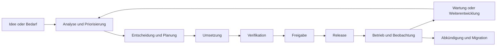
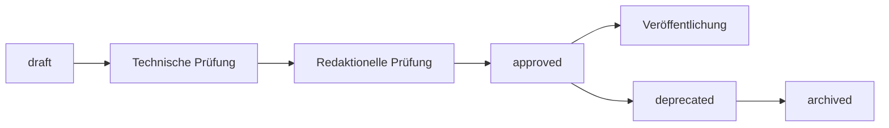
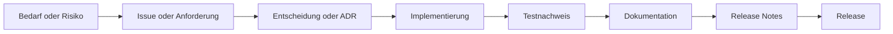

# Produktlebenszyklus und Roadmap

## Zweck

Dieses Kapitel beschreibt, wie die Healthcare Node Registry (HNR) geplant, versioniert, geprüft, freigegeben, aktualisiert und langfristig gepflegt wird. Es definiert den Zusammenhang zwischen Produktroadmap, Softwareversion, Dokumentation, Release Notes und Qualitätsnachweisen.

Das Kapitel legt keine Veröffentlichungstermine fest. Prioritäten und Releaseinhalte bleiben kontrollierte Produktentscheidungen.

## Geltungsbereich

Das Lebenszyklusmodell umfasst:

- Produktideen, Anforderungen und Roadmap-Einträge;
- technische und fachliche Entscheidungen;
- Implementierung und Qualitätsprüfung;
- Dokumentation und Freigabe;
- Versionierung und Veröffentlichung;
- Installation, Update und Rollback;
- Wartung, Fehlerbehebung und Sicherheitskorrekturen;
- Abkündigung, Migration und Archivierung.

Vertriebsprozesse, Preisgestaltung, Vertragsmodelle und kommerzielle Support-Level sind nicht Gegenstand dieses Kapitels.

## Lebenszyklusübersicht

Jede Phase erzeugt nachvollziehbare Ergebnisse. Eine Implementierung allein ist noch kein freigegebenes Produktmerkmal.

## Produktstatus und Funktionsstatus

### Aktuell verfügbar

Eine Funktion gilt als aktuell verfügbar, wenn:

- ihre Implementierung in der betreffenden Softwareversion enthalten ist;
- serverseitige Berechtigungen und Validierung vorhanden sind;
- relevante automatisierte und manuelle Prüfungen erfolgreich waren;
- Sicherheits- und Datenschutzfolgen bewertet wurden;
- die betroffene Produkt- und Benutzerdokumentation aktualisiert wurde;
- bekannte Einschränkungen dokumentiert sind;
- die Funktion in Release Notes oder einem freigegebenen Versionsnachweis enthalten ist.

### Geplant

Eine geplante Funktion wurde fachlich als sinnvoll erkannt oder in eine Roadmap aufgenommen, ist aber nicht freigegeben. Planung kann Analyse, Priorisierung oder bereits begonnene technische Arbeit umfassen.

Geplante Funktionen dürfen nicht in Bedienungsanleitungen als verfügbar beschrieben werden. Oberflächen dürfen sie nur dann als Vorschau kennzeichnen, wenn Zweck und Nichtverfügbarkeit eindeutig sind.

### Langfristige Vision

Eine langfristige Entwicklungsrichtung beschreibt eine mögliche strategische Ergänzung ohne zugesagten Zeitpunkt oder Umfang. Sie dient der Orientierung und ist keine vertragliche Produktzusage.

### Abgekündigt

Eine abgekündigte Funktion ist noch verfügbar, soll aber in einer späteren Version entfernt oder ersetzt werden. Abkündigung benötigt Zeitpunkt beziehungsweise Versionsziel, Begründung, Auswirkungen und Migrationsweg.

### Entfernt

Eine entfernte Funktion ist in der betreffenden Version nicht mehr verfügbar. Release Notes und Migrationshinweise müssen die Änderung nachvollziehbar beschreiben.

## Versionsmodell

Die HNR verwendet Semantic Versioning mit dem Schema `MAJOR.MINOR.PATCH`.

| Änderung | Versionstyp | Beispielhafte Bedeutung |
|---|---|---|
| MAJOR | inkompatible Produkt-, Daten- oder Schnittstellenänderung | Migration oder Anpassung bestehender Integrationen erforderlich |
| MINOR | rückwärtskompatible Funktion oder wesentliche Erweiterung | neuer Arbeitsbereich oder neue optionale Fähigkeit |
| PATCH | rückwärtskompatible Korrektur | Fehlerbehebung oder begrenzte Sicherheitskorrektur |

Vor Version 1.0 können Minor-Versionen stärkere Änderungen enthalten. Jede Abweichung von üblicher Rückwärtskompatibilität muss ausdrücklich in Release Notes und Migrationshinweisen dokumentiert werden.

Entwicklungsstände können ein Suffix wie `-dev` tragen. Ein solcher Stand ist kein freigegebenes Release.

## Zuordnung von Software und Dokumentation

Software und Dokumentation müssen eindeutig miteinander verbunden sein.

### Softwareversion

Ein Release verwendet:

- ein nachvollziehbares Git-Tag `vX.Y.Z`;
- einen eindeutigen Commit;
- reproduzierbare oder prüfbare Artefakte;
- freigegebene Abhängigkeitsstände;
- zugehörige Migrationen und Build-Artefakte.

### Dokumentversion

Jedes freigaberelevante Dokument enthält Frontmatter mit Status, Dokumentversion und Aktualisierungsdatum. Die Dokumentversion beschreibt die Entwicklung des Dokuments und ist nicht automatisch identisch mit der Softwareversion.

Bei Freigabe muss zusätzlich erkennbar sein, für welche Softwareversion oder Versionsreihe das Dokument gilt. Bis diese Zuordnung formell eingetragen ist, bleiben die aktuellen Produktbuch-Kapitel im Status `draft`.

### Versionshinweise

Release Notes bilden die verbindliche Brücke zwischen Software und Dokumentation. Sie verweisen auf:

- neue und geänderte Funktionen;
- Fehlerbehebungen und Sicherheitsänderungen;
- Breaking Changes;
- Installation, Update und Migration;
- Backup- und Restore-Hinweise;
- bekannte Einschränkungen;
- relevante Dokumentationsänderungen;
- Verifikations- und Freigabenachweise.

## Dokumentstatus

Der Dokumentationsworkflow verwendet folgende Status:

| Status | Bedeutung |
|---|---|
| `draft` | Inhalt wird erstellt oder fachlich überarbeitet |
| `review` | Inhalt befindet sich in technischer und redaktioneller Prüfung |
| `approved` | Inhalt ist für den angegebenen Produktstand freigegeben |
| `deprecated` | Inhalt ist noch nachvollziehbar, aber nicht mehr für den aktuellen Stand maßgeblich |
| `archived` | Inhalt wird nur noch als historischer Nachweis aufbewahrt |

Die Begriffe müssen in allen neuen Dokumenten konsistent verwendet werden. Bestehende ältere Dokumente können abweichende Begriffe enthalten und werden erst bei kontrollierter Überarbeitung angepasst.

## Dokumentationsfreigabe

### Technische Prüfung

Die technische Prüfung bestätigt:

- Übereinstimmung mit dem tatsächlich implementierten Produktstand;
- korrekte Funktions-, Sicherheits- und Betriebsgrenzen;
- gültige relative Links und Referenzen;
- korrekte Versionen, Pfade und Fachbegriffe;
- eindeutige Kennzeichnung geplanter Inhalte.

### Redaktionelle Prüfung

Die redaktionelle Prüfung bestätigt:

- verständliche, sachliche Sprache;
- konsistente Terminologie und Überschriften;
- angemessene Zielgruppenansprache;
- Vermeidung unnötiger Wiederholungen;
- eigenständige Verständlichkeit;
- Einhaltung der [Dokumentations-Masterspezifikation](../DOCUMENTATION_MASTER_SPECIFICATION.md).

### Freigabe

Die Freigabe benötigt eine verantwortliche Stelle, Freigabedatum, Dokumentversion und Zuordnung zum Produktstand. Ein Git-Merge allein ist nicht automatisch eine fachliche Produktfreigabe.

## Roadmap-Modell

Die Roadmap wird nach Nutzen, Risiko und Abhängigkeiten priorisiert. Sie ist keine reine Liste noch nicht implementierter Funktionen.

### Planungsebenen

| Ebene | Zweck | Verbindlichkeit |
|---|---|---|
| Aktueller Releasekandidat | definierter und geprüfter Inhalt der nächsten Freigabe | hoch, Änderungen kontrolliert |
| Nächste priorisierte Ausbaustufe | fachlich analysierte Kandidaten mit erkennbarem Mehrwert | mittel, noch keine Releasezusage |
| Backlog | bewertete oder noch zu bewertende Anforderungen | niedrig |
| Langfristige Vision | strategische Orientierung | keine Termin- oder Umfangszusage |

### Roadmap-Eintrag

Ein belastbarer Roadmap-Eintrag enthält mindestens:

- Problem oder Bedarf;
- betroffene Zielgruppen;
- erwarteten Nutzen;
- fachlichen Umfang und Nicht-Umfang;
- Abhängigkeiten;
- Sicherheits- und Datenschutzfolgen;
- technischen Aufwand und Risiken;
- Wiederverwendung bestehender Architektur;
- Akzeptanz- und Dokumentationskriterien;
- Status und verantwortliche Entscheidung.

Ein einzelnes Kontrollkästchen ohne diese Informationen ist eine Arbeitshilfe, aber noch keine vollständige Produktentscheidung.

## Priorisierungsgrundsätze

### Betriebsnutzen

Priorität erhalten Funktionen, die Datenqualität, sichere Administration, Nachvollziehbarkeit oder effiziente Störungseingrenzung deutlich verbessern.

### Risikoreduktion

Sicherheitslücken, Datenintegritätsrisiken, fehlende Wiederherstellbarkeit und unklare Berechtigungsgrenzen haben Vorrang vor rein kosmetischen Erweiterungen.

### Vollständigkeit bestehender Arbeitsabläufe

Eine fehlende Verwaltungsoberfläche, die vorhandene Fachlogik sicher nutzbar macht, kann höheren Nutzen besitzen als ein neuer isolierter Funktionsbereich.

### Wiederverwendung

Erweiterungen sollen vorhandene Modelle, Services, Policies, Audit-Infrastruktur und UI-Muster nutzen. Doppelte Fach- oder Berechtigungsarchitekturen erhöhen Aufwand und Risiko.

### Abhängigkeiten und Reihenfolge

Grundlagen wie Berechtigungen, Referenzdaten, Datenqualität und Betriebsverfahren werden vor Funktionen priorisiert, die auf ihnen aufbauen.

### MVP- und Release-Relevanz

Vor Version 1.0 haben Funktionen Vorrang, die einen belastbaren, administrierbaren und dokumentierten Kernbetrieb ermöglichen. Erweiterte Automatisierung, Integrationen und Spezialfunktionen folgen nach stabilen Grundlagen.

## Aktuelle Roadmap-Themen

Die detaillierte Arbeitsroadmap wird außerhalb dieses Kapitels gepflegt. Auf Produktebene sind derzeit folgende noch nicht vollständig verfügbare Themen dokumentiert:

### Datenqualität und Verwaltung

- strukturierte Verantwortlichkeiten;
- konfigurierbare Referenzdaten und zugehörige Verwaltungsoberflächen;
- weitere Konsistenzprüfungen und kontrollierte Pflegeverfahren.

### Dokumente und Audit

- produktive Malware-Scanner-Anbindung und Rescan-Prozess;
- Dokumentfreigabe und Vier-Augen-Prinzip;
- verbindliche Aufbewahrungsregeln;
- Audit-Aufbewahrung und formaler Integritätsnachweis.

### Diagnosehärtung

- weitere installationsbezogene Härtung der Diagnoseausführung;
- konfigurierbare CIDR-Allowlist, Timeouts und Parallelitätsgrenzen;
- DICOM-TLS;
- weitere synthetische Storage-SOP-Klassen;
- C-MOVE und C-GET erst nach eigenständigem Sicherheitsdesign.

### Identität und Schnittstellen

- Mehrfaktor-Authentisierung;
- externe Identitätsanbieter;
- eine öffentlich dokumentierte, versionierte Produkt-API;
- kontrollierte Integrationen mit vorhandenen Infrastrukturplattformen.

Diese Themen sind keine Releasezusage. Vor Aufnahme in einen Releasekandidaten benötigen sie Analyse, Priorisierung und Freigabe.

## Roadmap-Pflege

Die Roadmap muss regelmäßig mit Implementierung, Changelog und Dokumentation abgeglichen werden. Erledigte oder überholte Einträge werden aktualisiert, aber nicht so entfernt, dass Entscheidungen und Historie unverständlich werden.

Widersprüche zwischen Roadmap und implementiertem Produktstand sind als Dokumentationsabweichung zu behandeln. Die Implementierung allein aktualisiert keine Roadmap automatisch.

Die aktuell vorhandene Roadmap enthält gewachsene Einträge aus mehreren Entwicklungsphasen. Vor formeller Veröffentlichung benötigt sie eine redaktionelle Konsolidierung und eindeutige Versionszuordnung.

## Definition of Done für Funktionen

Eine Funktion ist für einen Release grundsätzlich erst abgeschlossen, wenn:

- Anforderung und Akzeptanzkriterien erfüllt sind;
- der Scope nicht unkontrolliert erweitert wurde;
- Code Review abgeschlossen ist;
- Autorisierung, Validierung und Fehlerfälle behandelt sind;
- risikobasierte automatisierte Tests vorhanden sind;
- CI und erforderliche Qualitätsprüfungen erfolgreich sind;
- Sicherheits- und Datenschutzfolgen bewertet sind;
- Logs auf sensible Daten geprüft wurden;
- Migration und Rückwärtskompatibilität bewertet wurden;
- UI und Accessibility angemessen geprüft sind;
- Produkt-, Benutzer-, Betriebs- und technische Dokumentation aktualisiert sind;
- Changelog, Roadmap und bekannte Einschränkungen geprüft sind;
- keine kritischen oder hohen ungeklärten Risiken bestehen oder eine dokumentierte Risikoakzeptanz vorliegt.

Die vollständige Checkliste enthält die [Definition of Done](../Development/DefinitionOfDone.md).

## Releasekandidat

Ein Releasekandidat friert den geplanten Funktionsumfang ein. Änderungen sind danach auf freigaberelevante Fehler, Sicherheitskorrekturen und ausdrücklich genehmigte Dokumentationskorrekturen begrenzt.

Vor Freigabe werden mindestens geprüft:

- vollständiger Qualitätslauf;
- Neuinstallation und Updatepfad;
- Datenbankmigrationen;
- Backup und realistischer Restore;
- Authentisierung und kritische Autorisierungsfälle;
- Dokumentupload und private Dateizugriffe, soweit betroffen;
- zentrale DICOM-Diagnosen, soweit betroffen;
- Changelog und Release Notes;
- bekannte Einschränkungen;
- Software-/Dokumentationszuordnung.

## Releasefreigabe

### Erforderliche Nachweise

Jedes freigegebene Release benötigt:

- Changelog;
- Release Notes;
- Migrationshinweise;
- geprüfte Installations- und Updateinformationen;
- Backup- und Restore-Hinweis;
- bekannte Einschränkungen;
- Test- und CI-Nachweis;
- dokumentierte Sicherheitsbewertung;
- Software Bill of Materials, sobald der freigegebene Prozess sie erzeugt;
- dokumentierte Freigabeentscheidung.

Ein in einer Vorlage vorgesehenes Feld darf nicht als erfüllter Nachweis gelten, solange kein tatsächliches Artefakt oder Prüfergebnis vorliegt.

### Release-Artefakte

Zu einem Release gehören mindestens:

- Git-Tag und Commit-Bezug;
- freigegebene Softwareartefakte;
- Datenbankmigrationen;
- Changelog;
- Release Notes;
- zugeordnete Dokumentation;
- Prüfsummen oder vergleichbare Artefaktnachweise, soweit im Releaseprozess vorgesehen.

## Release Notes

Release Notes richten sich an Betreiber und betroffene Anwender. Sie enthalten keine unstrukturierte Wiederholung aller Commits.

Die vorhandene [Release-Notes-Vorlage](../Releases/RELEASE_NOTES_TEMPLATE.md) sieht folgende Bereiche vor:

- Zusammenfassung;
- neue Funktionen;
- Änderungen;
- Fehlerbehebungen;
- Sicherheitsänderungen;
- Breaking Changes;
- Installation und Update;
- Datenbankmigration;
- Backup-/Restore-Hinweis;
- bekannte Einschränkungen;
- Verifikationsnachweise.

## Changelog

Das Changelog dokumentiert produktrelevante Änderungen in nachvollziehbarer Form. Es unterscheidet mindestens neue Funktionen, Änderungen, Fehlerbehebungen und Sicherheitskorrekturen.

Unreleased-Einträge werden vor Freigabe konsolidiert und einer konkreten Version zugeordnet. Doppelte Unreleased-Abschnitte oder veraltete Vorbereitungsvermerke sind vor einem Release zu bereinigen.

Interne Refactorings werden aufgenommen, wenn sie Auswirkungen auf Betrieb, Sicherheit, Erweiterbarkeit oder bekannte Risiken besitzen. Rein mechanische Änderungen ohne Produktwirkung benötigen keinen eigenen Produkteintrag.

## Migration und Rückwärtskompatibilität

### Datenbankmigration

Schemaänderungen verwenden versionierte Migrationen. Vor Freigabe werden Laufzeit, Sperrverhalten, Datenkonvertierung, Speicherbedarf und Wiederherstellungsweg bewertet.

### Konfigurationsmigration

Neue oder geänderte Konfigurationswerte benötigen:

- Zweck und Standardverhalten;
- sicheren Migrationswert;
- Kennzeichnung verpflichtender Betreiberentscheidungen;
- Updatehinweis;
- Schutz von Secrets.

### Datenmigration

Fachliche Umbenennungen oder Statusänderungen dürfen keine stillschweigende Bedeutungsänderung vorhandener Daten verursachen. Automatische Konvertierungen benötigen überprüfbare Regeln und Tests.

### Rollback

Rollbackfähigkeit wird vor Freigabe bewertet. Wenn ein Zurücksetzen der Anwendung ohne Datenrestore nicht sicher ist, muss dies ausdrücklich dokumentiert werden.

## Abkündigung

Eine Abkündigung folgt einem kontrollierten Prozess:

1. betroffenen Funktionsumfang identifizieren;
2. Grund und Risiken dokumentieren;
3. betroffene Zielgruppen und Daten bestimmen;
4. Ersatz oder Migrationsweg beschreiben;
5. Abkündigung in Dokumentation und Release Notes ankündigen;
6. angemessene Übergangsfrist festlegen;
7. Entfernung in einer eindeutig benannten Version dokumentieren;
8. veraltete Dokumentation als `deprecated` oder `archived` kennzeichnen.

Vor Version 1.0 können Übergangsfristen kürzer sein. Auch dann bleiben Auswirkungen und Migrationsweg dokumentationspflichtig.

## Sicherheitskorrekturen

Kritische Sicherheitskorrekturen können einen verkürzten Freigabeprozess benötigen. Verkürzt werden darf die Bearbeitungszeit, nicht die Nachvollziehbarkeit.

Mindestens erforderlich bleiben:

- dokumentierte Risikobewertung;
- qualifizierter Review;
- gezielte Regressionstests;
- sichere Migrations- und Rollbackbewertung;
- aktualisierte Sicherheitshinweise;
- kontrollierte Veröffentlichung ohne unnötige Offenlegung ausnutzbarer Details;
- nachgelagerte vollständige Dokumentations- und Prozessprüfung.

## Fehler- und Wartungsversionen

Patch-Releases sollen eng begrenzt bleiben. Eine Fehlerkorrektur darf nicht verdeckt neue Fachfunktionen oder inkompatible Datenänderungen einführen.

Für bekannte Fehler werden Auswirkungen, Umgehung und geplanter Korrekturstatus dokumentiert. Nicht jeder interne Fehler benötigt öffentliche Detailtiefe; betreiberrelevante Einschränkungen müssen jedoch sichtbar sein.

## Qualitätsziele

Die vorhandenen [Qualitätsziele](../Compliance/QualityObjectives.md) verlangen insbesondere:

- Changelog, Release Notes und dokumentierte Migrationen für Releases;
- automatisierte Tests kritischer Autorisierungs- und Geschäftsregeln;
- aktuelle Fach- und Betriebsdokumentation;
- keine bekannte kritische oder hohe ungeklärte Schwachstelle ohne Risikoakzeptanz;
- erfolgreichen realistischen Restore-Test vor produktiver Freigabe;
- bedienbare zentrale Registry-Abläufe;
- keine Patientendaten als Voraussetzung einer Kernfunktion.

Qualitätsziele benötigen messbare Nachweise. Eine Absichtserklärung oder ein nicht ausgefülltes Template ist kein Prüfergebnis.

## Rollen im Lebenszyklus

| Verantwortung | Aufgabe |
|---|---|
| Produktverantwortung | Bedarf, Nutzen, Priorität und Umfang entscheiden |
| Fachliche Verantwortung | Healthcare-IT- und DICOM-Korrektheit prüfen |
| Architektur | Modell, Abhängigkeiten und technische Folgen bewerten |
| Entwicklung | kontrolliert implementieren und technische Nachweise liefern |
| Informationssicherheit und Datenschutz | Risiken, Kontrollen und Restabweichungen prüfen |
| Qualitätssicherung | Akzeptanz, Regression und Wiederherstellbarkeit verifizieren |
| Dokumentationspflege | Produktstand konsistent und versioniert abbilden |
| Releaseverantwortung | Nachweise bündeln und Freigabeentscheidung dokumentieren |
| Betreiber | Installation, Update, Backup, Abnahme und lokalen Betrieb freigeben |

Eine Person kann mehrere Verantwortungen wahrnehmen. Kritische Änderungen sollen dennoch eine angemessene unabhängige Prüfung erhalten.

## Rückverfolgbarkeit

Für freigaberelevante Änderungen soll folgende Kette nachvollziehbar sein:

Nicht jede kleine Korrektur benötigt ein ADR. Architektur-, Sicherheits-, Datenmodell- oder langfristig bindende Entscheidungen müssen jedoch dauerhaft nachvollziehbar dokumentiert werden.

## Offene Prozesspunkte

Vor einer formellen Version-1.0-Freigabe sind insbesondere zu konsolidieren:

- eindeutige Eigentümer und Freigabeverantwortungen;
- einheitliches Statusvokabular in älteren Dokumenten;
- konsolidierte Roadmap ohne überholte oder doppelte Einträge;
- konsolidiertes Changelog mit eindeutigem Versionsbezug;
- verbindliche Release- und Artefaktfreigabe;
- SBOM- und Security-Scan-Nachweise;
- getestete Update-, Rollback- und Restore-Verfahren;
- Zuordnung freigegebener Dokumente zu Softwareversionen;
- Abkündigungs- und Supportverfahren.

Diese Punkte sind Prozess- und Reifegradanforderungen. Ihre Nennung bedeutet nicht, dass die zugehörigen Verfahren bereits vollständig implementiert sind.

## Hinweise für nachfolgende Dokumentation

Das Administratorhandbuch beschreibt konkrete Update-, Backup-, Restore- und Rollbackverfahren. Das Entwicklerhandbuch dokumentiert Branch-, Review-, Test- und Releaseabläufe. Versionshinweise verwenden die freigegebene Vorlage und verweisen auf die für das Release gültige Dokumentation.

Dieses Kapitel wird überprüft, wenn sich Versionsschema, Releaseprozess, Qualitätsziele, Roadmap-Governance oder Supportmodell ändern.

## Referenzen

- [Kapitel 2: Produktkonzept und Funktionsumfang](02-produktkonzept-und-funktionsumfang.md)
- [Kapitel 5: Sicherheits- und Datenschutzkonzept](05-sicherheits-und-datenschutzkonzept.md)
- [Kapitel 6: Betriebs- und Bereitstellungsmodell](06-betriebs-und-bereitstellungsmodell.md)
- [Dokumentations-Masterspezifikation](../DOCUMENTATION_MASTER_SPECIFICATION.md)
- [Definition of Done](../Development/DefinitionOfDone.md)
- [Dokumentkontrolle](../Compliance/DocumentControl.md)
- [Qualitätsziele](../Compliance/QualityObjectives.md)
- [Git-Workflow](../Development/GitWorkflow.md)
- [Release-Notes-Vorlage](../Releases/RELEASE_NOTES_TEMPLATE.md)
