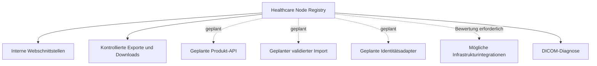

# Integrations- und API-Strategie

## Zweck

Dieses Kapitel beschreibt die Integrations- und API-Strategie der Healthcare Node Registry (HNR). Es konkretisiert das Produktprinzip API First, grenzt aktuelle interne Schnittstellen von einer zukünftigen öffentlich dokumentierten Produkt-API ab und definiert Anforderungen an spätere Integrationen.

Das Kapitel dokumentiert keine bereits freigegebene externe API. Der aktuelle Stand enthält keine öffentlich unterstützte Produkt-API mit stabilem Drittanbieter-Vertrag.

## Geltungsbereich

Die Strategie umfasst:

- interne Web- und Anwendungsschnittstellen;
- aktuelle Exporte und Downloads;
- zukünftige Produkt-APIs;
- kontrollierten Import und Export;
- Identitäts- und Verzeichnisintegration;
- mögliche Infrastruktur- und Registry-Integrationen;
- DICOM-, HL7-v2- und FHIR-Kontext;
- Versionierung, Sicherheit, Datenschutz und Lebenszyklus von Schnittstellen.

Konkrete Endpoint-Definitionen, Payload-Schemata und Authentisierungsprofile werden erst nach Implementierung und Freigabe in der [API-Referenz](../api/README.md) veröffentlicht.

## Bedeutung von API First

API First ist eine Architekturleitlinie. Fachliche Anwendungsfälle sollen über klar definierte, autorisierte und testbare Anwendungsgrenzen umgesetzt werden, damit Weboberfläche, Importe, Exporte und spätere Integrationen dieselbe Fachlogik verwenden können.

API First bedeutet nicht:

- dass jede interne Route eine öffentliche API ist;
- dass aktuell ein stabiler Drittanbieterzugriff zugesagt ist;
- dass interne Datenbanktabellen ein Integrationsvertrag sind;
- dass alle Fachobjekte automatisch extern veränderbar werden;
- dass eine Cloud- oder SaaS-Abhängigkeit entsteht;
- dass Sicherheits- und Berechtigungsprüfungen umgangen werden dürfen.

## Aktueller Schnittstellenstatus

### Webanwendung

Die HNR stellt eine browserbasierte Anwendung bereit. Der Webclient kommuniziert mit serverseitigen Laravel- und Inertia-Routen. Diese Routen sind Teil der aktuellen Benutzeroberfläche und kein öffentlich versionierter API-Vertrag.

Interne Routen können sich gemeinsam mit der Oberfläche ändern. Drittanbieter dürfen ihre Stabilität nicht voraussetzen.

### Interne JSON-Antworten

Einzelne Funktionen, beispielsweise die globale Suche, liefern intern strukturierte JSON-Antworten. Das Datenformat dient der HNR-Oberfläche und ist nicht als allgemein unterstützte Integrationsschnittstelle freigegeben.

### Exporte

Aktuell bestehen fachlich begrenzte Exportmöglichkeiten:

- CSV-Export gefilterter Audit-Ereignisse;
- JSON- und bei tabellarischen Ergebnissen CSV-Export einzelner Diagnoseergebnisse;
- berechtigungsgeprüfter Download von Registry-Dokumentversionen.

Diese Exporte sind keine vollständige Registry-API und kein allgemeiner Datenbankexport. Berechtigungen, Kontext, Maskierung und Dateisicherheit bleiben maßgeblich.

### DICOM-Kommunikation

Die aktuellen DICOM-Verbindungen dienen kontrollierter technischer Diagnose gegen registrierte Knoten. C-ECHO, C-FIND, kontrollierter C-STORE, Association Negotiation und Dateianalyse machen die HNR nicht zu einer allgemeinen DICOM-Integrationsplattform.

Die HNR empfängt aktuell keinen regulären klinischen DICOM-Datenstrom und übernimmt keine Router-, Archiv- oder Gateway-Funktion.

### Import

Ein allgemeiner fachlicher Import ist nicht als aktuell verfügbar dokumentiert. Das vorhandene Import-/Export-ADR beschreibt ein geplantes Zielbild mit versionierten CSV-Schemata, Dry Run und Validierungsbericht.

## Schnittstellenklassen

| Klasse | Aktueller Status | Stabilitätsaussage |
|---|---|---|
| Interne Webrouten | vorhanden | an die HNR-Oberfläche gebunden, kein öffentlicher Vertrag |
| Interne JSON-Formate | teilweise vorhanden | nicht für Drittanbieter freigegeben |
| Audit- und Testexport | vorhanden | fachlich begrenzt und berechtigungsgeprüft |
| Dokumentdownload | vorhanden | objekt- und versionsbezogen, kein Massendatenzugriff |
| DICOM-Diagnose | vorhanden | kontrollierte Prüfung, keine Integrationsplattform |
| Produkt-API | geplant | Vertrag erst nach Versionierung und Freigabe |
| Fachlicher Import | geplant | kein ungeprüfter Vollimport |
| Externe Identität | langfristig geplant | Adapter und Sicherheitsreview erforderlich |
| Infrastrukturintegration | langfristige Option | Datenführerschaft und Nutzen vorab festlegen |

## Zielbild einer Produkt-API

Eine zukünftige Produkt-API soll ausgewählte Fachanwendungsfälle kontrolliert verfügbar machen. Ihr Umfang wird nicht aus internen Controller-Routen abgeleitet, sondern als eigenständiger Produktvertrag festgelegt.

### Mögliche fachliche Ressourcen

Nach gesonderter Priorisierung können unter anderem folgende Ressourcen bewertet werden:

- Organisationen, Standorte und Abteilungen;
- Systeme;
- DICOM-Knoten;
- DICOM-Kommunikationsbeziehungen;
- freigegebene Referenzdaten;
- ausgewählte Dokumentmetadaten;
- ausgewählte Test- und Auditinformationen;
- Import- und Exportaufträge.

Die Aufnahme in diese Liste ist keine Zusage, dass alle Ressourcen lesend oder schreibend angeboten werden. Sensible Inhalte können vollständig ausgeschlossen oder auf besonders berechtigte Integrationen begrenzt bleiben.

### Kein Tabellenvertrag

Die API bildet fachliche Ressourcen und Anwendungsfälle ab. Tabellen- und Spaltennamen, interne Primärschlüssel, Pivot-Tabellen oder polymorphe Implementierungsdetails sind kein öffentlicher Vertrag.

### Wiederverwendung bestehender Fachlogik

Eine API verwendet dieselben serverseitigen Services, Policies, Validierungsregeln und Auditmechanismen wie die Webanwendung. Eine parallele Fach- oder Berechtigungsarchitektur ist nicht zulässig.

## API-Vertragsgrundsätze

### Explizite Versionierung

Öffentlich freigegebene Schnittstellen benötigen eine sichtbare Versionierungsstrategie. Die konkrete Form – beispielsweise Pfad, Header oder Medienformat – wird vor Implementierung entschieden und als ADR dokumentiert.

Eine API-Version ist vom Software-Release zu unterscheiden. Mehrere Softwareversionen können denselben API-Vertrag unterstützen; eine Vertragsänderung kann eine neue API-Version erfordern.

### Stabile öffentliche Kennungen

Externe Verweise verwenden öffentliche, unveränderliche Objektkennungen. Interne sequenzielle Datenbank-IDs werden nicht als dauerhafte externe Identität vorausgesetzt. Grundlage ist [ADR-0004](../Decisions/ADR-0004-identifiers.md).

### Eindeutige Schemata

Jede Ressource benötigt:

- dokumentierte Felder und Datentypen;
- Pflicht- und optionale Angaben;
- kontrollierte Werte und Status;
- Beziehungendarstellung;
- Validierungsregeln;
- Fehlerfälle;
- Berechtigungsanforderungen;
- Beispiele ohne vertrauliche oder klinische Echtdaten.

### Pagination und Filter

Listenendpunkte benötigen begrenzte Seitengrößen, stabile Sortierung und dokumentierte Filter. Unbegrenzte Vollabfragen sind kein sicherer Standard.

### Fehlerformat

Fehlerantworten müssen maschinenlesbar, begrenzt und ohne interne Stacktraces oder Secrets sein. Validierungsfehler sollen einzelne Felder nachvollziehbar benennen, ohne unautorisierte Ressourcen offenzulegen.

### Idempotenz und Nebenwirkungen

Schreibende Anwendungsfälle benötigen eine dokumentierte Aussage zu Wiederholung, Idempotenz und möglichen Nebenwirkungen. Besonders sensible Aktionen wie DICOM-Tests, Dokumentupload oder Exporte dürfen nicht allein durch ein generisches CRUD-Schema beschrieben werden.

### Zeit und Datumsangaben

Schnittstellen speichern und übertragen Zeitpunkte eindeutig mit Zeitzonenbezug. Anzeigeformat und lokale Zeitzone sind kein Bestandteil des gespeicherten fachlichen Zeitpunkts.

## Authentisierung für Schnittstellen

### Aktueller Stand

Die browserbasierte Anwendung verwendet lokale serverseitige Sitzungen. Dieses Verfahren ist nicht automatisch das Authentisierungsmodell einer zukünftigen Maschinen-API.

### Zielbild

Vor Freigabe einer externen API müssen mindestens bewertet werden:

- getrennte menschliche und technische Identitäten;
- kurzlebige Zugangsdaten;
- geeignete Token- oder Client-Verfahren;
- Widerruf und Rotation;
- minimale Berechtigungen;
- organisatorischer Geltungsbereich;
- Audit und Korrelationskennungen;
- Schutz vor Wiederholung und Missbrauch;
- Rate Limits.

Die konkrete Entscheidung wird nicht in diesem Produktbuch vorweggenommen. JWT ist für das reguläre Webfrontend weiterhin nicht vorgesehen.

## Autorisierung

Jeder API-Anwendungsfall wird serverseitig autorisiert. Ein erfolgreich authentisierter Client besitzt nicht automatisch Zugriff auf alle Ressourcen.

Eine zukünftige API muss:

- vorhandene Berechtigungen wiederverwenden oder kontrolliert erweitern;
- Objekt- und Kontextzugriff prüfen;
- sensible Exporte und Schreiboperationen gesondert schützen;
- nicht autorisierte Ressourcen nicht über Suche, Zähler oder Fehlermeldungen offenlegen;
- Rollen- und Berechtigungsänderungen auditiert behandeln.

Organisatorische Scopes sind noch nicht als vollständig verfügbar dokumentiert. Eine API darf keine Mandantenisolation versprechen, bevor sie technisch umgesetzt und geprüft ist.

## Audit und Rückverfolgbarkeit

API- und Integrationsaktionen benötigen denselben Nachvollziehbarkeitsstandard wie die Webanwendung.

Relevante Ereignisse sollen enthalten:

- technische oder menschliche Identität;
- Anwendungsfall und Ergebnis;
- betroffenes Objekt;
- Zeitpunkt;
- begrenzte relevante Änderungen;
- Korrelationskennung für zusammengehörige Schritte;
- Herkunft, soweit zulässig und erforderlich.

Vollständige Payloads, Secrets, Tokens, Dokumentinhalte oder unbereinigte Patientendaten gehören nicht in Audit-Metadaten.

## Rate Limits und Ressourcenschutz

Öffentliche Schnittstellen benötigen ressourcenbezogene Grenzen. Dazu gehören:

- Anfragedrosselung;
- begrenzte Seiten- und Dateigrößen;
- Timeouts;
- Parallelitätsgrenzen;
- Schutz teurer Such- und Exportvorgänge;
- kontrollierte Hintergrundverarbeitung, falls erforderlich;
- Quoten nur dort, wo sie fachlich und betrieblich nachvollziehbar sind.

Die vorhandene Drosselung einzelner Webfunktionen ist kein vollständiges API-Rate-Limit-Konzept.

## Importstrategie

### Grundprinzip

Importe dürfen Registry-Daten nicht ungeprüft verändern. Der geplante erste allgemeine Import verwendet versionierte CSV-Schemata.

### Geplanter Ablauf

Ein Import soll mindestens unterstützen:

- deklarierte Schemaversion;
- Zeilennummern und eindeutige Fehlermeldungen;
- Pflichtfeld- und Referenzprüfung;
- Duplikatwarnungen;
- Vorschau ohne Datenänderung;
- kontrollierte Transaktionsstrategie;
- Berechtigungsprüfung;
- Audit;
- Ergebnisbericht.

### Nicht-Ziele

- ungeprüfter Vollimport;
- direkte Datenbankimporte als Produktfunktion;
- automatische Änderungen ohne Vorschau;
- Übernahme unautorisierter Beziehungen;
- Speicherung von Secrets in Importdateien;
- implizite Erzeugung neuer Referenzwerte ohne Regel.

Das geplante Zielbild ist in [ADR-0010](../Decisions/ADR-0010-import-export.md) beschrieben.

## Exportstrategie

Exporte sind eigenständige autorisierte Anwendungsfälle und keine Umgehung der Oberfläche.

Ein freigegebener Export benötigt:

- definierten Zweck und Datensatz;
- Berechtigungs- und Kontextprüfung;
- begrenzte Felder;
- stabile öffentliche Kennungen;
- dokumentiertes Format und Schemaversion;
- Schutz vor Spreadsheet-Formula-Injection bei CSV;
- Maskierung sensibler Inhalte;
- Audit;
- sichere Dateinamen und Response-Header;
- dokumentierte Aufbewahrungs- und Weitergabeverantwortung.

Audit- und Diagnoseexporte erfüllen weiterhin ihren jeweils begrenzten Fachzweck. Zusätzlich ist eine gefilterte System- und DICOM-Knotenübersicht als XLSX und PDF verfügbar; sie ist kein vollständiger Datenbankexport und keine Registry-API.

## Identitäts- und Verzeichnisintegration

OIDC, LDAP/Active Directory und SAML bei nachgewiesenem Bedarf sind langfristige Erweiterungen.

Eine Verzeichnisintegration benötigt vor Umsetzung:

- klare Datenführerschaft für Identität, Name, E-Mail und Aktivierungsstatus;
- Zuordnungsregeln zwischen externen Gruppen und HNR-Rollen;
- Schutz der lokalen Systemadministrator- und Break-Glass-Verfahren;
- Verhalten bei Sperrung, Löschung oder Nichterreichbarkeit des Providers;
- Sitzungs- und Tokenlebenszyklus;
- Audit;
- Migrations- und Rückfallverfahren.

Externe Gruppen dürfen nicht unkontrolliert eine zweite Berechtigungsarchitektur neben den vorhandenen Rollen und Berechtigungen erzeugen.

## Integration mit Infrastrukturplattformen

Die HNR kann langfristig vorhandene CMDB-, Netzwerk- oder Inventarsysteme ergänzen. Vor jeder Integration muss festgelegt werden:

- welches System für welche Daten führend ist;
- welche Richtung der Datenaustausch besitzt;
- wie öffentliche Kennungen zugeordnet werden;
- wie Konflikte und Löschungen behandelt werden;
- ob Änderungen automatisch oder erst nach Bestätigung übernommen werden;
- welche Berechtigungen und Auditnachweise erforderlich sind;
- wie Ausfälle und Teilübertragungen behandelt werden.

Eine Integration darf nicht stillschweigend parallele Wahrheiten für System-, Netzwerk- oder Organisationsdaten erzeugen. Die HNR bleibt auf Healthcare-IT- und DICOM-Kontext fokussiert und ersetzt keine allgemeine CMDB.

## DICOM-Integration und Diagnose

### Aktueller Stand

Die HNR führt kontrollierte SCU-Prüfungen gegen aktive registrierte DICOM-Knoten aus. Das Ziel wird nicht frei durch den Browser vorgegeben.

### Abgrenzung

Aktuelle Tests sind keine dauerhafte Integration:

- C-ECHO prüft Association und Verification;
- C-FIND prüft begrenzte Worklist- oder Study-Root-Abfragen;
- C-STORE überträgt ein synthetisches Testobjekt;
- Capability-Prüfung handelt Presentation Contexts aus;
- Dateianalyse verarbeitet eine bereitgestellte Datei temporär.

Die HNR ist kein DICOM-SCP, Router, Gateway oder klinisches Archiv.

### Langfristige Erweiterungen

DICOM-TLS, weitere Storage-SOP-Klassen, C-MOVE und C-GET sind mögliche spätere Ausbaustufen. Sie benötigen gesonderte Sicherheits-, Netzwerk-, Datenminimierungs- und Betriebsentscheidungen.

## HL7-v2-Kontext

Eine HL7-v2-Integration ist nicht als aktueller Funktionsumfang vorhanden. Die HNR ist keine Interface Engine.

Falls HL7-v2-Kommunikationsbeziehungen später dokumentiert werden, sind mindestens zu modellieren:

- sendendes und empfangendes System;
- Richtung, Host, Port und Transport;
- TLS-Kennzeichnung;
- Nachrichtenarten und Trigger Events;
- Zeichensatz und ACK-Verhalten;
- fachlicher Zweck;
- Informationsquelle und Verantwortlichkeit.

Die Dokumentation einer HL7-Verbindung bedeutet nicht automatisch aktive Nachrichtenverarbeitung oder technische Prüfung.

## FHIR-Kontext

FHIR ist nicht als aktuelle aktive Integration dokumentiert. Eine spätere FHIR-bezogene Registry-Dokumentation kann enthalten:

- Base URL;
- FHIR-Version;
- Authentisierungsverfahren;
- TLS- und Zertifikatsinformation;
- relevante Ressourcen oder Profile;
- Referenz auf ein Capability Statement;
- fachlichen Zweck und Datenführerschaft.

Tokens und Client Secrets sind keine regulären Registry-Felder. Sie gehören in ein getrenntes Secret-Management-Verfahren.

Die Nutzung von FHIR als externe API-Technologie und die Dokumentation eines FHIR-Endpunkts sind zwei unterschiedliche Entscheidungen.

## Ereignis- und Benachrichtigungsintegration

Die aktuelle Audit-Infrastruktur speichert Ereignisse für Anzeige, Filter und Export innerhalb der HNR. Eine automatische Weiterleitung an externe Systeme, Webhooks oder Message Broker ist nicht als verfügbar dokumentiert.

Eine spätere Ereignisintegration müsste mindestens Zustellgarantie, Wiederholung, Reihenfolge, Authentisierung, Geheimnisschutz, Filterung, Datenschutz und Verhalten bei Ausfällen festlegen.

## Datenminimierung

Integrationen dürfen den Datenumfang nicht allein deshalb erweitern, weil ein Quellsystem zusätzliche Felder anbietet.

Besondere Regeln gelten für:

- Patientenschlüssel und klinische Inhalte;
- Benutzer- und Kontaktdaten;
- technische Netzwerkdetails;
- Dokumente und Dateiinhalte;
- Audit- und Sicherheitsmetadaten;
- Secrets, Tokens und Zertifikatsschlüssel.

Patientendaten sind kein regulärer Integrationsgegenstand der HNR. Technisch unvermeidbare temporäre Inhalte in Diagnosevorgängen werden minimiert und bereinigt.

## Integrationssicherheit

Jede neue Integration benötigt:

1. dokumentierten Zweck und Datenfluss;
2. benannte Datenführerschaft;
3. aktualisiertes Bedrohungsmodell;
4. Authentisierungs- und Autorisierungskonzept;
5. Secret- und Zertifikatsverwaltung;
6. Netzwerk- und Timeoutgrenzen;
7. Datenminimierung und Aufbewahrung;
8. Audit und Monitoring;
9. Fehler-, Wiederholungs- und Rückfallverfahren;
10. Tests, Betriebsdokumentation und Freigabe.

Eine technisch erreichbare Schnittstelle ist nicht automatisch fachlich oder sicherheitstechnisch freigegeben.

## Synchronisation und Konflikte

Bidirektionale Synchronisation erhöht das Risiko widersprüchlicher Daten. Sie ist nicht der Standard.

Vor einer schreibenden Integration müssen mindestens entschieden werden:

- führendes System pro Feld oder Objekt;
- Konflikterkennung;
- Umgang mit gleichzeitigen Änderungen;
- Archivierungs- und Löschsemantik;
- Wiederholung nach Teilausfällen;
- manuelle Klärung;
- Audit und Rückverfolgbarkeit.

Wo möglich, werden zunächst lesende oder bestätigungspflichtige Prozesse bevorzugt. Eine automatische Übernahme darf nicht aus Bequemlichkeit die fachliche Kontrolle ersetzen.

## Kompatibilität und Abkündigung

Freigegebene API-Verträge benötigen:

- dokumentierte unterstützte Versionen;
- klare Breaking-Change-Regeln;
- angemessene Abkündigungsfrist;
- Migrationshinweise;
- Test- oder Sandboxmöglichkeit, soweit betrieblich vertretbar;
- Release Notes;
- ein definiertes End-of-Support-Datum bei Entfernung.

Vor Version 1.0 können Verträge stärker verändert werden. Auch dann müssen Auswirkungen und Migration dokumentiert werden.

Interne Webrouten unterliegen nicht automatisch diesem öffentlichen Abkündigungsprozess.

## API-Dokumentation

Eine freigegebene API-Referenz enthält mindestens:

- Zweck und Zielgruppe;
- Basis-URL und Versionsmodell;
- Authentisierung und Berechtigungen;
- Ressourcen und Operationen;
- Request- und Response-Schemata;
- Filter, Sortierung und Pagination;
- Fehlerformat;
- Rate Limits;
- Beispiele mit synthetischen Daten;
- Idempotenz und Nebenwirkungen;
- Auditverhalten;
- bekannte Einschränkungen;
- Changelog und Abkündigungen.

Maschinenlesbare Verträge können die Referenz ergänzen, ersetzen aber nicht fachliche Erklärungen und Sicherheitsgrenzen.

## Geteilte Verantwortung

| Bereich | Produkt beziehungsweise Hersteller | Betreiber oder Integrationspartner |
|---|---|---|
| API-Vertrag | dokumentierte Ressourcen, Schemata und Kompatibilität | vertragsgemäße Nutzung und Clientpflege |
| Identität | unterstützte Authentisierungs- und Rollenmechanismen | Providerbetrieb, Gruppenpflege und Access Review |
| Netzwerk | dokumentierte Richtungen, Ports und Grenzen | Firewall, DNS, TLS und Zertifikate |
| Datenführerschaft | unterstützte Zuordnungs- und Konfliktregeln | fachliche System-of-Record-Entscheidung |
| Secrets | sichere Konfigurationsschnittstellen | Erzeugung, Speicherung, Rotation und Widerruf |
| Datenschutz | Minimierung und technische Schutzmechanismen | Rechtsgrundlage, zulässige Daten und Aufbewahrung |
| Betrieb | Fehler- und Auditinformationen | Monitoring, Alarmierung und Wiederanlauf |
| Updates | Versions- und Migrationshinweise | Kompatibilitätsprüfung und kontrollierte Einführung |

## Aktueller Stand und geplante Entwicklung

| Themenbereich | Aktuell | Geplant oder langfristig |
|---|---|---|
| Webzugriff | interne sessionbasierte HNR-Routen | getrennte externe API-Authentisierung |
| Suche | internes berechtigungsgeprüftes JSON-Format | kein veröffentlichter Suchvertrag |
| Exporte | Audit-CSV, Test-JSON/-CSV und System-/Knotenübersicht als XLSX/PDF | weitere versionierte Registry-Exporte |
| Import | nicht allgemein verfügbar | versioniertes CSV mit Dry Run und Bericht |
| DICOM | kontrollierte Diagnose gegen registrierte Ziele | TLS und weitere Dienste nach Sicherheitsdesign |
| Identität | lokale Benutzer und RBAC | OIDC, LDAP/AD, gegebenenfalls SAML und MFA |
| HL7 v2 | nicht verfügbar | mögliche spätere Dokumentation, keine Interface Engine |
| FHIR | nicht verfügbar | mögliche spätere Endpunktdokumentation oder Integration |
| Infrastrukturplattformen | keine allgemeine Synchronisation | kontrollierte Adapter nach Datenführerschaft |
| Ereignisse | internes Audit und CSV | externe Ereignisweitergabe nach eigenem Vertrag |

## Nicht-Ziele

Die Integrationsstrategie sieht nicht vor:

- interne Datenbanktabellen direkt als öffentliche API anzubieten;
- beliebige Datenbankdumps als Produktimport oder -export zu verwenden;
- eine zweite Berechtigungsarchitektur für Schnittstellen aufzubauen;
- Secrets als normale Registry-Felder zu speichern;
- unkontrollierte bidirektionale Synchronisation einzuführen;
- Patientendaten als allgemeinen Integrationsgegenstand zu verwenden;
- die HNR zu einer Interface Engine, einem DICOM-Router oder einer Enterprise-Service-Bus-Plattform zu machen;
- interne Webrouten ohne Prüfung als stabile Drittanbieterschnittstellen zu erklären.

## Entscheidungs- und Freigabekriterien

Eine neue Integration wird erst freigegeben, wenn:

- ihr betrieblicher Nutzen den zusätzlichen Aufwand und das Risiko rechtfertigt;
- Datenführerschaft und Verantwortlichkeiten geklärt sind;
- bestehende Fachlogik wiederverwendet wird;
- Sicherheits- und Datenschutzprüfung abgeschlossen ist;
- Fehler- und Wiederanlaufverhalten getestet sind;
- Versionierung und Abkündigung dokumentiert sind;
- Administrator- und API-Dokumentation vorliegen;
- Release Notes und Betriebsnachweise aktualisiert sind.

## Hinweise für nachfolgende Dokumentation

Die API-Referenz bleibt bis zur Freigabe eines stabilen Produktvertrags eine Zweckübersicht. Das Architekturhandbuch dokumentiert Adapter, Ports und Abhängigkeitsregeln. Das Administratorhandbuch beschreibt Konfiguration, Zertifikate, Netzwerkfreigaben und Secret-Verfahren einer konkreten Integration.

Dieses Kapitel wird überprüft, wenn eine externe API, ein Importformat, ein Identitätsprovider oder eine neue aktive Kommunikationsintegration geplant wird.

## Referenzen

- [Kapitel 2: Produktkonzept und Funktionsumfang](02-produktkonzept-und-funktionsumfang.md)
- [Kapitel 4: Fachliches Datenmodell](04-fachliches-datenmodell.md)
- [Kapitel 5: Sicherheits- und Datenschutzkonzept](05-sicherheits-und-datenschutzkonzept.md)
- [Kapitel 7: Produktlebenszyklus und Roadmap](07-produktlebenszyklus-und-roadmap.md)
- [API-Referenz](../api/README.md)
- [HL7- und FHIR-Hinweise](../Healthcare/HL7-FHIR.md)
- [ADR-0004: Kennungen](../Decisions/ADR-0004-identifiers.md)
- [ADR-0010: Import und Export](../Decisions/ADR-0010-import-export.md)
- [Modulabhängigkeitsregeln](../Architecture/DependencyRules.md)
- [Authentisierung](../Security/Authentication.md)
- [Diagnose-Workspace](../Healthcare/DiagnosticTestWorkspace.md)
