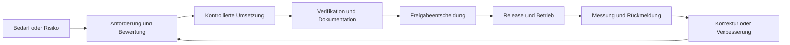
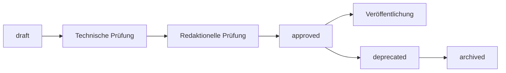
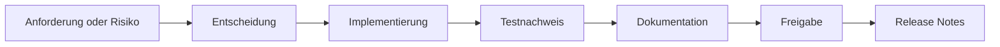

# Qualitäts- und Compliance-Rahmen

## Zweck

Dieses Kapitel beschreibt den Qualitäts- und Compliance-Rahmen der Healthcare Node Registry (HNR). Es verbindet Produktentwicklung, Informationssicherheit, Datenschutz, Risikomanagement, Dokumentenlenkung und Releasefreigabe zu einem nachvollziehbaren Vorgehen.

Der Rahmen unterstützt technische und organisatorische Prüfungen. Er ist weder eine Zertifizierung noch eine Rechts- oder Konformitätszusage.

## Geltungsbereich

Der Rahmen gilt für:

- Produktanforderungen und Architekturentscheidungen;
- Entwicklung, Prüfung und Freigabe;
- Produkt-, Betriebs- und Entwicklungsdokumentation;
- Sicherheits- und Datenschutzrisiken;
- Drittanbieterkomponenten und Lieferantenabhängigkeiten;
- Abweichungen, Korrekturmaßnahmen und kontinuierliche Verbesserung;
- Nachweise für Installation, Update, Backup und Wiederherstellung.

Vertragliche Zusagen, organisationsweite Zertifizierungen und die rechtliche Bewertung eines konkreten Betreiberbetriebs liegen außerhalb dieses Kapitels.

## Verbindliche Abgrenzung

Die HNR ist ein proprietäres, kommerzielles On-Premises-Softwareprodukt. Sie ist kein Medizinprodukt, kein diagnostisches System und ersetzt weder PACS, RIS, KIS noch VNA.

Die vorhandenen Dokumente zur ISO 9001 und ISO/IEC 27001 beschreiben eine Vorbereitung und fachliche Ausrichtung. Daraus folgen ausdrücklich keine Aussagen, dass:

- die HNR nach ISO 9001 oder ISO/IEC 27001 zertifiziert ist;
- der Hersteller oder ein Betreiber ein zertifiziertes Managementsystem besitzt;
- eine Installation automatisch DSGVO-konform betrieben wird;
- die Software regulatorisch geprüft oder als Medizinprodukt zugelassen ist.

ISO/IEC 27001 bewertet das Informationssicherheitsmanagementsystem einer Organisation. Produktfunktionen können ein solches System unterstützen, aber nicht ersetzen.

## Qualitätsgrundsätze

### Nachvollziehbarkeit

Produktrelevante Entscheidungen, Änderungen, Prüfungen und Freigaben müssen einem definierten Produktstand zugeordnet werden können. Ein Template oder eine Absichtserklärung ist noch kein Nachweis.

### Risikobasierte Prüfung

Prüftiefe und Freigabekriterien richten sich nach Auswirkung und Eintrittswahrscheinlichkeit. Autorisierung, Datenintegrität, Wiederherstellbarkeit, vertrauliche Infrastrukturinformationen und aktive DICOM-Diagnosen erhalten besondere Aufmerksamkeit.

### Tatsächlicher Produktstand

Dokumentation und Freigaben unterscheiden konsequent zwischen aktuell verfügbar, geplant und langfristiger Vision. Geplante Kontrollen dürfen nicht als bereits wirksam dargestellt werden.

### Geteilte Verantwortung

Der Hersteller stellt Produktfunktionen, Dokumentation und produktbezogene Nachweise bereit. Der Betreiber verantwortet unter anderem lokale Konfiguration, Berechtigungsvergabe, Infrastruktur, Rechtsgrundlagen, Backupbetrieb und organisatorische Verfahren.

### Kontinuierliche Verbesserung

Fehler, Sicherheitsbefunde, Pilotfeedback, Supportfälle und Prüfergebnisse werden bewertet und in Anforderungen, Risiken, Korrekturen oder Prozessverbesserungen überführt.

## Qualitätskreislauf

Jeder Übergang benötigt Ergebnisse, die dem Risiko angemessen sind. Eine erfolgreiche technische Prüfung ersetzt weder fachliche Bewertung noch Freigabe.

## Qualitätsziele

Die bestehenden [Qualitätsziele](../Compliance/QualityObjectives.md) bilden die Grundlage für messbare Freigabekriterien.

| Zielbereich | Erwarteter Nachweis |
|---|---|
| Rückverfolgbarkeit | Changelog, Release Notes und dokumentierte Migrationen je Release |
| Testqualität | risikobasierte automatisierte Tests kritischer Autorisierungs- und Geschäftsregeln |
| Dokumentationsaktualität | geprüfte Installations-, Update-, Backup- und Fachunterlagen |
| Sicherheit | keine ungeklärte kritische oder hohe Schwachstelle ohne dokumentierte Risikoakzeptanz |
| Wiederherstellbarkeit | protokollierter Restore aus einem realistischen Backup |
| Bedienbarkeit | nachvollziehbare Prüfung zentraler Registry-Arbeitsabläufe mit Zielnutzern |
| Datenminimierung | keine Patientendaten als Voraussetzung einer Kernfunktion |

Zielwerte, Messmethoden, Verantwortlichkeiten und Prüfintervalle müssen vor einer formellen Qualitätsbewertung eindeutig festgelegt werden.

## Nachweisarten

### Produktnachweise

- versionierte Anforderungen und Akzeptanzkriterien;
- Architekturentscheidungen;
- Code- und Sicherheitsreviews;
- automatisierte und manuelle Testergebnisse;
- Migrations- und Kompatibilitätsbewertungen;
- Changelog und Release Notes;
- freigegebene Produkt- und Betriebsdokumentation.

### Betriebsnachweise

- Installations- und Updateprotokolle;
- Backup- und Restore-Prüfungen;
- lokale Berechtigungs- und Access-Reviews;
- Schwachstellen- und Patchbewertungen;
- Incident- und Wiederanlaufnachweise;
- dokumentierte lokale Abweichungen und Risikoakzeptanzen.

Betriebsnachweise entstehen überwiegend in der Verantwortung des Betreibers. Der Hersteller dokumentiert die dafür vorgesehenen Produktverfahren.

## Risikomanagement

Das [Risikoregister](../Compliance/RiskRegister.md) erfasst bekannte produkt- und projektbezogene Risiken. Vor einer formellen Verwendung benötigt es definierte Bewertungsskalen, Verantwortlichkeiten, Reviewintervalle, Akzeptanzgrenzen und Eskalationswege.

Ein Risiko durchläuft mindestens:

1. Identifikation und verständliche Beschreibung;
2. Bewertung von Wahrscheinlichkeit und Auswirkung;
3. Auswahl einer Behandlung: vermeiden, reduzieren, übertragen oder akzeptieren;
4. Benennung einer verantwortlichen Rolle und Frist;
5. Umsetzung und Prüfung der Maßnahme;
6. Bewertung des verbleibenden Risikos;
7. regelmäßige Überprüfung bis zum kontrollierten Abschluss.

Änderungen an Authentisierung, Berechtigungen, DICOM-Diagnose, Dokumentverarbeitung, Datenexport, Netzwerkzugriff oder Lieferkette erfordern eine erneute Risikoprüfung.

## Abweichungen und CAPA

Normale Fehler werden über den regulären Entwicklungsprozess bearbeitet. Eine Corrective and Preventive Action (CAPA) ist für wesentliche oder wiederkehrende Qualitäts- und Sicherheitsabweichungen vorgesehen.

Der [CAPA-Prozess](../Compliance/CAPA.md) umfasst:

- Quelle und Beschreibung der Abweichung;
- erforderliche Sofortmaßnahme;
- Ursachenanalyse;
- Korrektur- oder Vorbeugemaßnahme;
- Verantwortlichkeit und Frist;
- messbares Wirksamkeitskriterium;
- Wirksamkeitsprüfung und Abschlussfreigabe.

CAPA darf nicht als bloßer Statuswechsel abgeschlossen werden. Der Abschluss benötigt einen nachvollziehbaren Wirksamkeitsnachweis.

## Dokumentenlenkung

Git bildet Versionen und Änderungshistorie ab. Für freigaberelevante Dokumente kommen Status, Dokumentversion, Aktualisierungsdatum, Produktbezug und verantwortliche Freigabe hinzu.

Der kontrollierte Ablauf lautet:

Vor Freigabe werden mindestens tatsächlicher Produktstand, relative Links, sensible Inhalte, Norm- und Versionsreferenzen sowie Betreiberhinweise geprüft. Details enthält die [Dokumentenlenkung](../Compliance/DocumentControl.md).

## Informationssicherheit

Die Ausrichtung an ISO/IEC 27001 umfasst produktbezogen insbesondere:

- Zugriffskontrolle und sichere Authentisierung;
- Verschlüsselung und TLS im jeweiligen Einsatzkontext;
- sichere Entwicklung und Änderungssteuerung;
- Logging, Audit und Monitoring-Unterstützung;
- Schwachstellen- und Patchmanagement;
- Backup und Wiederherstellung;
- Konfigurations- und Secret-Management;
- Lieferkettensicherheit;
- Incident-Unterstützung;
- Datenminimierung.

Der aktuelle Status ist Alignment und Vorbereitung. Eine belastbare organisationsweite Bewertung benötigt Scope, Verantwortlichkeiten, Risikoakzeptanz, Wirksamkeitsnachweise und interne beziehungsweise externe Prüfungen außerhalb des Produktcodes.

## Datenschutz

Die HNR soll ohne Patientendaten funktionieren. Benutzerkonten, Ansprechpartner, Auditdaten und technische Infrastrukturinformationen können dennoch personenbezogen oder vertraulich sein.

Produkt und Betrieb berücksichtigen:

- Zweckbindung und Datenminimierung;
- Richtigkeit und kontrollierte Änderung;
- Speicherbegrenzung und Aufbewahrung;
- Integrität und Vertraulichkeit;
- Nachvollziehbarkeit;
- Privacy by Design und Privacy by Default.

Der Betreiber bestimmt Zweck, Rechtsgrundlage, Aufbewahrung, Zugriffsberechtigungen und lokale Löschverfahren. Die vorhandene [DSGVO-Dokumentation](../Compliance/DSGVO.md) ist keine Rechtsberatung.

## Lieferanten und Abhängigkeiten

Frameworks, Bibliotheken, Container-Basisimages, Build-Werkzeuge, Scan-Engines und optionale Dienste werden als Lieferanten- oder Abhängigkeitsrisiko betrachtet.

Bewertungskriterien sind unter anderem:

- Wartungs- und Supportstatus;
- Sicherheitsverlauf;
- Lizenz und Nutzungsbedingungen;
- Updatefrequenz;
- Austausch- und Exit-Möglichkeit;
- Offline- und On-Premises-Eignung;
- mögliche Datenübertragung;
- unterstützte Laufzeit.

Lockfiles und dokumentierte Architekturentscheidungen sind vorhandene Nachweisarten. SBOM und automatisierte Dependency-Scans gelten erst dann als verfügbarer Release-Nachweis, wenn sie tatsächlich erzeugt, geprüft und dem Release zugeordnet werden. Grundlage ist das [Lieferanten- und Abhängigkeitsmanagement](../Compliance/SupplierDependencies.md).

## Releasefreigabe

Eine Releasefreigabe bündelt technische, fachliche, sicherheitsbezogene und dokumentarische Nachweise. Mindestens zu bewerten sind:

- definierter und eingefrorener Releaseumfang;
- erfolgreiche risikobasierte Qualitätsprüfungen;
- Neuinstallation und Updatepfad;
- Datenbankmigrationen und Rückwärtskompatibilität;
- realistischer Backup- und Restore-Test;
- kritische Authentisierungs- und Autorisierungsfälle;
- offene Fehler, Risiken und Schwachstellen;
- aktualisierte Dokumentation, Changelog und Release Notes;
- dokumentierte Freigabe- oder Risikoakzeptanzentscheidung.

Ein Entwicklungsstand mit dem Suffix `-dev` ist kein freigegebenes Release.

## Auditierbarkeit

Auditierbarkeit bedeutet, dass Entscheidungen und Nachweise innerhalb eines definierten Scopes auffindbar, verständlich und einem Produktstand zugeordnet sind. Sie bedeutet nicht, dass jede technische Aktivität unbegrenzt protokolliert wird.

Eine prüfbare Nachweiskette verbindet:

Auditdaten selbst benötigen Berechtigungsschutz, Datenminimierung, definierte Aufbewahrung und kontrollierten Export.

## Rollen und Verantwortlichkeiten

| Rolle | Verantwortung |
|---|---|
| Produktverantwortung | Nutzen, Umfang, Priorität und Freigaberelevanz |
| Fachliche Verantwortung | Healthcare-IT- und DICOM-Korrektheit |
| Architektur und Entwicklung | technische Umsetzung, Reviews und Nachweise |
| Qualitätssicherung | risikobasierte Verifikation und Regression |
| Informationssicherheit | Bedrohungen, Schwachstellen und Sicherheitsrisiken |
| Datenschutz | Datenschutzfolgen und produktbezogene Schutzmaßnahmen |
| Dokumentationspflege | konsistente, versionierte und freigabefähige Inhalte |
| Releaseverantwortung | Vollständigkeit der Nachweise und Freigabeentscheidung |
| Betreiber | lokaler sicherer Betrieb, Berechtigungen, Backup und Compliance |

Eine Person kann mehrere Rollen wahrnehmen. Änderungen mit hohem Risiko sollen dennoch eine angemessene unabhängige Prüfung erhalten.

## Aktueller Stand und offene Reifeanforderungen

| Bereich | Dokumentierter Stand | Offene Reifeanforderung |
|---|---|---|
| Qualitätsrahmen | Ziele und Arbeitsgrundlagen vorhanden | Messmethoden, Verantwortliche und Reviewrhythmus formalisieren |
| ISO 9001 | Alignment beschrieben | keine Zertifizierung oder Konformitätsbehauptung |
| ISO/IEC 27001 | produktbezogene Ausrichtung beschrieben | organisationsweiten ISMS-Scope und Wirksamkeit separat bewerten |
| Datenschutz | Prinzipien und Verantwortungsgrenzen dokumentiert | Betreiberverfahren und Rechtsgrundlagen je Einsatz festlegen |
| Risiken | initiales Risikoregister vorhanden | Skalen, Akzeptanzgrenzen und regelmäßige Reviews festlegen |
| CAPA | Vorlage und Anwendungsgrenze vorhanden | Verantwortlichkeit und Wirksamkeitsprüfung operationalisieren |
| Dokumentenlenkung | Statusmodell und Mindestprüfung vorhanden | Freigaberollen und Produktversionsbezug konsequent pflegen |
| Abhängigkeiten | Bewertungskriterien dokumentiert | SBOM- und Scan-Nachweise in den Releaseprozess integrieren |
| Wiederherstellung | Qualitätsziel definiert | Restore je freigegebenem Produktstand nachweisen |

## Nicht-Ziele

Dieses Kapitel:

- erklärt keine Norm vollständig;
- kopiert keine urheberrechtlich geschützten Normtexte;
- ersetzt keine Rechtsberatung;
- bestätigt keine Zertifizierung oder regulatorische Zulassung;
- erklärt die HNR nicht zum Medizinprodukt;
- übernimmt keine Betreiberverantwortung;
- stellt geplante Kontrollen nicht als implementiert dar;
- ersetzt keine konkrete Release- oder Prüfdokumentation.

## Hinweise für nachfolgende Dokumentation

Das Administratorhandbuch beschreibt konkrete Betriebsnachweise wie Installation, Update, Backup, Restore und Access Review. Das Entwicklerhandbuch konkretisiert Entwicklungs-, Test- und Reviewverfahren. Release Notes ordnen die tatsächlich erbrachten Nachweise einer Softwareversion zu.

Dieses Kapitel ist zu überprüfen, wenn sich Zertifizierungsziele, regulatorische Einordnung, Releaseverfahren, Datenschutzrollen oder wesentliche Lieferantenabhängigkeiten ändern.

## Referenzen

- [Kapitel 5: Sicherheits- und Datenschutzkonzept](05-sicherheits-und-datenschutzkonzept.md)
- [Kapitel 7: Produktlebenszyklus und Roadmap](07-produktlebenszyklus-und-roadmap.md)
- [ISO-9001-Alignment](../Compliance/ISO9001.md)
- [ISO/IEC-27001-Alignment](../Compliance/ISO27001.md)
- [Qualitätsziele](../Compliance/QualityObjectives.md)
- [Risikoregister](../Compliance/RiskRegister.md)
- [CAPA](../Compliance/CAPA.md)
- [Dokumentenlenkung](../Compliance/DocumentControl.md)
- [Lieferanten- und Abhängigkeitsmanagement](../Compliance/SupplierDependencies.md)
- [Datenschutz und DSGVO](../Compliance/DSGVO.md)
- [Definition of Done](../Development/DefinitionOfDone.md)

