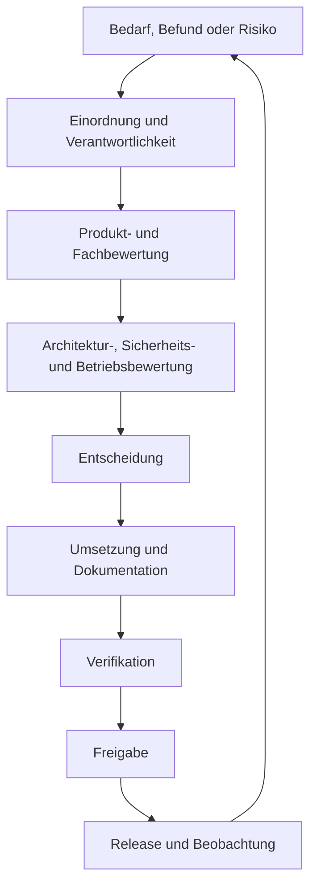

# Produktgovernance und Verantwortlichkeiten

## Zweck

Dieses Kapitel beschreibt, wie wesentliche Entscheidungen zur Healthcare Node Registry (HNR) vorbereitet, getroffen, dokumentiert, geprüft und bei Bedarf eskaliert werden. Es ordnet Produkt-, Fach-, Architektur-, Sicherheits-, Qualitäts-, Dokumentations- und Betreiberverantwortung ein.

Die beschriebenen Rollen sind Verantwortungsbereiche. Sie setzen weder eine bestimmte Unternehmensgröße noch eine fest eingebaute Workflow-Funktion der HNR voraus.

## Geltungsbereich

Die Produktgovernance umfasst:

- Produktvision, Scope und Roadmap;
- fachliche Anforderungen und Priorisierung;
- Architektur- und Datenmodellentscheidungen;
- Informationssicherheit und Datenschutz;
- Qualität, Dokumentation und Releasefreigabe;
- technische Schulden, Risiken und Abweichungen;
- Produktänderungen, Abkündigungen und Supportgrenzen;
- geteilte Verantwortung zwischen Hersteller und Betreiber.

Personalführung, Vertragsfreigaben und die interne Aufbauorganisation eines Herstellers oder Betreibers sind nicht Gegenstand dieses Kapitels.

## Governance-Grundsätze

### Entscheidung vor Zusage

Eine Idee, ein Backlog-Eintrag oder eine technische Möglichkeit ist keine Produktzusage. Neue Funktionen benötigen einen dokumentierten Bedarf, definierten Umfang, Risikobewertung, Verantwortlichkeit und Freigabe.

### Verantwortung bleibt benannt

Für wesentliche Entscheidungen muss eine verantwortliche Rolle erkennbar sein. Gemeinsame Beratung darf nicht dazu führen, dass Entscheidung, Umsetzung oder Risikoakzeptanz niemandem eindeutig zugeordnet ist.

### Fachlichkeit und Technik werden gemeinsam bewertet

Healthcare-IT- und DICOM-Korrektheit, sichere technische Umsetzung, Bedienbarkeit und Betriebsfähigkeit sind voneinander abhängig. Keine einzelne Perspektive ersetzt die übrigen Prüfungen.

### Nachweise vor Status

Ein Status wie „fertig“, „geprüft“ oder „freigegeben“ benötigt nachvollziehbare Kriterien und Ergebnisse. Ein Merge, ein grüner Einzeltest oder ein ausgefülltes Template genügt allein nicht.

### Bestehende Architektur wird weiterentwickelt

Entscheidungen sollen vorhandene Models, Services, Policies, Berechtigungen, Auditmechanismen und UI-Muster nutzen. Eine zweite Architektur für denselben fachlichen Zweck benötigt eine ausdrückliche Architekturentscheidung und belastbare Begründung.

### Betreiberhoheit wird respektiert

Die HNR unterstützt den Betrieb, übernimmt aber nicht die organisatorische Verantwortung des Betreibers für Datenqualität, Berechtigungen, Netzwerkfreigaben, Rechtsgrundlagen, Backup oder Wiederherstellung.

## Governance-Modell

Umfang und Formalität richten sich nach Risiko und Tragweite. Kleine Korrekturen benötigen keinen vollständigen Entscheidungsprozess; Änderungen an Sicherheitsgrenzen, Datenmodell, Schnittstellen oder Betriebsverfahren schon.

## Verantwortungsbereiche

| Verantwortungsbereich | Kernaufgaben | Typische Entscheidung |
|---|---|---|
| Produktverantwortung | Vision, Nutzen, Scope, Priorität und Roadmap | ob und wann ein Bedarf zum Produktumfang gehört |
| Fachliche Verantwortung | Healthcare-IT-, DICOM- und Nutzungskontext | ob Modell und Verhalten fachlich korrekt sind |
| Architektur | Systemgrenzen, Datenmodell, Abhängigkeiten und ADRs | wie eine langfristig bindende Änderung eingeordnet wird |
| Entwicklung | sichere Umsetzung, Review, Migration und technische Nachweise | ob die Umsetzung die freigegebenen Kriterien erfüllt |
| Qualitätssicherung | risikobasierte Verifikation und Regression | ob ausreichende Prüfnachweise vorliegen |
| Informationssicherheit | Bedrohungen, Schwachstellen und Sicherheitsrisiken | ob Schutzmaßnahmen und Restrisiko vertretbar sind |
| Datenschutz | Datenminimierung und Datenschutzfolgen | ob Produktverarbeitung und Dokumentation angemessen sind |
| Dokumentationspflege | konsistente, versionierte und zielgruppengerechte Inhalte | ob Dokumentation prüf- und freigabefähig ist |
| Releaseverantwortung | Bündelung der Nachweise und Releaseentscheidung | ob ein Produktstand veröffentlicht werden darf |
| Betrieb und Support | Installierbarkeit, Diagnose, Wiederanlauf und Rückmeldung | welche betrieblichen Einschränkungen eskaliert werden müssen |

Eine Person kann mehrere Verantwortungsbereiche übernehmen. Bei Änderungen mit hohem Risiko soll eine unabhängige zweite Prüfung erhalten bleiben.

## Entscheidungsarten

### Produktentscheidung

Eine Produktentscheidung betrifft Nutzen, Zielgruppe, Scope, Priorität oder Abgrenzung. Sie dokumentiert mindestens:

- Problem und betroffene Zielgruppe;
- erwarteten Nutzen;
- Umfang und Nicht-Umfang;
- Abhängigkeiten und Risiken;
- Status als aktuell, geplant oder langfristige Vision;
- verantwortliche Entscheidung.

### Architekturentscheidung

Langfristig bindende oder schwer umkehrbare technische Entscheidungen werden als Architecture Decision Record (ADR) dokumentiert. Dazu gehören insbesondere:

- System- und Modulgrenzen;
- Authentisierungs- und Autorisierungsmodell;
- öffentliche Kennungen und Datenmodell;
- Dokumentablage und Auditstrategie;
- Schnittstellen, Import und Export;
- wesentliche Infrastruktur- oder Bibliotheksentscheidungen.

ADRs verwenden die Status `Proposed`, `Accepted`, `Superseded` und `Rejected`. Die Übersicht befindet sich unter [Architecture Decision Records](../Decisions/README.md).

### Sicherheits- und Datenschutzentscheidung

Eine gesonderte Bewertung ist erforderlich, wenn eine Änderung:

- neue Vertrauens- oder Netzwerkgrenzen schafft;
- Authentisierung oder Berechtigungen verändert;
- vertrauliche Infrastrukturinformationen erweitert;
- Dokumente, Exporte oder personenbezogene Metadaten betrifft;
- aktive DICOM- oder Netzwerkkommunikation ausführt;
- externe Dienste oder Identitätsanbieter einbindet;
- Aufbewahrung, Löschung oder Audit verändert.

### Releaseentscheidung

Die Releaseentscheidung bestätigt einen konkreten Produktstand. Sie basiert auf definiertem Umfang, Prüfergebnissen, Dokumentation, offenen Risiken, Migrationsbewertung und Wiederherstellbarkeit. Details beschreibt [Kapitel 7](07-produktlebenszyklus-und-roadmap.md).

### Risikoakzeptanz

Eine Risikoakzeptanz benennt mindestens Risiko, Auswirkung, Begründung, kompensierende Maßnahmen, Gültigkeitsdauer und entscheidungsberechtigte Rolle. Sie darf keine unbegrenzte Ersatzlösung für eine notwendige Korrektur werden.

## Entscheidungskriterien

Wesentliche Produktentscheidungen werden anhand folgender Kriterien bewertet:

| Kriterium | Leitfrage |
|---|---|
| Betriebsnutzen | Verbessert die Änderung Datenqualität, Administration oder Störungseingrenzung? |
| Fachliche Passung | Unterstützt sie Healthcare-IT- und DICOM-Anwendungsfälle? |
| Risiko | Welche Sicherheits-, Datenschutz-, Integritäts- und Betriebsrisiken entstehen? |
| Architektur | Kann vorhandene Logik wiederverwendet werden? |
| Aufwand | Welche Entwicklungs-, Test-, Dokumentations- und Betriebskosten entstehen? |
| Bedienbarkeit | Bleibt der Arbeitsablauf konsistent und verständlich? |
| Nachweisbarkeit | Lässt sich die Wirkung verifizieren und einem Release zuordnen? |
| Erweiterbarkeit | Verhindert die Entscheidung spätere sinnvolle Entwicklungen? |
| Produktgrenze | Bleibt die HNR eine Registry und Diagnosehilfe statt eines Fremdsystems? |

## Entscheidungsnachweis

Nicht jede Entscheidung benötigt dasselbe Artefakt. Der Nachweis richtet sich nach ihrer Art.

| Entscheidung | Geeigneter Nachweis |
|---|---|
| begrenzte Fehlerkorrektur | Issue, Review und Test |
| neue Produktfunktion | Anforderung, Akzeptanzkriterien, Roadmap- und Releasebezug |
| bindende Architekturänderung | ADR |
| Sicherheitsänderung | Bedrohungs- oder Risikobewertung und gezielte Tests |
| Datenmodelländerung | Migration, Integritätsregeln, Tests und Dokumentation |
| bewusste technische Schuld | Eintrag im Technical-Debt-Register mit Ziel und Verantwortlichkeit |
| wesentliche Abweichung | CAPA oder gleichwertiger kontrollierter Nachweis |
| Produktfreigabe | Release Notes, Prüfnachweise und Freigabeentscheidung |

Die vorhandene [Anforderungsrückverfolgbarkeit](../Product/RequirementsTraceability.md) ist eine Arbeitsgrundlage. Ihre Versionsangaben sind vor einer formellen Releaseverwendung mit dem tatsächlichen Produktstand abzugleichen.

## Gremien und Reviews

Dieses Kapitel schreibt keine festen Gremiennamen vor. Eine kleine Organisation kann mehrere Reviews in einem Termin bündeln. Folgende Perspektiven müssen bei relevanten Änderungen dennoch abgedeckt sein:

- Produkt- und Nutzensicht;
- fachliche Healthcare-IT- und DICOM-Sicht;
- Architektur und Wartbarkeit;
- Sicherheit und Datenschutz;
- Qualität und Testbarkeit;
- Betrieb und Support;
- Dokumentation und Releasekommunikation.

Reviewteilnahme allein bedeutet keine Freigabe. Entscheidung und offene Einwände müssen protokolliert werden.

## Eskalation

Eine Eskalation ist erforderlich, wenn:

- eine kritische oder hohe Schwachstelle ungeklärt bleibt;
- Datenintegrität oder Wiederherstellbarkeit nicht nachgewiesen ist;
- fachliche und technische Bewertung zu gegensätzlichen Ergebnissen kommen;
- Produktdokumentation dem tatsächlichen Stand widerspricht;
- Scope oder Termin nur durch das Auslassen notwendiger Kontrollen gehalten werden kann;
- eine Abhängigkeit nicht mehr sicher oder wartbar erscheint;
- regulatorische oder vertragliche Aussagen ohne belastbare Grundlage vorgesehen sind;
- eine Entscheidung außerhalb der Befugnis der bearbeitenden Rolle liegt.

Mögliche Ergebnisse sind Nacharbeit, Scope-Reduktion, dokumentierte zeitlich begrenzte Risikoakzeptanz oder Abbruch der Änderung. Schweigen gilt nicht als Zustimmung.

## Änderungssteuerung

Produktrelevante Änderungen folgen mindestens diesem Ablauf:

1. Bedarf und Auswirkung erfassen;
2. verantwortliche Rolle bestimmen;
3. Scope und Akzeptanzkriterien festlegen;
4. Architektur-, Sicherheits-, Datenschutz- und Betriebsfolgen bewerten;
5. Umsetzung und Migration planen;
6. risikobasiert prüfen;
7. Dokumentation und Releaseinformationen aktualisieren;
8. offene Risiken bewerten;
9. Freigabe dokumentieren;
10. Wirkung nach Veröffentlichung beobachten.

Notfallkorrekturen dürfen die Bearbeitungszeit verkürzen, nicht aber die nachträgliche Nachvollziehbarkeit aufheben.

## Technische Schulden

Technische Schulden dürfen bewusst aufgenommen werden, wenn Nutzen, Risiko und Folgemaßnahmen transparent sind. Ein Eintrag benötigt:

- konkrete Beschreibung und Ursache;
- Auswirkung auf Produkt, Sicherheit oder Wartbarkeit;
- verantwortliche Rolle;
- Zielversion oder Überprüfungstermin;
- Status und Abschlusskriterium.

Das vorhandene [Technical-Debt-Register](../Knowledge/TechnicalDebt.md) ist derzeit eine leere Struktur. Es ist kein Nachweis, dass keine technischen Schulden bestehen.

## Verhältnis zur Produkt-Roadmap

Die Roadmap priorisiert nach Mehrwert, Risiko und Abhängigkeiten. Governance verhindert, dass sie zu einer unbewerteten Wunschliste oder einer stillschweigenden Produktzusage wird.

Ein Roadmap-Eintrag wird erst für einen Releasekandidaten verbindlich, wenn:

- Nutzen und Zielgruppe bestätigt sind;
- Scope und Nicht-Umfang feststehen;
- Abhängigkeiten geklärt sind;
- Risiken bewertet wurden;
- Umsetzung, Tests und Dokumentation realistisch geplant sind;
- eine verantwortliche Produktentscheidung vorliegt.

## Dokumentationsgovernance

Dokumentation ist Teil des Produktumfangs. Kapitel durchlaufen Erstellung, technische Prüfung, redaktionelle Prüfung, Freigabe und Veröffentlichung. Die Status `draft`, `review`, `approved`, `deprecated` und `archived` dürfen nicht ohne die zugehörigen Kriterien verwendet werden.

Eine Softwareänderung ist nicht vollständig freigabefähig, wenn betroffene Anwender-, Administrator-, Architektur-, API- oder DICOM-Dokumentation fehlt oder veraltet ist.

## Geteilte Verantwortung mit Betreibern

| Bereich | Produkt beziehungsweise Hersteller | Betreiber |
|---|---|---|
| Produktfunktion | dokumentierter Umfang und sichere Standardlogik | freigegebener lokaler Anwendungszweck |
| Identitäten | Rollen, Berechtigungen und Durchsetzung | Kontenprozess, Rollenzuweisung und Access Review |
| Netzwerk | dokumentierte Kommunikationsrichtungen und Grenzen | Segmentierung, Firewall, DNS, TLS und Freigaben |
| Daten | Validierung, Status und Auditunterstützung | fachliche Richtigkeit, Pflege und Aufbewahrung |
| Dokumente | geschützte Ablage und Versionsmechanismen | zulässige Inhalte, Freigabe und Löschregeln |
| Backup | dokumentierter Datenumfang und Verfahren | Durchführung, Schutz und Restore-Test |
| Updates | Artefakte, Hinweise und Migrationsanforderungen | Wartungsfenster, Sicherung, Abnahme und Rollbackentscheidung |
| Compliance | produktbezogene Nachweise und Abgrenzung | organisations- und installationsbezogene Bewertung |

## Aktueller Stand und geplante Entwicklung

### Aktuell dokumentiert

- Produktprinzipien und Nicht-Ziele;
- Rollen- und Berechtigungsmodell der Anwendung;
- ADR-Struktur für Architekturentscheidungen;
- Qualitätsziele, Risikoregister und CAPA-Vorlage;
- Dokumentstatus und Freigabeschritte;
- Roadmap-, Release- und Nachweisgrundsätze.

### Noch zu operationalisieren

- namentliche beziehungsweise organisationsbezogene Zuordnung der Verantwortungsrollen;
- verbindliche Reviewintervalle und Eskalationsschwellen;
- konsolidierte Anforderungs- und Release-Rückverfolgbarkeit;
- gepflegtes Technical-Debt-Register;
- formale Risikoakzeptanz und CAPA-Wirksamkeitsprüfung;
- eindeutige Freigabematrix für Releases und Dokumente.

Diese Punkte beschreiben Prozessreife und keine bereits implementierten Produktfunktionen.

## Nicht-Ziele

Die Produktgovernance:

- bildet kein vollständiges Qualitätsmanagementsystem einer Organisation ab;
- ersetzt keine arbeits-, gesellschafts- oder vertragsrechtlichen Befugnisse;
- führt keine zweite Rollen- oder Berechtigungsarchitektur in der Anwendung ein;
- behauptet keine fest eingebaute Vier-Augen-Freigabe, solange diese nicht implementiert ist;
- macht aus einer Roadmap keine Liefer- oder Terminzusage;
- überträgt Betreiberverantwortung nicht auf den Hersteller;
- erklärt eine technische Entscheidung nicht automatisch zur Produktfreigabe.

## Hinweise für nachfolgende Dokumentation

Das Administratorhandbuch konkretisiert betriebliche Rollen und Verfahren. Das Entwicklerhandbuch beschreibt Reviews, Tests, ADRs und Änderungssteuerung. Die Architektur- und API-Dokumentation benennt Eigentümer stabiler Verträge. Release Notes dokumentieren die Freigabe eines konkreten Produktstands.

Dieses Kapitel ist zu überprüfen, wenn sich Produktorganisation, Freigabemodell, Supportmodell, regulatorische Einordnung oder Verantwortungsgrenzen ändern.

## Referenzen

- [Kapitel 1: Produktvision](01-product-vision.md)
- [Kapitel 7: Produktlebenszyklus und Roadmap](07-produktlebenszyklus-und-roadmap.md)
- [Kapitel 9: Qualitäts- und Compliance-Rahmen](09-qualitaets-und-compliance-rahmen.md)
- [Architecture Decision Records](../Decisions/README.md)
- [Anforderungsrückverfolgbarkeit](../Product/RequirementsTraceability.md)
- [Technical-Debt-Register](../Knowledge/TechnicalDebt.md)
- [Risikoregister](../Compliance/RiskRegister.md)
- [CAPA](../Compliance/CAPA.md)
- [Dokumentations-Masterspezifikation](../DOCUMENTATION_MASTER_SPECIFICATION.md)

