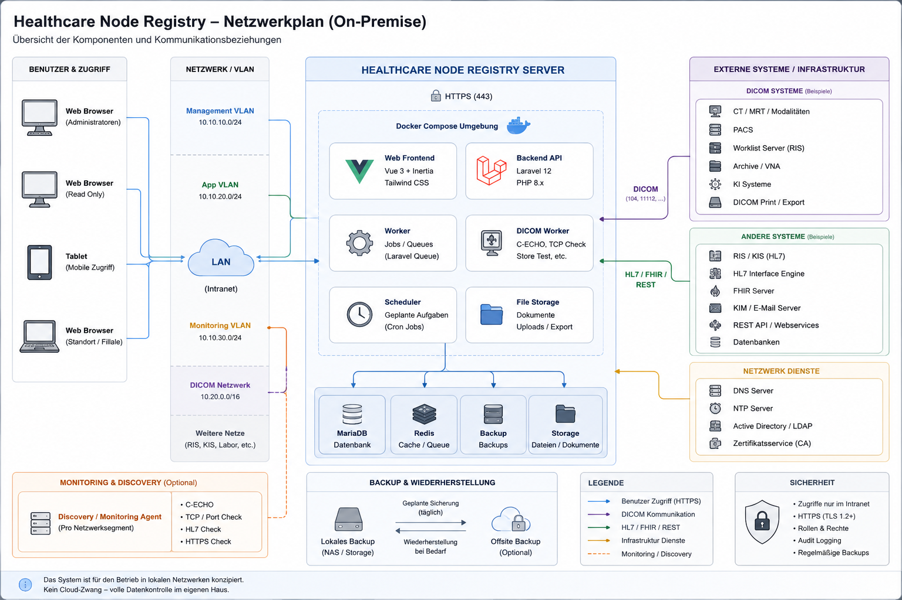

# Network Architecture Reference

## Zweck

Das Referenzbild beschreibt die gewünschte konzeptionelle Platzierung des Produkts in einer lokalen Healthcare-Infrastruktur.

## Interpretationsregeln

- Die Anwendung wird zentral im Kundennetz betrieben.
- Browser-Clients greifen per HTTPS zu.
- PostgreSQL, Applikation und optionale Worker sind nicht direkt aus Benutzer-VLANs erreichbar.
- Zugriff auf medizinische Netzwerksegmente wird nur für ausdrücklich aktivierte Funktionen benötigt.
- Der MVP dokumentiert Verbindungen, führt aber keine automatische Discovery durch.
- Reverse Proxy, Firewall, DNS, NTP, Backup und Identitätsdienste bleiben Teil der Kundeninfrastruktur.
- Optionale Agenten oder aktive Checks sind spätere, getrennt freizugebende Komponenten.

## Zielzonen

1. Benutzer-/Admin-Zone
2. Applikationszone
3. Datenbank-/Persistenzzone
4. Dokumentenspeicher
5. optionale Integrations-/Monitoring-Zone
6. Backup-Ziel

## Sicherheitsgrenzen

- TLS-Terminierung
- Authentisierung und Autorisierung
- Applikation–Datenbank
- Datei-Upload und -Download
- optionale Verbindung in DICOM-/Integrations-VLANs
- Administrationszugriff
- Backup und Restore

Das Bild ist keine Firewallfreigabe. Konkrete Regeln werden installationsbezogen erstellt.
