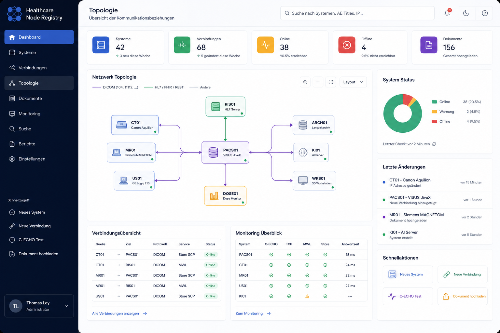

# UI Reference

## Verbindlicher Charakter

Die Referenz ist die gestalterische Ausgangsbasis. Sie definiert:

- dunkle, klar gegliederte Seitenleiste
- helle, großzügige Hauptarbeitsfläche
- Dashboard-Karten und kompakte Statusinformationen
- zentralen Topologie-Arbeitsbereich
- rechte Detail-/Informationsfläche
- moderne, ruhige Enterprise-Anmutung

## Nicht verbindlich

- dargestellte Beispielwerte
- Produktname und Logo
- exakte Farben, solange Design-Tokens und Kontrastanforderungen eingehalten werden
- Monitoringfunktionen, die noch nicht implementiert sind
- pixelgenaue Abstände

## UX-Grundsatz

Die Oberfläche darf keine Funktion vortäuschen. Ein Registry-Status ist nicht automatisch ein Live-Monitoringstatus. Begriffe wie „online“, „healthy“ oder „latency“ werden nur genutzt, wenn echte Messdaten mit Zeitstempel vorliegen.
